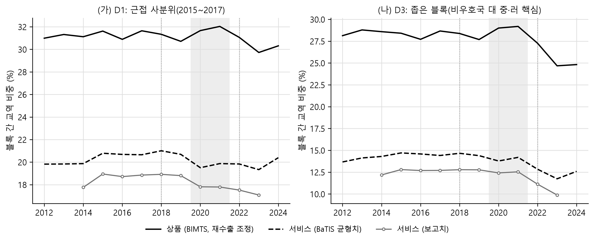
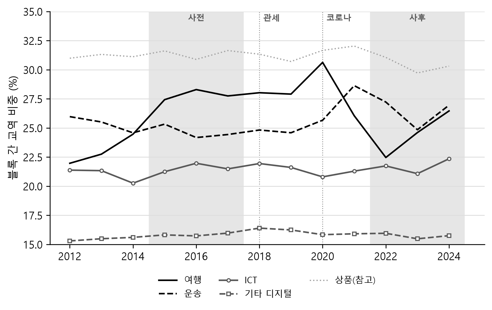
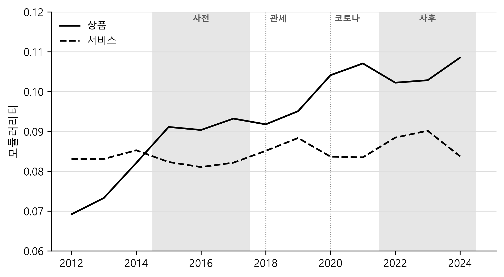

# 지경학적 분절화는 서비스 교역에서도 일어나는가

Does Geoeconomic Fragmentation Extend to Services Trade?

작성일: 2026-09-21

---

## 요약

미중 갈등과 러시아의 우크라이나 침공 이후 상품 교역이 지정학적 블록을 따라 재편되는 지경학적 분절화(geoeconomic fragmentation)가 여러 연구에서 확인되었으나, 서비스 교역에서 같은 현상이 나타나는지는 검증되지 않았다. 본 연구는 OECD가 각국 보고치의 비대칭을 조정해 짝으로 내놓은 서비스 교역 자료(BaTIS)와 상품 교역 자료(BIMTS)를 같은 국가쌍에 대응시켜, 미국 측과 중국 측 두 블록에 속한 경제끼리의 교역 가운데 블록 경계를 넘은 흐름이 차지하는 비중, 곧 블록 간 교역 비중을 측정한다. 표본은 2015\~2017년과 2022\~2023년 다섯 해 모두 어느 한쪽이라도 서비스 교역을 보고한 9,192개 수출 흐름으로 고정한 뒤 그 목록을 2012\~2024년 전체에 적용했고, 블록은 사전 기간의 UN 총회 이념점수로 미국과 중국에 가장 가까운 사분위를 구분해 정의했다. 분석 결과를 요약하면, 서비스의 블록 간 교역 비중은 상품만큼 줄었지만, 그 하락은 디지털 서비스가 아니라 여행에서 나왔고 교역 상대의 재편이 아니라 중국 측 블록의 서비스 교역 위축을 반영한다. 구체적으로 블록 간 교역 비중의 하락폭은 2015\~2017년 대비 2022\~2024년에 서비스에서 0.84%p, 상품에서 1.02%p다. 서비스 쪽이 더 작지만, 서비스의 블록 간 교역 비중이 사전 기간에 20.70%로 상품의 31.39%보다 낮은 데서 출발하므로 상대적 크기로는 둘이 사실상 같다. 다만 두 수치의 오차는 크다. 수출국을 복원추출해 다시 계산하면 서비스의 하락은 -2.11에서 +0.81%p에 걸쳐 흩어져, 하락이 없었을 가능성을 배제하지 못하며 두 교역 가운데 어느 쪽이 더 줄었는지도 말하기 어렵다. 본 연구가 주장하는 것은 하락의 크기가 아니라, 블록을 어떻게 정의하고 어떤 교역 계열을 쓰든 방향이 같다는 점이다. 하락이 나타난 시점은 서로 달라, 상품은 2022년 이후에 내려갔고 서비스는 코로나 충격기인 2020년에 이미 한 단계 내려앉았다. 서비스를 다섯 범주로 나누면 하락은 여행에서 나온다. 여행은 블록 간 비중이 높은 범주인데 서비스 교역에서 차지하는 몫이 21.73%에서 16.36%로 줄었고, 통신·컴퓨터·정보서비스의 블록 간 비중은 21.56%에서 21.74%로 변하지 않았다.

---

## I. 서론

지경학적 분절화는 시장 조건이 아니라 지경학적 요인(geoeconomic factors), 곧 안보와 동맹 관계를 고려한 정책으로 세계 경제의 통합이 후퇴하는 현상을 가리킨다(Aiyar et al., 2023). 관세와 수출 통제, 투자 심사, 제재가 그런 정책이다. 세계 교역의 규모 자체는 줄지 않았으므로 분절화를 다루는 국제경제학 문헌이 주목하는 것은 총량이 아니라 교역 상대의 재편이다. Gopinath et al. (2025)는 러시아의 우크라이나 침공 이후 지정학적으로 먼 블록 사이의 상품 교역이 같은 블록 안의 교역보다 약 12% 더 줄었다고 추정했고, WTO (2023)는 UN 총회 표결로 두 블록을 가정했을 때 침공 이후 블록 사이의 상품 교역이 블록 안의 교역보다 4\~6% 느리게 늘었다고 보고했다. 두 연구가 다룬 것은 모두 상품 교역이다. 서비스 교역에서 같은 재편이 나타나는지는 자료의 제약 때문에 거의 검증되지 않았다.

가설은 서로 반대 방향으로 두 가지를 세울 수 있다. 첫째, 서비스는 관세와 원산지 규정을 받지 않으므로 교역 상대를 정책으로 구분할 수단이 상품보다 적고, 그만큼 분절화가 약하게 나타날 수 있다. 둘째, 데이터 현지화, 클라우드 규제, 보안 심사처럼 디지털 서비스를 겨냥한 조치는 2018년 이후 늘었으므로, 디지털로 전달되는 서비스가 오히려 상품보다 먼저 분절될 수 있다. 두 가설은 블록 간 교역 비중이 어떻게 움직일지를 반대로 예측한다. 본 연구는 어느 쪽이 자료와 맞는지를 기술적 사실의 수준에서 확인한다.

두 가설을 같은 자료에서 구분하려면 상품과 서비스를 같은 조건에서 측정해야 한다. 본 연구의 기여는 그 비교 가능성을 확보한 데 있다. 상품과 서비스의 분절화를 따로 측정할 경우 서로 다른 자료와 다른 국가 표본을 쓰게 되므로 두 결과의 차이가 현상의 차이인지 측정의 차이인지를 구분하기 어렵다. 본 연구가 사용하는 서비스 교역 자료인 BaTIS와 상품 교역 자료인 BIMTS는 OECD가 각국 보고치의 비대칭을 조정해 짝으로 내놓은 자료다. 두 자료가 같은 경제 코드 체계를 쓰고 금액 단위도 같으므로, 같은 국가쌍에 대응시키면 국가 표본과 연도를 고정한 채 상품과 서비스의 블록 간 교역 비중을 직접 비교할 수 있다.[^1]

[^1]: 다만 고정되는 것은 자료의 출처와 국가 표본과 연도이지 균형화 알고리즘까지는 아니다. 두 자료의 균형화가 어떻게 다른지, 균형화를 거치지 않은 계열이나 독립 조정 자료로 바꾸면 결과가 어떻게 되는지는 IV.3절에서 다룬다.

분석은 세 가지 원칙을 따른다. 첫째, 미국 측과 중국 측 두 블록에 속한 경제끼리의 교역을 파악할 때 금액 수준이 아니라 그 전체에서 블록 경계를 넘은 흐름이 차지하는 몫을 본다. 명목 달러 금액에는 환율과 가격 변동이 섞이지만, 비중은 같은 해의 금액끼리 나눈 값이므로 그 영향이 크게 줄어든다. 둘째, 인과 추정이 아니라 기술적 사실을 정립한다. 정치적 거리가 교역 관계 자체의 영향을 받는 역인과(reverse causality)가 있기 때문이다. 셋째, 블록 정의와 교역 계열을 각각 하나로 고정하고 그 선택이 결과를 유리하게 만들지 않는지를 밝힌다. 블록은 미국과 중국을 두 극으로 놓고 사전 기간(2015\~2017년)의 이념점수로 정한 기준안을, 계열은 두 자료의 균형치를 쓴다. 이 선택이 분절화를 작게 잡는 쪽이라는 점은 II장에서 밝히고, 두 선택을 각각 바꾸었을 때의 결과는 IV장에서 제시한다.

---

## II. 자료와 측정

### 1. 교역 자료와 분석 표본

서비스는 BaTIS(OECD and WTO, 2025)의 총서비스와 12개 대분류를, 상품은 BIMTS(OECD, 2025)의 전 품목 합계를 쓴다. 모두 백만 달러 단위이고 세계나 EU처럼 여러 경제를 묶은 집계 항목은 빼고 개별 경제만 남긴다. 자료가 개별 경제로 분류하는 코드 가운데 나머지 세계(rest of the world)는 보고되지 않은 상대를 묶은 잔여 항목이므로 함께 뺀다. BaTIS는 한 흐름을 수출국이 보고한 수출 행과 수입국이 보고한 수입 행 두 개에 담으므로, 수출 방향 행을 관측으로 삼아 한 흐름을 한 번만 세고 수입 행의 값은 그 흐름의 수입국 보고로 붙여 둔다. 문헌에서는 이것을 거울상 통계(mirror statistics)라 부른다. 반면 BIMTS는 원래 수출국 기준의 단일 기록이다.

두 자료가 싣는 금액은 균형치(balanced value)다. 균형치는 수출국 보고와 수입국 보고의 차이를 조정하고 보고가 없는 칸은 추정해, 세계 합이 맞아떨어지도록 만든 값이다. 상품은 재수출을 생산국으로 재배분한 균형치를 쓴다. 재수출(re-export)은 들여온 물건을 실질적인 가공 없이 다시 내보내는 것으로, 통관 기록은 마지막으로 내보낸 나라를 수출국으로 적는다. 따라서 중국산 제품이 홍콩을 거쳐 미국으로 가면 원자료에는 홍콩의 대미 수출로 기록되지만, BIMTS의 재수출 조정은 그 금액을 중국의 대미 수출로 되돌린다.

두 자료 모두 수출국 기준이므로 각 관측은 한 경제가 다른 경제로 내보내는 수출 흐름이다. 한국의 대미 수출과 미국의 대한 수출은 방향이 반대인 서로 다른 흐름이고, 본 연구는 둘을 각각 센다. BaTIS는 어느 쪽도 보고하지 않은 칸을 중력모형(gravity model) 추정으로 채우므로, 자료에 값이 있다고 해서 그 흐름이 실제로 보고된 것은 아니다. 본 연구는 그 가운데 사전 기간과 사후 기간 양쪽에서 보고가 이어지는 흐름만 골라 쓰고 나머지는 분석에서 뺀다. 사전 기간은 2015\~2017년, 사후 기간은 2022\~2024년이며 네 기간의 구분은 이 장의 3절에서 정한다. 이유는 둘이다. 하나는 채워 넣은 값이 경제 규모와 거리처럼 모형에 넣은 요인만 반영한다는 점이다. 블록 사이의 교역이 실제로 줄어도 추정으로 채운 칸은 그 감소를 담지 못하므로, 그런 칸을 함께 세면 분절화가 희석된다. 다른 하나는 어느 흐름에 보고가 있는지가 해마다 바뀐다는 점이다. 상대별로 보고한 수출 칸의 비중으로 보면 미국은 2015\~2017년 35.5%에서 2022\~2023년 94.0%로 올라 전에는 추정으로만 있던 미국의 흐름이 대거 보고로 바뀌었고, 러시아는 96.5%에서 0%로 떨어져 보고가 있던 흐름이 모두 사라졌다. 대상을 해마다 새로 고르면 이런 보고의 변화가 교역 구성의 변화로 잘못 읽힌다.

표본은 보고 여부로 정한다. 어느 해에 보고가 있다는 것은 그 흐름을 수출국이 수출로 보고했거나 수입국이 수입으로 보고한 것 가운데 하나라도 있는 경우를 말한다. 두 보고는 같은 흐름을 양쪽에서 적은 것이므로 어느 한쪽만 있어도 그 해의 교역이 실제로 관측된 것으로 본다. 여기서 달라지는 것은 흐름의 방향이 아니라 그 흐름을 적은 쪽이다. 관측은 언제나 수출국에서 수입국으로 가는 흐름 하나이고, 수입국의 기록을 쓸 때도 그 흐름의 방향은 그대로다. 보고 여부는 추론한 것이 아니라 자료에 기록된 것이다. BaTIS는 칸마다 보고치와 균형치를 따로 싣고 그 칸을 어떤 방법으로 만들었는지도 코드로 남기는데, 보고가 없는 칸은 보고치가 비어 있고 추정 방법 코드가 붙는다. 이 정의 위에서 두 단계를 밟는다. 첫째, 총서비스를 기준으로 2015, 2016, 2017, 2022, 2023년 다섯 해 모두 그 조건이 성립하는 흐름만 남긴다. 사전 기간과 사후 기간 양쪽에서 끊기지 않고 관측되는 흐름만 쓰겠다는 뜻이다. 둘째, 그렇게 고른 목록을 2012\~2024년 모든 연도와 두 자료, 서비스 12개 대분류에 그대로 적용한다. 상품도 같은 목록으로 제한하므로 상품과 서비스가 같은 흐름에서 측정된다. BIMTS에 행이 없는 흐름은 교역이 없는 흐름이어서 비중에 0으로 들어간다. 보고를 요구하는 해는 위의 다섯 해뿐이므로 나머지 해에는 보고가 빠진 흐름이 섞일 수 있는데, 표본 안에서 보고가 있는 금액의 비중은 2014\~2023년 내내 99%를 넘고 2012년 91.4%, 2013년 95.5%, 2024년 72.9%다.

이 규칙으로 남은 것이 200개 경제 사이의 9,192개 수출 흐름이고, 이 집합이 세계 서비스 교역의 82.2%(2019년)와 83.8%(2023년), 상품 교역의 75.8%와 74.1%를 차지한다. 미국과 중국 사이의 두 방향은 모두 포함된다. 표본이 보고가 있는 흐름으로 치우치므로, 본 연구의 수치는 세계 전체가 아니라 보고가 이어지는 흐름을 대상으로 측정한 값이다.

### 2. 블록 정의

블록은 미국과 중국을 두 극으로 놓고 나눈다. 관세와 수출 통제, 투자 심사 같은 조치가 대부분 그 축에서 나왔기 때문이고, 상품 교역의 분절화를 보고한 연구들이 같은 축을 썼기 때문이기도 하다. Gopinath et al. (2025)는 UN 총회 표결로 미국 측과 중국 측, 비동맹을 나누었고 WTO (2023)도 같은 표결로 두 블록을 가정했다. 축이 다르면 서비스의 결과를 그들의 상품 결과와 비교할 수 없다. 블록 간 교역 비중을 측정하려면 각 경제가 어느 쪽에 속하는지를 먼저 정해야 하는데, 블록은 공식 기구가 아니어서 자료에 적혀 있지 않으므로 기준을 세워 배정한다.

정치적 위치는 이념점수(ideal point)로 나타낸다. Bailey et al. (2017)이 UN 총회의 최종 통과 표결에서 추정한 1946\~2025년 값으로, 경제별로 해마다 하나씩 주어지는 1차원 수치이며, 값이 클수록 미국 및 그 동맹국과 표결이 비슷하다. 이념점수가 없는 경제에는 규칙을 따로 정했다. 해외 영토는 주권국을 따르고(버뮤다와 케이맨 제도는 영국, 아루바와 퀴라소는 네덜란드), 홍콩과 마카오는 중국을 따른다. 대만은 2022년 러시아의 비우호국 지정에 포함되었고 미국과의 안보 관계도 분명하므로 미국 측에 두었다.

배정은 2015\~2017년 평균 이념점수로 각 경제가 미국과 중국에서 얼마나 떨어져 있는지를 구한 뒤, 미국에 가장 가까운 25%를 미국 측, 중국에 가장 가까운 25%를 중국 측, 나머지를 비동맹으로 두는 방식이다. 사분위의 경계는 2015\~2017년 이념점수가 있는 193개 경제에서 구하고 그 결과를 앞 문단의 규칙과 함께 표본에 적용한다. 두 사분위가 겹치면 더 가까운 쪽에 배정하도록 했으나 실제로 겹치는 경제는 없다. 그렇게 나누면 표본의 200개 경제 가운데 미국 측이 54개, 중국 측이 51개, 비동맹이 93개가 되고, 이념점수가 없는 팔레스타인과 코소보 둘은 어느 블록에도 배정하지 않는다. 사전 기간의 점수를 쓰는 것은 2015\~2017년의 표결로 정한 배정이 2018년의 관세와 2022년의 침공보다 앞서 있어, 측정하려는 교역 변화가 배정에 영향을 줄 수 없기 때문이다.

두 사분위는 이념점수 축의 양 끝을 뜻하지 않는다. 미국은 점수가 가장 높은 쪽 끝에 있어 미국 측 블록도 그 끝에 모이지만, 중국은 축의 가운데 아래에 있어 중국 측 블록은 중국의 점수를 둘러싼 좁은 구간이 된다. 그래서 중국보다 점수가 더 낮은 쿠바나 이란 같은 경제는 중국과의 거리가 멀어 비동맹에 남는다. 결국 비동맹은 성격이 고른 집단이 아니다. 어느 쪽과도 표결이 비슷하지 않은 경제와 미국에서 가장 먼 경제가 함께 들어간다. 다음 절에서 정의하는 핵심 지표는 두 블록에 속한 경제끼리의 교역만 쓰고 비동맹이 포함된 흐름은 분자와 분모에서 모두 배제하므로, 이 이질성이 측정에 섞이지는 않는다. 다만 그 배제에는 대가가 있다. 러시아는 2015\~2017년 이념점수가 중간 부근이어서 이 기준에서 비동맹이 되므로 아래의 모든 수치에 들어 있지 않다. 제재로 교역이 급감한 나라를 빼고 측정하는 셈이고, 그만큼 이 기준은 분절화를 작게 잡는 쪽으로 기운다. 요컨대 아래의 결과는 서방과 반미 진영 사이가 아니라 미국에 가까운 사분위와 중국 주변 구간 사이의 교역을 측정한 것이다.

### 3. 지표와 기간

핵심 지표는 블록 간 교역 비중 $S$다. 미국 측 블록을 $U$, 중국 측 블록을 $C$라 하고 $X_{ij}$를 $i$에서 $j$로의 교역액이라 할 때, 두 블록에 속한 경제끼리의 교역만 모아 다음과 같이 정의한다.

$$
S = \frac{\sum_{i \in U, j \in C} X_{ij} + \sum_{i \in C, j \in U} X_{ij}}{\sum_{i, j \in U \cup C} X_{ij}} \qquad (1)
$$

여기에서 분자는 블록 경계를 넘는 흐름, 곧 미국 측 블록의 경제가 중국 측 블록의 경제로 내보낸 교역과 그 반대 방향의 교역을 더한 값이다. 분모는 두 블록에 속한 경제끼리의 교역 전체로서, 분자에 미국 측 내부 교역과 중국 측 내부 교역을 더한 값이다. 따라서 $S$는 두 블록이 관여한 교역 가운데 블록 경계를 넘는 몫이고, 모든 교역이 경계를 넘으면 1, 블록 안에서만 이루어지면 0이 된다. 분절화가 진행되면 이 값이 내려간다. 비동맹 경제가 포함된 교역은 분자와 분모 모두에서 제외한다. 기간에 대해 산출한 값은 연도별 비중의 평균이 아니라 기간 동안의 합산 비율이다.

서비스의 블록 간 비중은 상품보다 낮은 수준에서 출발하므로 같은 폭의 변화라도 상대적 크기가 다르다. 두 교역을 같은 척도로 비교하려고 로그 오즈의 변화 $\Delta \ln[S/(1-S)]$를 보조 지표로 둔다. $\Delta$는 사전에서 사후로의 변화를 뜻하며 아래에서도 같은 뜻으로 쓴다. 이 값은 블록 간 교역의 로그 증가율에서 블록 내 교역의 로그 증가율을 뺀 것과 같다.

$S$는 교역 상대가 재편되지 않아도 움직인다. 한 블록의 교역이 통째로 위축되면 블록을 넘는 흐름은 줄지만 다른 블록의 내부 교역은 그대로 남아 비중만 낮아진다. 이 효과를 덜어 내려면 관측된 교역을 두 블록이 교역에서 차지하는 몫만으로 기대되는 교역과 비교해야 한다. 나라쌍 수준에서 그 일을 하는 것이 교역집약도(trade intensity) 지수다(Drysdale and Garnaut, 1982). 본 연구는 같은 발상을 블록 수준으로 옮겨 교역집약도 $I = S/E$를 계산한다. 여기에서 $E$는 교역 상대가 무작위로 정해졌을 때 기대되는 블록 간 비중이다. 두 블록에 속한 경제끼리의 교역액 가운데 미국 측이 수출한 몫을 $x_U$, 수입한 몫을 $m_U$라 하면 $E = x_U(1-m_U) + (1-x_U)m_U$이며, 이는 수출국과 수입국이 서로 다른 블록에 속할 확률이다. $I$가 1을 밑돌면 상대를 무작위로 짝지었을 때보다 블록을 넘는 교역이 적다는 뜻이고, 1을 넘으면 그 반대다. $S$의 변화에는 두 블록이 차지하는 몫의 변화와 상대 선택의 변화가 섞여 있지만 $I$의 변화에는 뒤쪽만 남는다. III.5절에서 쓰는 교역망의 모듈러리티(modularity)가 관측된 교역을 무작위 배분의 기댓값과 비교한다는 점에서 같은 발상이다.

본 연구는 분석 기간을 넷으로 나눈다. 사전 기간은 미국의 대중 관세 부과 이전인 2015\~2017년, 무역분쟁기는 2018\~2019년, 코로나 충격기는 2020\~2021년, 사후 기간은 2022\~2024년이다. 모든 변화는 사전 기간 대비로 계산한다. 사전 추세를 확인하려고 2012\~2014년에서 2015\~2017년으로의 변화도 함께 적는다.

---

## III. 분석 결과

### 1. 블록 간 교역 비중의 추이

먼저 식 (1)의 블록 간 교역 비중을 상품과 서비스에 대해 2012년부터 해마다 계산했다. 그림 1이 그 계열이다. 회색 띠는 II.3절에서 정한 사전 2015\~2017년과 사후 2022\~2024년이고, 점선은 관세가 시작된 2018년과 코로나 충격이 시작된 2020년이다.

**그림 1. 같은 국가쌍에서 측정한 블록 간 교역 비중(%)**

자료: OECD-WTO BaTIS 2025년 12월판과 OECD BIMTS 2026년 5월 파일에서 계산.

그림에서 세 가지가 보인다. 첫째, 관세가 시작된 2018년과 그 이듬해, 곧 무역분쟁기에는 두 교역 모두 뚜렷한 변화가 없다. 무역분쟁기를 사이에 두고 2017년과 2019년을 비교하면 서비스는 20.7%에서 20.7%로 같고, 상품은 31.6%에서 30.7%로 0.9%p 내리는 데 그친다. 상품의 이 하락도 그 후 계속 이어지지 않아 2021년에는 32.0%로 2017년 수준을 넘어선다. 다만 여기서 보는 것은 미국과 중국 두 나라 사이의 교역이 아니라 블록 전체의 교역 구성이므로, 관세가 두 나라의 교역을 바꾸었더라도 이 지표에는 드러나지 않을 수 있다.

둘째, 상품의 하락은 2022년 이후에 나타난다. 2021년 32.0%에서 2023년 29.7%로 내려갔고 2024년에도 30.3%에 그친다. 셋째, 서비스는 시점이 다르다. 2020년에 19.5%로 한 단계 내려앉은 뒤 2023년 19.3%까지 낮아졌다가 2024년 20.4%로 되돌아왔다. 서비스의 사후 하락에는 2022년 이후의 움직임만이 아니라 코로나 충격기에 생긴 수준 변화가 함께 들어 있는 셈이다. 그 수준 변화가 어느 범주와 관련되는지는 III.3절에서 다룬다.

### 2. 기간별 변화

표 1은 블록 간 교역 비중의 수준과 변화를 서비스와 상품 두 교역에 대해 정리한 것이다. 사전 수준 열은 식 (1)의 $S$를 2015\~2017년 합산으로 구한 값이고, 이어지는 두 열은 그 값이 사전 대비 얼마나 달라졌는지를 무역분쟁기 2018\~2019년과 사후 2022\~2024년에 대해 적은 것이다. 마지막 열은 사전에서 사후로의 로그 오즈 변화 $\Delta \ln[S/(1-S)]$다.

<!-- Word 변환 지침 (표 1):
- 헤더 2행 구조.
  · 1행: [교역 (1\~2행 rowspan=2 병합)] [사전 수준(%) (rowspan=2)] [변화(%p) (3\~4열 colspan=2)] [로그 오즈 변화 (rowspan=2)]
  · 2행: [ (교역·사전 수준 셀과 각각 rowspan=2 병합) ] [무역분쟁][사후] [ (로그 오즈 변화 셀과 rowspan=2 병합) ]
- 마크다운의 "변화(%p) 무역분쟁"·"변화(%p) 사후"는 1행의 "변화(%p)"와 2행의 "무역분쟁"·"사후"로 나눠 넣는다.
- 병합 셀은 세로·가로 가운데 정렬.
- 숫자 열은 우측 정렬, 소수 자릿수 현행 유지.
-->

**표 1. 블록 간 교역 비중의 수준과 변화(사전 2015\~2017년 대비)**

| 교역 | 사전 수준(%) | 변화(%p) 무역분쟁 | 변화(%p) 사후 | 로그 오즈 변화 |
|---|---|---|---|---|
| 서비스 | 20.70 | +0.14 | -0.84 | -0.052 |
| 상품 | 31.39 | -0.37 | -1.02 | -0.048 |

주: 서비스는 BaTIS 균형치, 상품은 BIMTS 재수출 조정 균형치다. 사전 수준은 사전 기간의 블록 간 교역 비중이다.\
자료: OECD-WTO BaTIS 2025년 12월판과 OECD BIMTS 2026년 5월 파일에서 계산.

표에서 사후 기간을 먼저 보면, 두 교역 모두에서 블록 간 교역 비중의 하락이 나타나고 그 크기도 비슷하다. 서비스가 0.84%p, 상품이 1.02%p다. 하락의 폭은 서비스 쪽이 조금 작지만 상대적 크기로는 둘이 같다. 서비스는 더 낮은 수준에서 출발하므로 같은 폭이라도 더 큰 상대적 변화가 되고, 그래서 서비스의 0.84%p 하락이 상품의 1.02%p 하락과 맞먹는다. 로그 오즈의 변화가 서비스 -0.052, 상품 -0.048로 차이가 미미한 것이 그것을 반영한다. 한편 무역분쟁기의 변화는 서비스 +0.14%p, 상품 -0.37%p로 두 교역 모두 사후 하락보다 작고 방향도 서로 반대여서, 2018\~2019년에 블록 구성이 달라졌다고 보기 어렵다. 표에 싣지 않았으나 2012\~2014년에서 2015\~2017년으로의 변화, 곧 사전 추세는 서비스 +0.86%p, 상품 +0.25%p로 두 교역 모두 양이었으므로, 사후 하락은 상승하던 추세가 역전된 것이다.

두 교역의 차이가 통계적으로 구별되는지를 보려고 수출국 105개를 단위로 복원추출하는 부트스트랩을 1,000회 수행했다. 사후 변화의 95% 구간은 서비스 -2.11\~+0.81, 상품 -2.44\~+0.47%p이고, 두 변화의 차이(서비스 빼기 상품)는 -1.09\~+1.77%p다. 세 구간이 모두 0을 포함하기 때문에 각 교역에서 하락이 없었을 가능성을 배제하지 못하고, 어느 쪽이 더 줄었는지도 말할 수 없다. 본 연구가 주장하는 것은 이 하락 크기의 정밀도가 아니라 방향의 견고함이다. 다음 장에서 살펴보겠지만, 블록 정의를 네 가지로, 교역 계열을 다섯 가지로 바꾸어도 하락의 방향은 모두 같다.

### 3. 서비스 범주별 분해

앞 절에서 본 하락은 서비스를 하나로 묶은 값이라 어느 범주에서 나왔는지는 드러나지 않는다. 범주로 나누어 보는 것은 서론에서 언급한 두 번째 가설을 검증하기 위해서다. 그 가설은 디지털 서비스를 겨냥한 규제가 2018년 이후 늘어 디지털로 전달되는 서비스가 상품보다 먼저 분절되었을 수 있다는 것이다. 이 가설이 맞다면 서비스 전체의 하락은 디지털 범주에서 나와야 하고, 그 범주의 블록 간 비중은 2018년 이후에 내려가야 한다. 서비스를 다섯 범주로 나누고 전체 변화를 범주별 기여로 분해했다.

범주는 운송, 여행, 통신·컴퓨터·정보서비스(이하 ICT), 기타 디지털 전달 가능 서비스(보험, 금융, 지식재산권 사용료, 기타 사업, 개인·문화·여가), 기타(가공, 수리, 건설, 정부)다. 서비스 전체의 블록 간 비중은 범주별 교역 비중 $w_k$와 범주 내 블록 간 비중 $s_k$의 가중합 $S = \sum_k w_k s_k$이므로, 그 변화를 다음과 같이 두 항으로 정확히 분해할 수 있다.

$$
\Delta S = \sum_k \bar{s}_k \Delta w_k + \sum_k \bar{w}_k \Delta s_k \qquad (2)
$$

여기에서 $\bar{w}_k$와 $\bar{s}_k$는 각각 $w_k$와 $s_k$를 사전과 사후 두 기간에 대해 평균한 값이다. 첫 항은 구성 효과로서 블록 간 비중이 높은 범주의 교역이 커지거나 작아져서 생기는 변화이고, 둘째 항은 범주 내 효과로서 같은 범주 안에서 교역 상대가 재편되어 생기는 변화다. 표 2가 그 분해다. 앞의 네 열은 각 범주의 교역 비중 $w_k$와 범주 내 블록 간 비중 $s_k$를 사전과 사후로 보인다. 마지막 두 열은 그 범주가 서비스 전체의 변화 $\Delta S$에 보탠 몫으로 식 (2)의 첫째 항 $\bar{s}_k \Delta w_k$와 둘째 항 $\bar{w}_k \Delta s_k$다. 범주 자신의 변화 $\Delta w_k$와 $\Delta s_k$는 앞의 네 열에서 읽는다.

**표 2. 서비스 블록 간 비중 변화의 범주 분해(사전 2015\~2017년 대비 사후 2022\~2024년)**

<!-- Word 변환 지침 (표 2):
- 헤더 2행 구조.
  · 1행: [범주 (1\~2행 rowspan=2 병합)] [교역 비중(%) (2\~3열 colspan=2)] [블록 간 비중(%) (4\~5열 colspan=2)] [전체 변화 기여(%p) (6\~7열 colspan=2)]
  · 2행: [ (범주 셀과 rowspan=2 병합) ] [사전][사후] [사전][사후] [구성 효과][범주 내 효과]
- 마크다운의 "교역 비중(%) 사전"·"교역 비중(%) 사후"는 1행의 "교역 비중(%)"과 2행의 "사전"·"사후"로 나눠 넣는다. 블록 간 비중과 전체 변화 기여의 두 열도 같은 방식으로 나눈다.
- 병합 셀은 세로·가로 가운데 정렬.
- 숫자 열은 우측 정렬, 소수 자릿수 현행 유지.
-->

| 범주 | 교역 비중(%) 사전 | 교역 비중(%) 사후 | 블록 간 비중(%) 사전 | 블록 간 비중(%) 사후 | 전체 변화 기여(%p) 구성 효과 | 전체 변화 기여(%p) 범주 내 효과 |
|---|---|---|---|---|---|---|
| 여행 | 21.73 | 16.36 | 27.83 | 24.79 | -1.41 | -0.58 |
| 운송 | 16.74 | 17.24 | 24.65 | 26.38 | +0.13 | +0.29 |
| ICT | 8.86 | 11.75 | 21.56 | 21.74 | +0.63 | +0.02 |
| 기타 디지털 | 46.97 | 49.14 | 15.84 | 15.72 | +0.34 | -0.06 |
| 기타 | 5.70 | 5.50 | 20.70 | 17.86 | -0.04 | -0.16 |
| 전체 | 100 | 100 | 20.70 | 19.87 | -0.35 | -0.48 |

주: 서비스는 BaTIS 균형치다. 전체 행은 교역 비중과 두 기여 열에서는 세로 합이고, 블록 간 비중 두 열에서는 서비스 전체의 값이다. 서비스 전체의 변화 -0.84%p가 두 기여 열의 합과 같으며, -0.83%p와의 차이는 반올림에서 온다. 기타 디지털은 보험, 금융, 지식재산권 사용료, 기타 사업, 개인·문화·여가를 묶은 것이고, 기타는 가공, 수리, 건설, 정부다.\
자료: OECD-WTO BaTIS 2025년 12월판에서 계산.

여행 한 범주가 서비스 전체의 블록 간 비중을 1.99%p 끌어내린다(구성 -1.41, 범주 내 -0.58). 서비스 전체의 하락 0.84%p보다 큰데, 나머지 네 범주의 기여를 합하면 양수이기 때문이다. 여행은 블록 간 비중이 높은 범주인데 사후에 그 교역 비중이 줄었고 범주 안에서도 블록 간 비중이 내려갔다. ICT는 반대다. 범주 내 블록 간 비중이 21.56%에서 21.74%로 사실상 그대로인데 교역 비중이 커지면서 서비스 전체의 블록 간 비중을 0.63%p 끌어올렸다. 기타 디지털 서비스의 범주 내 효과도 -0.06%p에 그친다.

표 2는 사전과 사후 두 시점의 값만 보이므로 범주 안의 변화가 언제 일어났는지는 드러나지 않는다. 그림 2는 다섯 범주의 블록 간 비중을 2012년부터 해마다 그린 것이다. 비교를 위해 상품의 블록 간 비중을 옅은 점선으로 함께 그렸다.

**그림 2. 서비스 범주별 블록 간 교역 비중(균형치, %)**

자료: OECD-WTO BaTIS 2025년 12월판과 OECD BIMTS 2026년 5월 파일에서 계산.

여행의 블록 간 비중은 2020년 30.6%로 뛰었다가 2022년 22.5%로 떨어진 뒤 2024년 26.5%까지 회복했다. 표 2의 사전 27.83%와 사후 24.79%의 차이 3.04%p는 이렇게 오르내린 끝에 남은 값이지 한 방향으로 진행된 변화가 아니다. ICT는 전 기간 20.3\~22.4% 범위에 머물러 같은 굴곡이 없다.

여행의 하락에는 지정학적 분절과 구분되지 않는 요인이 섞여 있다. 중국은 2023년 1월까지 방역을 이유로 출입국을 통제했으므로 2022년의 급락에는 코로나 정책이 섞여 있다. 그래서 사후 기간을 중국의 국경 재개 이후인 2023\~2024년으로만 잡아 다시 분해했다. 여행이 끌어내리는 폭은 1.57%p(구성 -1.13, 범주 내 -0.44)로 줄었지만 여전히 서비스 전체 하락의 대부분을 차지한다. 여행 교역의 위축이 방역 통제 해제 뒤에도 남아 있다는 뜻이지만, 그것이 중국인 해외여행의 더딘 회복과 정치적 요인 가운데 무엇에서 오는지는 이 자료로 구분되지 않는다.

### 4. 블록별 몫을 통제한 집약도

$S$의 하락이 교역 상대의 재편인지, 한 블록의 몫이 줄어서 생긴 것인지는 집약도 $I$로 구분할 수 있다. 표 3은 II.3절에서 정의한 $I = S/E$를 사전 기간과 사후 기간에 대해 구한 것이다. $S$ 열은 식 (1)의 블록 간 교역 비중으로 사전 값은 표 1의 사전 수준과 같고, $E$ 열은 수출 쪽 몫과 수입 쪽 몫을 그대로 둔 채 수출국과 수입국을 무작위로 짝지었을 때 기대되는 블록 간 비중이며, $I$ 열은 앞의 둘을 나눈 값이다. 마지막 열은 $I$의 사후 값이 사전 값에서 몇 % 달라졌는지로, 값이 음수이면 두 블록의 몫이 달라진 것만으로 기대되는 것보다 블록 간 교역이 더 줄었다는 뜻이고 양수이면 그 반대다.

<!-- Word 변환 지침 (표 3):
- 헤더 2행 구조.
  · 1행: [교역 (1\~2행 rowspan=2 병합)] [사전 2015\~2017년 (2\~4열 colspan=3)] [사후 2022\~2024년 (5\~7열 colspan=3)] [$I$ 변화(%) (rowspan=2)]
  · 2행: [ (교역 셀과 rowspan=2 병합) ] [$S$(%)][$E$(%)][$I$] [$S$(%)][$E$(%)][$I$] [ ($I$ 변화 셀과 rowspan=2 병합) ]
- 마크다운의 "사전 S"·"사전 E"·"사전 I"는 1행의 "사전 2015\~2017년"과 2행의 "S"·"E"·"I"로 나눠 넣는다. 사후도 같다.
- 병합 셀은 세로·가로 가운데 정렬.
- 숫자 열은 우측 정렬, 소수 자릿수 현행 유지.
-->

**표 3. 블록 간 교역 비중과 집약도(사전 2015\~2017년, 사후 2022\~2024년)**

| 교역 | 사전 $S$(%) | 사전 $E$(%) | 사전 $I$ | 사후 $S$(%) | 사후 $E$(%) | 사후 $I$ | $I$ 변화(%) |
|---|---|---|---|---|---|---|---|
| 서비스 | 20.70 | 24.19 | 0.856 | 19.87 | 22.82 | 0.871 | +1.71 |
| 상품 | 31.39 | 30.91 | 1.016 | 30.37 | 30.33 | 1.001 | -1.39 |

주: 서비스는 BaTIS 균형치, 상품은 BIMTS 재수출 조정 균형치이고 두 기간 모두 합산이다. $S$는 관측된 블록 간 교역 비중이고 $E$는 두 블록의 몫만으로 기대되는 블록 간 비중이다. $I = S/E$는 무차원이다.\
자료: OECD-WTO BaTIS 2025년 12월판과 OECD BIMTS 2026년 5월 파일에서 계산.

서비스에서는 집약도의 하락이 없다. $S$가 사전 대비 4.0% 낮아지는 동안 $E$는 5.6% 낮아져, 두 블록의 몫만으로 기대되는 블록 간 비중이 관측된 비중보다 더 크게 줄었기 때문이다. 서비스의 블록 간 비중 하락은 교역 상대가 재편되어서가 아니라 중국 측 블록이 서비스 교역에서 차지하는 비중이 줄어서 생긴 것으로 판단된다. 앞 절에서 본 여행 교역의 위축이 그 비중 감소의 경로다. 상품에서는 반대로 $S$가 3.2% 낮아지는 동안 $E$가 1.9% 낮아지는 데 그쳐 몫을 통제한 뒤에도 하락이 남지만, 그 크기는 1.39%다. 이 하락은 상품 계열을 재배분 이전의 총 균형치나 BACI로 바꾸면 사라지며, 세 계열의 비교는 IV.3절에 있다.

다만 집약도로 읽은 결과는 보수적으로 받아들여야 한다. 제재가 한 블록의 교역 규모 자체를 줄였다면 그 규모 감소도 분절화의 결과인데, 집약도는 그것을 통제해 버리기 때문이다. 따라서 이 수치는 서비스에서 분절화가 없다는 증거가 아니라, 서비스에서 관측된 비중 하락이 블록별 몫의 변화 이상을 포함하지 않는다는 증거다.

### 5. 교역망의 구조

비중과 집약도는 두 블록 사이의 흐름만 본다. 교역망 전체의 군집 구조가 지정학적 블록과 가까워지는지를 보려고 서비스와 상품의 교역망을 해마다 만들었다. 노드는 2015\~2017년 서비스 교역 상위 80개 경제이고, 간선 가중치는 두 방향 교역의 합을 두 나라 총교역의 기하평균으로 나눈 값이다. 이 정규화가 없으면 미국과 중국 같은 대형 경제가 모든 군집을 흡수한다.

이 절은 표본이 아니라 전체 균형치를 쓴다. 표본은 다섯 해 모두 보고가 있는 흐름만 남긴 것이어서, 상위 80개 경제가 이룰 수 있는 유향 쌍 6,320개 가운데 표본에 드는 것이 3,590개로 56.8%에 그친다. 모듈러리티는 간선이 없는 것과 교역이 없는 것을 구분하지 못하므로, 표본으로 교역망을 만들면 나머지 43.2%가 교역이 없는 자리로 들어가 군집 구조에 섞인다. 비중과 집약도는 빠진 흐름을 분자와 분모에서 함께 빼므로 같은 문제가 없다. 따라서 이 절의 결과만은 앞의 네 절과 같은 흐름에서 측정한 것이 아니며, 같은 국가쌍에서 상품과 서비스를 비교한다는 이 연구의 설계가 여기서는 노드 집합을 두 교역에 같게 두는 데까지만 적용된다.

그림 3은 블록 구분을 교역망에 그대로 적용했을 때의 가중 모듈러리티다. 이 값이 오르면 교역이 같은 블록 안에 무작위 기대보다 더 몰린다는 뜻이다(Newman and Girvan, 2004).

**그림 3. 교역망의 블록 모듈러리티(상위 80개 경제)**

주: 모듈러리티는 무차원이다. 표본이 아니라 전체 균형치로 만든 교역망에서 계산했다.\
자료: OECD-WTO BaTIS 2025년 12월판과 OECD BIMTS 2026년 5월 파일에서 계산.

상품 교역망의 블록 모듈러리티는 2012년 0.069에서 2024년 0.109로 꾸준히 올랐고, 사전 기간 평균 0.092에서 사후 0.105로 높아졌다. 서비스 교역망은 전 기간 0.081\~0.090 범위에 머물러 뚜렷한 추세가 없으며 사전 0.082, 사후 0.087이다. 상품 교역망이 블록을 따라 구조화되는 변화는 2022년에 시작된 것이 아니라 2012년 이후 장기적으로 진행되었다. 두 교역 모두 모듈러리티의 절대 수준은 낮다. 교역이 같은 블록 안에 몰리는 정도가 무작위 기대를 크게 넘지는 않는다는 뜻이다.

---

## IV. 해석과 강건성

### 1. 두 가설에 대한 답

첫 번째 가설, 관세와 원산지 규정을 받지 않는 서비스에서는 분절화가 약하다는 가설에 대한 답은 측정 방식에 따라 달라진다. 블록 간 비중으로 측정하면 이 가설은 지지되지 않는다. 서비스의 비중 하락은 폭으로는 상품보다 조금 작지만 상대적 크기로는 같다. 다만 III.2절에서 적었듯이 두 하락은 모두 0과 구별되지 않으므로, 이 대목이 뒷받침하는 것은 서비스의 하락이 상품보다 작다는 증거가 없다는 데까지다. 블록별 몫을 통제한 집약도와 교역망의 모듈러리티로 측정하면 이 가설과 맞는 결과가 나온다. 서비스에서는 몫의 변화를 넘는 재편이 보이지 않는다. 상품에서는 약하게 보이지만 그것도 재수출 조정 균형치에서만 나타나고 다른 두 상품 계열에서는 나타나지 않으며, 계열별 비교는 이 장의 3절에 있다. 두 측정이 다른 답을 내는 것은 서비스의 하락이 교역 상대의 재편이 아니라 중국 측 블록의 서비스 교역 위축에서, 구체적으로는 여행의 위축에서 나왔기 때문이다.

두 번째 가설, 디지털 서비스가 상품보다 먼저 분절된다는 가설은 이 자료에서 지지되지 않는다. ICT의 블록 간 비중은 변하지 않았고, 2018년 이후 데이터 규제가 늘어난 시기에도 추세가 없었다. 오히려 ICT 교역의 성장은 서비스 전체의 블록 간 비중을 높였다. 다만 이것이 디지털 서비스 규제가 효과가 없었다는 뜻은 아니다. BaTIS는 대분류에서 상대별 값의 보고 범위가 총서비스보다 좁다. 2019년 개별 경제 사이 균형치 가운데 어느 한쪽이라도 보고한 금액의 비중은 총서비스 88.0%, ICT 82.1%, 나머지 11개 대분류 77.5%다. 또한 규제가 가장 집중된 미중 사이의 디지털 교역은 금액이 작아 블록 전체의 비중에서 보이지 않을 수 있다.

### 2. 블록 정의의 선택과 대체안

본 연구는 사전 기간의 이념점수로 정한 기준안 하나만 썼다. 정치적 위치는 교역 관계의 영향을 받으므로 사후 정보를 쓰는 정의는 분류와 결과가 함께 움직이는 문제를 안는다. 사전 기간으로 고정한 것은 그 경로를 막기 위해서이지만, 그 대신 뒤늦게 어느 쪽에 가까운지가 뚜렷해진 나라가 비동맹으로 남는다. 러시아가 그 경우다. 이념점수로 블록을 구분하는 방식 자체가 추정 기간과 표결 선택에 민감하다는 비판도 있다(Airaudo et al., 2025).

표 4는 블록을 네 가지로 정의해 사후 변화를 다시 구한 것이다. D1이 본 연구의 기준안으로 규칙은 II.2절에 적은 대로다. D2는 다른 것이 모두 같고 사후 기간인 2022\~2024년 평균 이념점수를 쓴다는 점만 다르다. D3과 D4는 이념점수를 쓰지 않고 2022년의 공식 기록으로 나눈 것으로, 러시아 정부가 그해 3월 5일 명령 430-r호로 지정한 비우호국 목록과 사흘 앞선 UN 총회 결의 ES-11/1의 표결 기록을 쓴다. D3은 그 두 명단에 오른 경제만 두 블록에 넣고 나머지를 비동맹으로 두는 좁은 정의이고, D4는 미국 측을 D3과 같게 둔 채 배정할 수 있는 나머지를 모두 상대편으로 묶어 비동맹을 두지 않는다. 경제 수 열은 표본의 200개 경제가 미국 측, 중국 측, 비동맹에 각각 몇 개씩 배정되는지이고, 이어지는 네 열은 식 (1)의 $S$가 사전 2015\~2017년 대비 2022\~2024년에 얼마나 달라졌는지를 서비스와 상품에 대해, 그리고 각각 러시아와 벨라루스가 포함된 흐름을 뺀 값과 함께 적은 것이다.

<!-- Word 변환 지침 (표 4):
- 헤더 2행 구조.
  · 1행: [정의 (1\~2행 rowspan=2 병합)] [규칙 (rowspan=2)] [경제 수 (rowspan=2)] [서비스 (4\~5열 colspan=2)] [상품 (6\~7열 colspan=2)]
  · 2행: [ (정의·규칙·경제 수 셀과 각각 rowspan=2 병합) ] [전체][러시아·벨라루스 제외] [전체][러시아·벨라루스 제외]
- 마크다운의 "서비스 전체"·"서비스 러시아·벨라루스 제외"는 1행의 "서비스"와 2행의 "전체"·"러시아·벨라루스 제외"로 나눠 넣는다. 상품도 같다.
- 병합 셀은 세로·가로 가운데 정렬.
- 숫자 열은 우측 정렬, 소수 자릿수 현행 유지.
-->

**표 4. 블록 정의를 바꾸었을 때의 사후 변화(사전 2015\~2017년 대비, %p)**

| 정의 | 규칙 | 경제 수 | 서비스 전체 | 서비스 러시아·벨라루스 제외 | 상품 전체 | 상품 러시아·벨라루스 제외 |
|---|---|---|---|---|---|---|
| D1 사전 사분위 | 2015\~2017년 평균 이념점수로 미국에 가장 가까운 25% 대 중국에 가장 가까운 25% | 54 · 51 · 93 | -0.84 | -0.82 | -1.02 | -1.00 |
| D2 사후 사분위 | 같은 규칙, 2022\~2024년 평균 이념점수 | 54 · 50 · 93 | -2.74 | -1.82 | -2.08 | -0.99 |
| D3 좁은 블록 | 러시아가 지정한 비우호국 대 중국과 침공 규탄 결의에 반대한 다섯 경제 | 54 · 8 · 138 | -2.18 | -1.11 | -2.66 | -1.44 |
| D4 서방 대 비서방 | D3의 미국 측 대 배정할 수 있는 나머지 전부 | 54 · 144 · 0 | -1.06 | -0.38 | -1.43 | -0.67 |

주: D1이 본 연구가 쓴 기준안이다. 서비스는 BaTIS 균형치, 상품은 BIMTS 재수출 조정 균형치다. 경제 수는 표본 200개 경제 가운데 미국 측, 중국 측, 비동맹에 배정된 수이며, 해당 기간의 이념점수가 없거나 배정 규칙이 닿지 않는 경제는 그 정의에서 빠지므로 세 수의 합은 정의마다 다르다. D3의 중국 측에는 홍콩과 마카오가 함께 들어간다. 제외 열은 러시아와 벨라루스가 포함된 흐름을 분자와 분모에서 모두 뺀 값이다.\
자료: OECD-WTO BaTIS 2025년 12월판, OECD BIMTS 2026년 5월 파일, Bailey et al. (2017)의 이념점수 2026년판, 러시아 정부 명령 430-r호(2022-03-05), UN 총회 결의 ES-11/1 표결 기록에서 계산.

네 정의 모두에서 서비스와 상품의 블록 간 비중은 사후에 내려간다. 크기는 정의에 따라 서비스 0.84\~2.74%p, 상품 1.02\~2.66%p로 달라지지만 방향은 같고, 기준안 D1이 네 정의 가운데 가장 작은 하락을 낸다. 러시아와 벨라루스를 빼면 서비스의 하락은 D2에서 2.74에서 1.82%p로, D3에서 2.18에서 1.11%p로, D4에서 1.06에서 0.38%p로 줄어, 이 세 정의에서는 하락의 3분의 1에서 3분의 2가 두 나라에서 나온다. 기준안에서는 서비스가 0.84에서 0.82%p로, 상품이 1.02에서 1.00%p로 거의 그대로인데, 러시아가 애초에 두 블록 어느 쪽에도 들어 있지 않고 중국 측에 배정된 벨라루스는 교역 규모가 작기 때문이다. 방향이 모든 정의에서 같으므로, 본 연구가 쓴 기준안은 결과를 만들어 낸 선택이 아니라 가장 작게 잡는 선택이다.

### 3. 교역 계열의 선택과 재수출 재배분

BaTIS는 결측 추정과 대칭지수 가중평균을 거치고, BIMTS는 품목 단위의 모듈식 조정과 재수출 재배분을 거친다. 본 연구가 보고 여부로 표본을 고정한 것은 추정으로 채운 칸을 배제하기 위해서이지만, 표본 안의 값도 균형화를 거친 값이다. 서비스는 보고치까지 내려가 확인할 수 있으나 상품은 보고치 원자료가 없어 조정된 자료끼리만 비교할 수 있다. 표 5는 기준안 D1을 고정한 채 교역 계열만 바꾼 결과다. 서비스 보고치는 균형화를 거치지 않은 각국 보고 원자료로, 2024년에 보고가 크게 빠지므로 사후 기간을 2022\~2023년으로 둔다. 상품 총 균형치는 재수출을 생산국으로 되돌리기 전의 균형치이고, BACI는 CEPII가 BaTIS·BIMTS와 다른 절차로 만든 독립 조정 자료다(Gaulier and Zignago, 2010). 사전 수준 열은 식 (1)의 $S$를 2015\~2017년 합산으로 구한 값, 사후 변화 열은 그 값의 사후 변화, 집약도 변화율 열은 III.4절의 $I$가 사전 대비 몇 % 달라졌는지다.

**표 5. 교역 계열을 바꾸었을 때의 사후 변화(기준안 D1, 사전 2015\~2017년 대비)**

| 계열 | 사전 수준(%) | 사후 변화(%p) | 집약도 변화율(%) |
|---|---|---|---|
| 서비스 균형치 | 20.70 | -0.84 | +1.71 |
| 서비스 보고치 | 18.84 | -1.55 | +7.29 |
| 상품 재수출 조정 균형치 | 31.39 | -1.02 | -1.39 |
| 상품 총 균형치 | 31.64 | -0.81 | +1.01 |
| 상품 BACI | 32.86 | -0.43 | +0.70 |

주: 기준 계열은 서비스 균형치와 상품 재수출 조정 균형치다. 사후 기간은 2022\~2024년이며 서비스 보고치만 2022\~2023년이다.\
자료: OECD-WTO BaTIS 2025년 12월판, OECD BIMTS 2026년 5월 파일, CEPII BACI V202601에서 계산.

다섯 계열 모두에서 사후 변화는 음수다. 서비스를 균형화 이전의 보고치로 측정하면 하락이 0.84에서 1.55%p로 커지므로, 기준 계열인 균형치는 서비스의 하락을 작게 잡는 쪽이다. 상품은 반대로 재배분 이전의 총 균형치에서 0.81%p, BACI에서 0.43%p로 하락이 작아진다. 집약도 변화율은 서비스에서 두 계열 모두 양수여서, 몫을 통제하면 하락이 사라진다는 III.4절의 결론이 유지된다. 상품에서는 계열마다 부호가 다르다. 몫을 통제한 뒤 남는 하락은 재수출 조정 균형치에서만 나타나고 나머지 두 계열에서는 부호가 반대다. 상품에서 몫의 변화를 넘는 재편이 약하게 보인다는 III.4절의 서술은 이만큼 한정해서 읽어야 한다.

재수출 재배분은 연결국(connector)의 문제와도 닿는다. 분절화 문헌에서 연결국은 두 블록 사이의 교역을 중개하는 제3국인데, BIMTS의 재수출 조정은 홍콩 같은 중계지의 재수출을 원 생산국으로 되돌리므로 연결국을 거치는 우회 교역을 직접 교역으로 바꿔 놓는다. 본 연구는 비동맹 경제를 분석에서 제외하므로 연결국 경유 교역 자체는 측정하지 않았다. 비동맹 경제가 두 블록 양쪽과 하는 교역의 점유율을 따로 측정하는 것은 후속 과제다.

### 4. 기간의 선택과 짧은 사후 관측

사후 관측은 2022\~2024년 세 해다. 이 기간은 코로나 이후의 교역 정상화, 에너지 가격 급등, 달러 강세와 겹친다. 비중 지표가 가격과 환율 효과를 줄이지만 제거하지는 못한다. 기준 기간을 2015\~2017년으로 둔 것은 2018년 무역분쟁과 2020\~2021년 코로나를 모두 피하기 위해서다. 2020년에 교역 구성이 급변했으므로 코로나기를 기준으로 삼으면 사후 변화가 과장되거나 상쇄된다. 다만 그만큼 사전과 사후의 간격이 대응하는 해끼리 7년으로 벌어져 그 사이의 구조 변화가 사후 변화에 섞인다. 사전 추세를 함께 제시한 이유다.

---

## V. 결론

본 연구는 상품 교역에서 확인된 지경학적 분절화가 서비스 교역에서도 나타나는지를 물었다. 같은 국가쌍에 고정한 9,192개 수출 흐름에서 두 교역을 같은 조건에서 측정한 결과, 블록 간 교역 비중은 사후 기간에 서비스에서 0.84%p, 상품에서 1.02%p 낮아졌다. 하락의 폭은 서비스 쪽이 작지만 서비스의 비중 수준이 낮은 데서 출발하므로 상대적 크기로는 둘이 같다. 미중 관세 분쟁기에는 두 교역 모두 변화가 없었고, 하락이 나타난 시점은 서로 달라 상품은 2022년 이후에, 서비스는 코로나 충격기인 2020년에 한 단계 내려앉았다.

같은 크기의 하락이 두 교역에서 같은 것을 뜻하지는 않는다. 서비스의 하락은 여행 한 범주에서 나왔고, 각 블록의 몫이 달라진 부분을 감안하면 남지 않는다. 교역 상대가 블록을 따라 재편되어서가 아니라, 블록 간 비중이 높은 여행 교역이 위축되면서 블록을 넘는 교역도 함께 줄어든 것이다. 교역망이 블록을 따라 군집화되는 정도가 상품에서만 높아진 것도 같은 방향을 가리킨다. 다만 이 마지막 결과만은 보고가 이어지는 흐름으로 고정한 표본이 아니라 전체 균형치에서 측정했다. 디지털 서비스가 상품보다 먼저 분절된다는 가설은 확인되지 않았다. 데이터 규제가 늘어난 시기에도 ICT의 블록 간 비중은 움직이지 않았고, 이 범주의 성장은 오히려 서비스 전체의 블록 간 비중을 높였다.

이 결과는 분절화를 블록 간 비중 하나로 측정하는 관행에 단서를 붙인다. 비중은 교역 상대의 선택만이 아니라 각 블록의 몫에도 반응하므로, 한쪽 블록의 교역이 위축된 기간에는 두 가지가 섞인다. 비중으로 보면 서비스와 상품의 하락이 비슷하지만, 몫을 통제한 집약도는 서비스에서 1.71% 오르고 상품에서 1.39% 내려 방향이 반대다. 여행처럼 부침이 큰 범주를 안고 있는 교역에서는 이 구분이 결론을 바꾼다. 상품 교역에서 세워진 측정 관행을 서비스로 옮길 때 몫을 통제한 지표를 함께 보아야 하는 이유다.

본 연구가 정립한 것은 기술적 사실이며 세 가지 단서를 갖는다. 첫째, 수출국을 복원추출한 구간은 두 하락도 두 교역의 차이도 0과 구별하지 못한다. 본 연구가 주장하는 것은 하락의 크기가 아니라 블록 정의와 교역 계열을 바꾸어도 방향이 같다는 점이다. 둘째, 블록을 사전 기간의 이념점수로 정했으므로 러시아가 두 블록 어느 쪽에도 들어 있지 않다. 대체안 세 가지에서는 하락이 더 커지므로 기준안은 분절화를 작게 잡는 선택이다. 셋째, 사후 관측이 세 해뿐이다. 남은 과제로는 비동맹 경제가 두 블록 양쪽과 하는 교역의 점유율을 따로 측정해 연결국의 역할을 보는 일과, 여행의 위축에서 방역 정책의 잔여 효과와 정치적 요인을 구분하는 일이 있다.

---

## 참고문헌

- Airaudo, F. S., F. de Soyres, K. Richards, and A. M. Santacreu (2025), "Fragmentation? Revisiting the Ideal Point Distance Measure of Geopolitical Distance," FEDS Notes, Board of Governors of the Federal Reserve System, March 21.
- Aiyar, S., J. Chen, C. Ebeke, R. Garcia-Saltos, T. Gudmundsson, A. Ilyina, A. Kangur, T. Kunaratskul, S. Rodriguez, M. Ruta, T. Schulze, G. Soderberg, and J. Trevino (2023), "Geoeconomic Fragmentation and the Future of Multilateralism," IMF Staff Discussion Note SDN/2023/001.
- Bailey, M. A., A. Strezhnev, and E. Voeten (2017), "Estimating Dynamic State Preferences from United Nations Voting Data," *Journal of Conflict Resolution* 61(2), 430–456.
- Drysdale, P., and R. Garnaut (1982), "Trade Intensities and the Analysis of Bilateral Trade Flows in a Many-Country World: A Survey," *Hitotsubashi Journal of Economics* 22, 62–84.
- Gaulier, G., and S. Zignago (2010), "BACI: International Trade Database at the Product-Level. The 1994-2007 Version," CEPII Working Paper 2010-23.
- Gopinath, G., P.-O. Gourinchas, A. F. Presbitero, and P. Topalova (2025), "Changing Global Linkages: A New Cold War?" *Journal of International Economics* 153.
- Newman, M. E. J., and M. Girvan (2004), "Finding and Evaluating Community Structure in Networks," *Physical Review E* 69, 026113.
- OECD and WTO (2025), *The OECD-WTO Balanced Trade in Services Database (BaTIS)*, OECD Publishing.
- OECD (2025), *The OECD Balanced International Merchandise Trade Dataset (BIMTS)*, OECD Publishing.
- WTO (2023), *World Trade Report 2023: Re-globalization for a Secure, Inclusive and Sustainable Future*, World Trade Organization.
