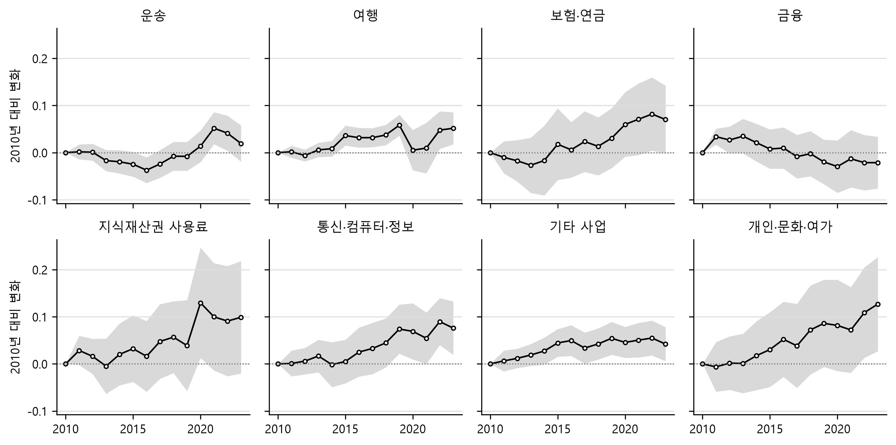

# 디지털 서비스 교역에서 거리의 효과는 약해졌는가

Has the Distance Effect Weakened in Digital Services Trade? Evidence from Reported Bilateral Flows

작성일: 2026-09-24

---

## 요약

통신 기술이 발달하면서 디지털 서비스의 교역은 거리의 제약을 덜 받게 되었을 것이라는 예상이 있다. 본 연구는 OECD-WTO BaTIS의 2010\~2023년 양자 서비스 교역 가운데 추정으로 채운 값을 빼고 상대국별 보고치가 있는 교역만으로 EBOPS 2010 대분류 여덟 범주의 중력식을 PPML로 추정했다. 결과는 셋이다. 첫째, 먼 나라일수록 교역이 적어지는 정도, 곧 거리의 효과는 서비스 교역 전반에서 조금씩 줄어들고 있으나 디지털 서비스에서 더 빨리 줄어들지는 않았다. 통신 기술의 발달이 디지털 서비스의 전달 비용을 낮추므로, 이들 서비스에서는 화물이나 사람이 직접 이동해야 하는 운송과 여행보다 거리의 효과가 더 빨리 줄어들 것으로 예상할 수 있다. 그러나 통신·컴퓨터·정보를 포함한 어느 디지털 범주도 이 두 범주보다 유의하게 빨리 줄지 않았다. 유의한 차이는 오히려 예상과 반대 방향으로 나타났는데, 디지털 서비스인 금융에서는 운송, 여행과 달리 거리의 효과가 줄지 않았다. 이는 1992\~2006년 서비스 교역에서 거리의 효과가 줄고 있음을 보인 Head et al. (2009)와 방향은 같지만, 줄어드는 속도는 훨씬 느리고 금융에서는 그들과 달리 줄지 않았다. 둘째, 디지털 서비스라고 해서 거리의 영향을 덜 받는 것도 아니다. 디지털 서비스의 여섯 범주 모두 여행보다는 거리의 영향을 덜 받는다. 운송과 비교하면 유의하게 덜 받는 것은 지식재산권 사용료뿐이고, 통신·컴퓨터·정보와 개인·문화·여가는 오히려 거리가 멀수록 교역이 더 크게 줄어든다. 셋째, 추정으로 채운 값까지 표본에 넣으면 결과가 범주에 따라 달라진다. 디지털 서비스 가운데 보험·연금에서는 거리의 효과가 줄어드는 추세가 유의하지 않게 된다. BaTIS가 보고치 없는 교역을 채울 때 쓴 중력모형은 거리의 효과가 해마다 같다고 가정하므로, 채운 값을 섞으면 이런 변화가 희석될 수 있다.

---

## I. 서론

거리가 교역을 줄인다는 관계는 국제경제학에서 가장 안정적으로 재현되는 실증 결과 가운데 하나다. Disdier and Head (2008)는 103편의 논문에서 추정된 1,467개의 거리 효과를 종합해, 상품 교역에서 거리의 부정적 효과가 20세기 중반에 커진 뒤 그 수준에서 줄지 않았음을 보였다. 운송비가 크게 낮아진 기간에도 거리의 효과가 남아 있다는 이 결과는 거리가 운송비만이 아니라 정보, 신뢰, 선호의 차이를 함께 반영한다는 해석으로 이어졌다. Blum and Goldfarb (2006)는 운송비가 없는 디지털 재화에서도 이 관계가 성립한다는 것을 보였는데, 미국 이용자가 음악, 게임처럼 취향에 좌우되는 디지털 재화를 제공하는 해외 웹사이트를 방문하는 빈도는 언어와 소득을 통제한 뒤에도 거리가 멀수록 낮았다.

서비스 교역은 이 질문을 다른 조건에서 던질 수 있게 한다. 서비스의 상당 부분은 국경을 넘는 물리적 이동 없이 통신망으로 전달되므로, 상품의 거리 효과를 설명하던 운송비의 몫이 작다. 통신 기술의 발달로 원격 공급 비용이 낮아진다면 그 효과는 디지털 전달 가능 서비스(이하 디지털 서비스)에서 먼저, 그리고 크게 나타나야 한다. Kimura and Lee (2006)는 OECD 10개국의 1999\~2000년 자료에서 서비스 교역이 상품 교역보다 중력식으로 더 잘 설명된다는 결과를 얻었다. Head et al. (2009)는 유로스탯의 1992\~2006년 양자 서비스 교역에 중력식을 추정해, 운송, 여행, 정부 서비스를 뺀 기타 상업서비스의 거리 효과가 1992년에는 상품보다 컸으나 상품보다 빠르게 줄었다고 보고했다. 이 연구는 기타 상업서비스를 금융, 컴퓨터·정보, 기타 사업 서비스로 나누어 추정했지만 운송과 여행을 따로 추정하지 않았으므로, 디지털 서비스를 운송이나 여행과 같은 조건에서 비교하지 않았다. 보고국도 EU 회원국을 중심으로 32개였다.

본 연구가 사용하는 OECD-WTO BaTIS는 200개가 넘는 경제의 서비스 교역을 EBOPS 2010 범주별 수출국×수입국 행렬로 제공하므로 이 비교에 필요한 범위를 갖춘다. 다만 이 자료로 거리의 효과를 추정할 때는 자료의 구성이 문제가 된다. BaTIS는 상대국별 보고치가 없는 교역을 주로 중력모형으로 채우며, 그 모형의 교역비용 변수는 거리, 국경 인접, 공용어, 식민 관계다(OECD and WTO, 2025b). 이렇게 채운 값을 종속변수에 포함하고 같은 변수로 중력식을 추정하면, 관측된 교역의 성질이 아니라 추정 모형에 들어간 관계를 다시 측정하게 된다. 추정 모형은 거리의 계수를 시간에 따라 바꾸지 않고 선형 시간 추세만 두므로, 거리 효과의 변화를 묻는 질문에서는 이 문제가 더 커진다.

본 연구의 기여는 이 문제를 자료 구성에서 통제한 데 있다. BaTIS는 관측마다 그 값이 보고치인지 추정값인지를 방법론 코드로 밝히므로, 수출국이나 수입국 가운데 한쪽이라도 상대국별로 보고한 교역만 골라낼 수 있다. 본 연구는 이렇게 고른 2010\~2023년의 보고 표본으로 세 가지를 검증한다. 첫째, 범주별 거리 탄력성의 수준에서 디지털 서비스가 운송과 여행보다 거리에 덜 민감한가. 둘째, 같은 수출국과 수입국 사이에서 거리 탄력성이 2010년 이후 약해졌는가. 셋째, 그 변화가 디지털 서비스에서 비교 범주보다 빠른가. 마지막으로 같은 식을 추정으로 채운 값까지 포함한 전체 표본에 적용해 자료 선택이 결론을 얼마나 바꾸는지를 제시한다.

---

## II. 자료와 추정

### 1. 보고 표본

교역 자료는 OECD-WTO BaTIS 2025년 12월판의 균형치다(OECD and WTO, 2025a). 균형치는 수출국의 보고와 수입국의 거울상 보고를 화해시킨 값이며 개별 경제 사이에서는 수출과 거울상 수입이 일치한다. 범주는 EBOPS 2010 대분류 가운데 여덟이다. 운송과 여행을 비교 범주로 두고, 보험·연금, 금융, 지식재산권 사용료, 통신·컴퓨터·정보, 기타 사업, 개인·문화·여가 여섯을 디지털 서비스로 둔다. 이 구분은 IMF et al. (2023)의 디지털 전달 가능 서비스 정의를 대분류 수준에서 따른 것이며, 대분류 안에 디지털로 전달되지 않는 거래가 섞여 있다는 한계가 있다. 이 여섯은 국제수지 분류의 기타 상업서비스에서 건설을 뺀 것과 같다. 가공, 수리, 건설, 정부 서비스는 분석에서 뺀다.

각 관측은 경제 $i$에서 경제 $j$로의 범주별 연간 수출이다. 이하에서 수출국과 수입국의 순서쌍 $(i, j)$를 나라쌍이라 부르며, $(i, j)$와 $(j, i)$는 서로 다른 나라쌍이다. 홍콩, 마카오, 대만처럼 국가가 아닌 경제도 한 나라로 센다. 한 나라쌍은 범주와 연도마다 관측 하나를 가진다. $i$가 상대국 $j$로의 수출을 보고했거나 $j$가 상대국 $i$로부터의 수입을 보고한 관측을 모은 것을 보고 표본이라 부르고, 여기에 BaTIS가 중력모형으로 예측하거나 보고치를 보간해 채운 값까지 더한 것을 전체 표본이라 부른다. 보고 여부는 BaTIS의 방법론 코드로 판정하며, 코드가 `R_`로 시작하면 보고치다. 보고 표본의 값도 보고치가 아니라 균형치를 쓴다. 한쪽만 보고한 관측과 양쪽이 보고한 관측을 같은 계열로 다루기 위해서다. 집계 코드와 잔여 코드(Rest of the world)는 뺀다.

분석 기간은 2010\~2023년이다. 총서비스에서 보고 표본의 관측 수는 2009년 1,641개에서 2010년 7,481개로 한 해에 4.6배가 되는데, 2010년 보고치 행의 81.7%가 이 해부터 들어오는 유로스탯 국제서비스교역통계에서 나온다. 2010년 전후를 함께 쓰면 거리 계수의 변화에 표본의 급변이 섞이므로 2010년부터 시작한다. 2024년은 보고가 덜 들어와 관측이 2,658개로 2023년 10,987개의 4분의 1에 그치므로 분석에서 뺀다.

표 1은 분석 표본의 범주별 규모를 정리한 것이다. 첫째 열은 2010\~2023년 보고 표본의 관측 수이고, 둘째 열은 그 관측이 이루는 나라쌍의 수다. 셋째 열은 그 범주를 한 해라도 상대국별로 보고한 경제의 수다. 넷째 열은 보고 표본의 균형치가 전체 표본의 균형치 합계에서 차지하는 비중이고, 다섯째 열은 보고 표본 가운데 수출국과 수입국이 모두 보고한 관측의 비중이다.

**표 1. 범주별 보고 표본의 규모(2010\~2023년, 개)**

| 범주 | 관측 수 | 나라쌍 | 보고 경제 | (금액 비중) | (양쪽 보고 비중) |
|---|---:|---:|---:|---:|---:|
| 운송 | 53,780 | 5,975 | 58 | (71.7%) | (20.5%) |
| 여행 | 48,772 | 5,282 | 58 | (66.7%) | (19.8%) |
| 보험·연금 | 42,128 | 4,271 | 51 | (74.6%) | (26.3%) |
| 금융 | 44,963 | 4,543 | 55 | (85.5%) | (27.9%) |
| 지식재산권 사용료 | 40,463 | 4,212 | 56 | (86.2%) | (26.5%) |
| 통신·컴퓨터·정보 | 47,597 | 5,325 | 58 | (77.0%) | (20.1%) |
| 기타 사업 | 49,873 | 5,513 | 58 | (76.7%) | (20.1%) |
| 개인·문화·여가 | 39,207 | 4,491 | 55 | (65.3%) | (19.8%) |

주: 금액 비중의 분모는 같은 범주, 같은 기간에 전체 표본의 균형치 합계다. 전체 표본은 개별 경제 사이의 교역이며 코소보와 공용어 변수가 없는 관측을 뺀 것이다. 양쪽 보고 비중의 분모는 보고 표본의 관측 수다.\
자료: OECD-WTO BaTIS 2025년 12월판에서 계산.

표에서 보듯이 관측은 범주마다 약 4만\~5만 개이고, 여덟 범주를 합친 전체 표본 관측 수의 8.5%다. 그러나 금액으로는 74.7%를 차지하는데, 큰 교역은 대부분 보고되고 추정으로 채운 값은 대체로 금액이 작기 때문이다. 금액 비중은 금융과 지식재산권 사용료에서 85% 이상으로 가장 높고, 비교 범주인 여행과 운송에서는 각각 66.7%, 71.7%다. 상대국별로 보고하는 경제는 51\~58개이고 그 가운데 26\~27개가 EU 회원국이다. 중국과 인도는 상대국별로 보고하지 않으므로 이 두 나라의 교역은 상대국이 보고한 경우에만 표본에 들어온다. 본 연구의 결과는 보고하는 경제가 한쪽에라도 포함된 교역에 대한 것이다.

### 2. 거리와 통제변수

거리와 통제변수는 CEPII Gravity V202211에서 가져온다(Conte et al., 2022). 거리는 두 나라 안의 도시 간 거리를 인구로 가중한 조화평균 거리이고, 통제변수는 국경 인접, 공용어(공식 언어 기준), 식민 관계(한 번이라도 식민 관계였는지)다. 이 넷은 BaTIS가 보고치 없는 교역을 추정할 때 쓴 교역비용 변수와 같다. 본 연구가 추정으로 채운 값을 분석에서 빼는 직접적인 이유가 여기에 있다.

두 자료의 경제 코드는 ISO 3자리 코드로 맞춘다. BaTIS의 개별 경제 202개 가운데 코소보만 Gravity에 없어 뺀다. 코소보가 포함된 관측은 범주에 따라 관측 수의 0.2\~1.3%이고 금액으로는 0.1%에 못 미친다. 거리와 통제변수는 시간에 따라 변하지 않으므로 2010\~2021년 가운데 두 나라가 모두 존재한 가장 늦은 해의 값을 두 나라 사이에 하나 붙이고, Gravity가 끝나는 2021년 이후의 관측에도 같은 값을 쓴다. Gravity는 중국과 홍콩, 중국과 대만 사이의 식민 관계를 비워 두었는데, 두 방향씩 네 나라쌍이 보고 표본 금액의 2.17%를 차지하므로 빼지 않고 0으로 채운다. 공용어가 비어 있는 퀴라소와 신트마르턴의 관측 260개는 뺀다. 그 금액은 보고 표본 전체의 0.001%에 못 미친다.

### 3. 추정식

범주 $k$의 거리 탄력성은 다음 식으로 추정한다.

$$X_{ijt}^{k} = \exp\left(\beta^{k} \ln D_{ij} + \gamma^{k\prime} Z_{ij} + \alpha_{it}^{k} + \mu_{jt}^{k}\right) \varepsilon_{ijt}^{k} \quad (1)$$

$X_{ijt}^{k}$는 $t$년 $i$에서 $j$로의 범주 $k$ 수출이고, $D_{ij}$는 거리, $Z_{ij}$는 국경 인접, 공용어, 식민 관계다. $\alpha_{it}^{k}$와 $\mu_{jt}^{k}$는 수출국×연도와 수입국×연도 고정효과로, 각국의 경제 규모와 모든 상대국과의 교역비용을 함께 반영하는 다자간 저항항을 흡수한다. 추정은 PPML로 한다(Santos Silva and Tenreyro, 2006). 로그 선형화에 따른 편의가 없고 0인 관측을 버리지 않는다. 표준오차는 나라쌍으로 군집한다.

거리 탄력성의 변화는 나라쌍 고정효과 $\eta_{ij}^{k}$를 더한 두 식으로 추정한다.

$$X_{ijt}^{k} = \exp\left(\sum_{s=2011}^{2023} \delta_{s}^{k} \ln D_{ij} \cdot \mathbf{1}[t = s] + \alpha_{it}^{k} + \mu_{jt}^{k} + \eta_{ij}^{k}\right) \varepsilon_{ijt}^{k} \quad (2)$$

$$X_{ijt}^{k} = \exp\left(\theta^{k} \ln D_{ij} \cdot (t - 2010) + \alpha_{it}^{k} + \mu_{jt}^{k} + \eta_{ij}^{k}\right) \varepsilon_{ijt}^{k} \quad (3)$$

나라쌍 고정효과는 거리의 수준과 시간 불변 통제변수를 모두 흡수하므로, 식 (2)의 $\delta_{s}^{k}$는 $s$년의 거리 탄력성이 2010년에 비해 얼마나 달라졌는지를 같은 수출국과 수입국 사이의 변화로 측정한다. 관측되는 나라쌍이 해마다 달라도 그 구성의 변화가 계수에 들어가지 않는다는 점이 고정효과를 넣지 않은 연도별 추정과 다르다. 거리 탄력성은 음수이므로 $\delta_{s}^{k}$가 양수이면 거리의 효과가 약해졌다는 뜻이다. 식 (3)의 $\theta^{k}$는 이 변화를 연간 선형 추세 하나로 요약한 것이다.

두 식이 측정하는 것은 국제 교역 안에서 가까운 상대와 먼 상대 사이의 교역 차이가 어떻게 변했는가다. Yotov (2012)가 보였듯이 국내 교역을 함께 넣지 않은 중력식은 국제 교역 전체가 국내 교역에 비해 늘었는지를 식별하지 못하며, 그 몫은 수출국×연도와 수입국×연도 고정효과에 흡수된다. BaTIS에는 국내 교역이 없으므로 본 연구의 추정은 이 상대적 변화에 한정된다. 고정효과를 세 겹으로 넣은 PPML은 Correia et al. (2020)의 알고리즘을 옮긴 pyfixest로 추정했다.

---

## III. 분석 결과

### 1. 범주별 거리 탄력성

표 2는 식 (1)을 범주별로 2010\~2023년 합동 추정한 결과다. 첫째와 둘째 열은 보고 표본의 거리 탄력성 $\beta^{k}$와 그 표준오차이고, 셋째와 넷째 열은 전체 표본으로 같은 식을 추정한 결과다. 나머지 세 열은 보고 표본 추정의 통제변수 계수다. 전체 표본 열은 IV장에서 다루고 이 절은 보고 표본 열을 읽는다.

**표 2. 범주별 거리 탄력성(식 (1), 2010\~2023년 합동)**

| 범주 | 보고 표본 | 표준오차 | 전체 표본 | 표준오차 | 국경 인접 | 공용어 | 식민 관계 |
|---|---:|---:|---:|---:|---:|---:|---:|
| 운송 | -0.591 | 0.023 | -0.591 | 0.019 | 0.244 | 0.135 | 0.153 |
| 여행 | -0.847 | 0.031 | -0.803 | 0.022 | 0.409 | 0.464 | 0.220 |
| 보험·연금 | -0.682 | 0.056 | -0.711 | 0.059 | -0.052 | 0.406 | -0.345 |
| 금융 | -0.582 | 0.055 | -0.504 | 0.044 | 0.150 | 0.394 | -0.244 |
| 지식재산권 사용료 | -0.404 | 0.075 | -0.315 | 0.082 | -0.167 | 0.062 | -0.474 |
| 통신·컴퓨터·정보 | -0.681 | 0.029 | -0.638 | 0.025 | -0.050 | 0.161 | -0.300 |
| 기타 사업 | -0.539 | 0.026 | -0.512 | 0.025 | 0.050 | 0.477 | -0.315 |
| 개인·문화·여가 | -0.708 | 0.041 | -0.589 | 0.028 | 0.164 | 0.479 | 0.149 |

주: PPML 추정치이며 수출국×연도와 수입국×연도 고정효과를 넣었다. 표준오차는 나라쌍 군집이다. 거리는 인구 가중 조화평균 거리의 로그다. 통제변수 계수의 표준오차는 재현 노트북 §3에 있다.\
자료: OECD-WTO BaTIS 2025년 12월판과 CEPII Gravity V202211에서 계산.

표에서 모든 범주의 거리 탄력성은 음수이고 1% 수준에서 유의하다. 여행이 -0.847로 가장 크다. 여행 서비스는 소비자가 공급국으로 이동해야 소비되므로 이 결과는 거리의 효과에 사람의 이동 비용이 포함된다는 해석과 일치한다. 가장 작은 범주는 지식재산권 사용료(-0.404)이고 기타 사업(-0.539), 금융(-0.582)이 그다음이며, 이 세 범주의 추정치는 운송(-0.591)보다 작다.

표의 추정치는 범주별로 따로 구한 것이고, 같은 나라쌍이 여러 범주에 함께 나오므로 두 범주의 추정치는 독립이 아니다. 두 추정치의 차이가 유의한지는 디지털 범주 하나와 비교 범주 하나를 쌓아 검정했다. 고정효과와 통제변수를 모두 범주와 교차시킨 채 로그 거리에 디지털 범주 더미를 곱한 항을 더하면, 그 계수는 디지털 범주의 거리 탄력성에서 비교 범주의 거리 탄력성을 뺀 값이고, 양수이면 디지털 범주가 거리에 덜 민감하다는 뜻이다. 표준오차는 범주를 구분하지 않고 군집한다. 여행과 비교하면 여섯 디지털 범주가 모두 1% 수준에서 유의하게 거리에 덜 민감하며 차이는 0.139\~0.443이다. 운송과 비교하면 결과가 범주에 따라 다르다. 지식재산권 사용료의 차이는 0.188로 5% 수준에서 유의하고, 기타 사업의 차이 0.053은 10% 수준에서만 유의하며, 금융의 차이 0.009는 유의하지 않다($p$값 0.873). 금융과 운송의 거리 탄력성은 구분되지 않는다.

디지털 서비스가 모두 운송보다 거리에 덜 민감하지는 않다. 통신·컴퓨터·정보(-0.681)는 운송과의 차이가 -0.089로 1% 수준에서 유의하게 거리에 더 민감하고, 개인·문화·여가(-0.708)도 차이가 -0.117로 1% 수준에서 유의하다. 보험·연금(-0.682)의 차이 -0.091은 10% 수준에서 유의하지 않다($p$값 0.107). 원격 공급이 가장 쉬울 것으로 보이는 통신·컴퓨터·정보에서 거리의 효과가 운송보다 크게 추정된다는 점은 이 범주의 거리 효과가 전달 비용보다 다른 요인, 예컨대 거래 상대에 대한 정보와 규제 환경의 유사성을 반영할 가능성을 시사한다. 본 연구는 이 요인을 분리하지 않았다. 거리를 대표 도시 간 거리나 수도 간 거리로 바꾸어도 탄력성은 여행이 가장 크고 지식재산권 사용료가 가장 작으며, 통신·컴퓨터·정보(-0.653, -0.663)가 운송(-0.564, -0.583)보다 크다는 관계는 유지된다.

통제변수 가운데 공용어는 여덟 범주 모두에서 양수이며 여행, 기타 사업, 개인·문화·여가에서 0.46 이상이다. 식민 관계는 비교 범주와 개인·문화·여가에서 양수이고 금융, 지식재산권 사용료, 통신·컴퓨터·정보, 기타 사업에서는 5% 수준에서 유의한 음수다. 거리와 공용어를 통제한 뒤의 조건부 계수이므로 이 부호를 식민 관계의 효과로 해석하지 않는다.

### 2. 거리 탄력성의 변화

그림 1은 식 (2)의 연도별 계수 $\delta_{s}^{k}$를 범주별로 그린 것이다. 가로축은 연도, 세로축은 2010년 대비 거리 탄력성의 변화이고, 점선은 2010년 수준(0), 회색 띠는 95% 신뢰구간이다. 양수는 거리의 효과가 2010년보다 약해졌다는 뜻이다. 모든 범주가 같은 세로축을 쓴다.

**그림 1. 연도별 거리 탄력성의 변화(식 (2), 2010년 대비)**

주: 나라쌍 고정효과를 넣은 PPML의 로그 거리×연도 계수다.\
자료: OECD-WTO BaTIS 2025년 12월판과 CEPII Gravity V202211에서 계산.

그림에서 금융을 제외한 일곱 범주의 계수는 2023년에 0보다 크다. 변화의 시점과 형태는 범주마다 다르다. 통신·컴퓨터·정보와 개인·문화·여가는 2015년 무렵부터 대체로 해마다 계수가 커졌으며, 통신·컴퓨터·정보는 2019년에 이미 0.074에 이르렀다. 이 범주의 변화는 코로나 기간의 원격 전환 이전에 시작되었다. 운송은 2016년까지 오히려 거리의 효과가 강해져(-0.037) 2021년에 0.052로 올랐다가 2023년에 0.019로 돌아왔다. BaTIS의 값은 명목 금액이므로 2021년의 상승에는 이 시기 장거리 해상 운임의 급등이 가격으로 반영되었을 가능성이 있다. 여행은 2019년 0.058에서 2020년 0.005로 내려가 코로나 첫해에 먼 곳으로의 여행이 가까운 곳보다 더 크게 줄었음을 보이고, 2022년 이후 이전 수준으로 돌아왔다. 금융은 2011\~2013년에 양수였다가 이후 내려가 2020년에 -0.030이 되었다.

표 3은 식 (3)의 연간 추세 $\theta^{k}$다. 첫째와 둘째 열은 보고 표본의 추정치와 표준오차이고, 셋째 열은 그 값에 13을 곱한 2010\~2023년의 누적 변화다. 넷째와 다섯째 열은 같은 식을 전체 표본에 적용한 결과로 IV장에서 다룬다.

**표 3. 거리 탄력성의 연간 추세(식 (3))**

| 범주 | 보고 표본 | 표준오차 | 13년 누적 | 전체 표본 | 표준오차 |
|---|---:|---:|---:|---:|---:|
| 운송 | 0.0040 | 0.0014 | 0.052 | 0.0029 | 0.0010 |
| 여행 | 0.0042 | 0.0015 | 0.054 | 0.0035 | 0.0009 |
| 보험·연금 | 0.0084 | 0.0032 | 0.109 | 0.0023 | 0.0035 |
| 금융 | -0.0044 | 0.0025 | -0.057 | -0.0017 | 0.0020 |
| 지식재산권 사용료 | 0.0089 | 0.0053 | 0.116 | 0.0083 | 0.0047 |
| 통신·컴퓨터·정보 | 0.0075 | 0.0023 | 0.098 | 0.0058 | 0.0020 |
| 기타 사업 | 0.0032 | 0.0015 | 0.042 | 0.0032 | 0.0013 |
| 개인·문화·여가 | 0.0103 | 0.0039 | 0.133 | 0.0109 | 0.0030 |

주: 나라쌍 고정효과를 넣은 PPML의 로그 거리×(연도-2010) 계수다. 양수는 거리의 효과가 약해졌다는 뜻이다. 표준오차는 나라쌍 군집이다.\
자료: OECD-WTO BaTIS 2025년 12월판과 CEPII Gravity V202211에서 계산.

표의 첫째 열에서 추세는 여섯 범주에서 5% 수준에서 유의한 양수다. 비교 범주인 운송(0.0040)과 여행(0.0042)도 유의하게 양수이므로, 거리 효과의 약화는 디지털 서비스에 한정된 현상이 아니다. 13년 누적으로 운송과 여행의 거리 탄력성은 약 0.05 약해졌고, 이는 표 2의 수준 -0.591과 -0.847에 비해 각각 9%와 6%다. 통신·컴퓨터·정보(0.0075), 보험·연금(0.0084), 개인·문화·여가(0.0103)의 추세는 비교 범주의 두 배 안팎이며 13년 누적으로 0.10\~0.13이다. 지식재산권 사용료는 추정치가 0.0089로 크지만 표준오차도 커서 10% 수준에서만 유의하다. 금융은 유일하게 음수(-0.0044)이며 10% 수준에서 유의하다.

Head et al. (2009)가 1992\~2006년에 대해 보고한 서비스 교역의 거리 효과 감소는 2010\~2023년에도 금융을 제외한 범주에서 확인된다. 그들의 범주별 추정에서도 금융의 연간 추세(0.035)가 컴퓨터·정보(0.058)보다 작았으나 5% 수준에서 유의한 양수였고, 본 연구에서는 음수다. 감소의 속도는 본 연구에서 훨씬 느리다. 그들의 컴퓨터·정보 추세는 1992년 거리 탄력성 -1.882의 3.1%인 반면, 본 연구의 통신·컴퓨터·정보 추세는 표 2의 수준 -0.681의 1.1%다. 두 연구는 추정량(로그 선형 OLS와 PPML), 시간대 차이 변수의 포함 여부, 나라쌍 고정효과의 유무, 범주의 범위(그들의 컴퓨터·정보는 통신을 포함하지 않는다)가 다르며, 본 연구는 속도의 차이가 이 가운데 어디에서 오는지를 분해하지 않았다.

### 3. 표본 구성의 강건성

나라쌍 고정효과는 관측되는 나라쌍의 구성이 해마다 바뀌는 문제를 계수의 수준에서 통제하지만, 짧게 관측된 나라쌍의 연도 안 변화가 추세에 들어가는 것까지 막지는 않는다. 표 4는 식 (3)을 다섯 가지 부분 표본에 다시 추정한 결과다. 첫째 열은 표 3의 기준 추정치다. 둘째에서 넷째 열은 각각 2011년까지 처음 관측된, 14년 가운데 10년 이상 관측된, 14년 모두 관측된 나라쌍만 쓴다. 다섯째 열은 중국, 홍콩, 마카오, 대만 사이의 교역을 빼고, 여섯째 열은 두 나라가 모두 EU 27개국인 교역을 뺀다. 다섯째 열은 금액이 크고 거리가 짧은 소수의 나라쌍이 금액 가중 추정량인 PPML의 결과를 좌우하는지를, 여섯째 열은 보고국의 절반가량을 차지하는 EU 안의 교역이 결과를 좌우하는지를 확인한다.

**표 4. 부분 표본별 거리 탄력성의 연간 추세(식 (3))**

| 범주 | 기준 | 2011년까지 진입 | 10년 이상 | 14년 모두 | 중화권 제외 | EU 역내 제외 |
|---|---:|---:|---:|---:|---:|---:|
| 운송 | 0.0040 | 0.0034 | 0.0038 | 0.0054 | 0.0046 | 0.0058 |
| 여행 | 0.0042 | 0.0040 | 0.0038 | 0.0049 | 0.0038 | 0.0051 |
| 보험·연금 | 0.0084 | 0.0073 | 0.0082 | 0.0063 | 0.0084 | 0.0078 |
| 금융 | -0.0044 | -0.0044 | -0.0045 | -0.0041 | -0.0026 | -0.0030 |
| 지식재산권 사용료 | 0.0089 | 0.0083 | 0.0081 | 0.0078 | 0.0090 | 0.0057 |
| 통신·컴퓨터·정보 | 0.0075 | 0.0073 | 0.0072 | 0.0026 | 0.0080 | 0.0066 |
| 기타 사업 | 0.0032 | 0.0027 | 0.0026 | 0.0007 | 0.0029 | 0.0055 |
| 개인·문화·여가 | 0.0103 | 0.0094 | 0.0089 | 0.0007 | 0.0095 | 0.0133 |

주: 각 열의 표준오차와 표본의 나라쌍 수, 금액 비중은 재현 노트북 §6에 있다. 중화권 제외는 중국, 홍콩, 마카오, 대만 네 경제 사이의 교역을 뺀 것이다.\
자료: OECD-WTO BaTIS 2025년 12월판과 CEPII Gravity V202211에서 계산.

표에서 2011년까지 진입했거나 10년 이상 관측된 나라쌍으로 표본을 좁혀도 추정치는 기준과 거의 같다. 통신·컴퓨터·정보는 0.0073과 0.0072로 모두 1% 수준에서 유의하다. 따라서 이 범주의 추세가 분석 기간 중에 새로 보고되기 시작한 나라쌍에서 나온 것은 아니다. 중화권 안의 교역을 빼면 금융의 추세가 -0.0044에서 -0.0026으로 줄어 유의성을 잃고, 운송은 0.0040에서 0.0046으로 커진다. 두 범주에서 중화권 안의 큰 교역이 추정치를 움직이지만 방향은 바뀌지 않는다. EU 역내 교역을 빼면 개인·문화·여가(0.0133)와 기타 사업(0.0055)의 추세가 커지고 지식재산권 사용료(0.0057)는 작아진다.

14년 모두 관측된 나라쌍만 쓰면 결과가 달라진다. 통신·컴퓨터·정보의 추세는 0.0026, 기타 사업과 개인·문화·여가는 0.0007로 줄어 모두 유의하지 않고, 운송과 여행은 0.0054와 0.0049로 유의하게 남는다. 이 부분 표본은 통신·컴퓨터·정보에서 825개 나라쌍, 보고 표본 금액의 52.1%이며, 양쪽이 모두 EU인 관측의 비중이 31.9%로 보고 표본 전체의 18.4%보다 높고, 거리의 중앙값이 3,260km로 전체의 5,266km보다 짧다. 10년 이상 관측된 표본에서는 추세가 유지되므로, 결과를 가른 것은 한두 해의 결측을 허용하는가이다. 본 연구는 이 부분 표본이 유럽 안의 짧은 거리 교역으로 치우쳐 있다는 점을 확인했으나, 이 표본에서 통신·컴퓨터·정보의 추세가 사라지는 이유를 분리하지는 못했다.

### 4. 범주 간 차이

III.2절의 추세도 범주별로 따로 추정한 것이므로 두 범주의 추정치 차이가 유의한지는 알려 주지 않는다. 표 5는 III.1절에서 수준의 차이를 검정한 것과 같이 디지털 범주 하나와 비교 범주 하나를 쌓고 모든 고정효과를 범주와 교차시킨 채, 식 (3)의 추세 항에 디지털 범주 더미를 곱한 항을 더해 추정한 결과다. 그 계수는 디지털 범주의 추세에서 비교 범주의 추세를 뺀 값이고, 표준오차는 범주를 구분하지 않고 군집한다. 첫 세 열은 운송, 뒤 세 열은 여행과 비교한 것이다.

<!-- Word 변환 지침 (표 5):
- 헤더 2행 구조.
  · 1행: [범주 (1~2행 rowspan=2 병합)] [운송 대비 (2~4열 colspan=3)] [여행 대비 (5~7열 colspan=3)]
  · 2행: [ (범주 셀과 rowspan=2 병합) ] [차이][표준오차][p값] [차이][표준오차][p값]
- 마크다운의 "운송 대비 차이" 등은 1행의 "운송 대비"와 2행의 "차이"로 나눠 넣는다.
- 병합 셀은 세로·가로 가운데 정렬.
- 숫자 열은 우측 정렬, 소수 자릿수 현행 유지.
-->

**표 5. 디지털 범주와 비교 범주의 추세 차이(식 (3)을 두 범주로 쌓은 추정)**

| 범주 | 운송 대비 차이 | 운송 대비 표준오차 | 운송 대비 $p$값 | 여행 대비 차이 | 여행 대비 표준오차 | 여행 대비 $p$값 |
|---|---:|---:|---:|---:|---:|---:|
| 보험·연금 | 0.0043 | 0.0034 | 0.203 | 0.0042 | 0.0035 | 0.232 |
| 금융 | -0.0084 | 0.0026 | 0.001 | -0.0085 | 0.0028 | 0.002 |
| 지식재산권 사용료 | 0.0049 | 0.0054 | 0.368 | 0.0047 | 0.0056 | 0.394 |
| 통신·컴퓨터·정보 | 0.0035 | 0.0027 | 0.188 | 0.0034 | 0.0027 | 0.207 |
| 기타 사업 | -0.0008 | 0.0018 | 0.676 | -0.0009 | 0.0020 | 0.656 |
| 개인·문화·여가 | 0.0063 | 0.0042 | 0.139 | 0.0061 | 0.0040 | 0.127 |

주: 양수는 디지털 범주의 거리 효과가 비교 범주보다 빠르게 약해졌다는 뜻이다. 보고 표본만 쓴다.\
자료: OECD-WTO BaTIS 2025년 12월판과 CEPII Gravity V202211에서 계산.

표에서 여섯 디지털 범주 가운데 네 범주의 차이는 양수이지만 어느 것도 10% 수준에서 유의하지 않다. 통신·컴퓨터·정보의 차이는 운송 대비 0.0035, $p$값 0.188이고, 차이가 가장 큰 개인·문화·여가도 0.0063, $p$값 0.139다. 유의한 차이는 금융 하나로, 운송 대비 -0.0084, 여행 대비 -0.0085이며 $p$값이 모두 0.01 미만이다. 운송과 여행의 거리 효과가 약해지는 동안 금융의 거리 효과는 약해지지 않았다는 뜻이다. 두 비교 범주의 추세가 0.0040과 0.0042로 거의 같으므로 운송 대비 결과와 여행 대비 결과도 거의 같다.

---

## IV. 추정으로 채운 값이 결과에 미치는 영향

BaTIS가 추정으로 채운 값은 대부분 PPML로 적합한 중력모형의 예측값이고, 나머지는 앞뒤 연도의 보고치를 보간하거나 연장한 값이다. 그 모형은 두 나라의 명목 GDP와 거리, 국경 인접, 공용어, 식민 관계, 상품 교역, 관광객 수, 각국의 대세계 서비스 교역, 보고국의 1인당 GDP, 선형 시간 추세, 상대국 고정효과를 설명변수로 쓰고, 정책 변수는 의도적으로 넣지 않았다(OECD and WTO, 2025b). 거리의 계수는 한 모형 안에서 시간에 따라 변하지 않는다. 따라서 중력모형으로 채운 값에서 거리에 따른 교역의 차이는 모형이 적합한 계수를 따르고, 해마다 달라지지 않는다는 모형의 가정을 그대로 가진다. 전체 표본의 추정치는 보고 표본과 채운 값의 금액 가중 혼합이 된다.

표 2의 전체 표본 열에서 거리 탄력성은 여덟 범주 가운데 여섯에서 보고 표본보다 절댓값이 작다. 차이는 개인·문화·여가(-0.708에서 -0.589), 지식재산권 사용료(-0.404에서 -0.315), 금융(-0.582에서 -0.504)에서 크고, 운송은 두 추정치가 -0.591로 같다. 보험·연금은 반대로 -0.682에서 -0.711로 커진다. 채운 값의 금액 비중은 범주에 따라 14\~35%로 크지 않지만, 개인·문화·여가처럼 보고 표본의 금액 비중이 65.3%로 낮은 범주에서는 수준 추정치가 표준오차의 세 배 가까이 움직인다.

표 3의 전체 표본 열에서 추세는 운송(0.0040에서 0.0029), 통신·컴퓨터·정보(0.0075에서 0.0058), 여행(0.0042에서 0.0035)에서 보고 표본보다 작고, 보험·연금은 0.0084에서 0.0023으로 줄어 유의성을 잃는다. 이 방향은 시간 불변 계수로 채운 값이 섞여 추세가 0 쪽으로 끌려간다는 예상과 일치한다. 개인·문화·여가(0.0109)와 기타 사업(0.0032)에서는 두 추정치가 거의 같다. 전체 표본을 쓴 분석은 보험·연금의 거리 효과가 약해지지 않았다고 결론 내리게 되고, 보고 표본을 쓴 분석은 그 범주의 추세가 통신·컴퓨터·정보보다 크다고 결론 내린다. 방법론 코드로 보고 표본을 골라내는 절차가 결론에 영향을 주는 범주가 있다는 뜻이다.

---

## V. 결론

본 연구는 BaTIS의 양자 서비스 교역 가운데 상대국별 보고치가 있는 교역만으로 2010\~2023년 범주별 거리 탄력성의 수준과 변화를 추정했다. 결과는 셋이다. 첫째, 디지털 서비스가 비교 범주보다 일관되게 거리에 덜 민감하지는 않다. 여섯 범주는 모두 여행보다 유의하게 거리에 덜 민감하지만, 운송과 비교하면 5% 수준에서 유의하게 덜 민감한 것은 지식재산권 사용료뿐이고 통신·컴퓨터·정보와 개인·문화·여가는 유의하게 더 민감하다. 둘째, 같은 수출국과 수입국 사이에서 거리의 효과는 금융을 제외한 일곱 범주에서 약해지는 방향으로 추정되었고, 그 가운데 5% 수준에서 유의한 여섯 범주에 운송과 여행이 포함된다. 통신·컴퓨터·정보의 약화는 코로나 이전에 시작되었고 새로 보고되기 시작한 나라쌍을 빼도 유지된다. 셋째, 디지털 범주의 추세를 비교 범주와 한 식에서 비교하면 어느 디지털 범주도 유의하게 빠르지 않고 금융만 유의하게 느리다.

이 결과는 디지털 서비스에서 거리가 특별히 빠르게 중요성을 잃고 있다는 예상을 지지하지 않는다. 거리의 효과가 약해지는 현상은 서비스 교역 전반에서 완만하게 나타나며, 통신·컴퓨터·정보와 개인·문화·여가의 추정치가 비교 범주의 두 배 안팎이라는 점은 표준오차 안에서 구분되지 않는다. 금융의 거리 효과가 유지되는 이유는 본 연구가 확인하지 못했다. 금융 서비스의 국경 간 공급이 규제와 감독 체계의 차이에 크게 영향받는다는 점이 한 가지 해석이지만, 이 가설을 검증하려면 양자 규제 지표를 결합해야 한다.

해석에는 네 가지 한계가 있다. 첫째, BaTIS에는 국내 교역이 없으므로 추정치는 국제 교역 안에서 가까운 상대와 먼 상대 사이의 상대적 변화이며, 국제 교역 전체가 국내 교역에 비해 늘었는지는 말하지 않는다. 둘째, 교역액이 명목 금액이므로 거리별로 가격이 다르게 움직인 경우 그 변화가 거리 탄력성의 변화로 측정된다. 2021년 운송의 변화가 그런 예일 수 있다. 셋째, 국제수지 통계는 해외 현지법인을 통한 공급을 포함하지 않으므로, 디지털 서비스 기업이 현지법인으로 공급하는 몫은 이 자료에 나타나지 않는다. 넷째, 상대국별로 보고하는 경제는 51\~58개이고 중국과 인도는 보고하지 않으며, 14년 모두 관측된 나라쌍에서 통신·컴퓨터·정보의 추세가 사라지는 이유를 분리하지 못했다.

본 연구의 비교는 대분류에 한정했다. 대분류 안의 세부 항목, 예컨대 컴퓨터 서비스와 통신 서비스를 구분하면 디지털 전달의 정도에 더 가까운 비교가 가능하지만, 세부 항목은 대분류보다 보고된 관측이 적고 보고국마다 세부 항목의 보고 여부가 다르다. 같은 설계를 세부 항목에 적용하면 통신·컴퓨터·정보 안에서 어느 서비스가 거리 효과의 약화를 주도하는지를 검증할 수 있다.

---

## 참고문헌

- Blum, B. S., and A. Goldfarb (2006), "Does the Internet Defy the Law of Gravity?" *Journal of International Economics* 70(2), 384–405.
- Conte, M., P. Cotterlaz, and T. Mayer (2022), "The CEPII Gravity Database," CEPII Working Paper 2022-05.
- Correia, S., P. Guimarães, and T. Zylkin (2020), "Fast Poisson Estimation with High-Dimensional Fixed Effects," *Stata Journal* 20(1), 95–115.
- Disdier, A.-C., and K. Head (2008), "The Puzzling Persistence of the Distance Effect on Bilateral Trade," *Review of Economics and Statistics* 90(1), 37–48.
- Head, K., T. Mayer, and J. Ries (2009), "How Remote Is the Offshoring Threat?" *European Economic Review* 53(4), 429–444.
- IMF, OECD, UNCTAD, and WTO (2023), *Handbook on Measuring Digital Trade*, Second Edition, International Monetary Fund, Organisation for Economic Co-operation and Development, United Nations Conference on Trade and Development, and World Trade Organization.
- Kimura, F., and H.-H. Lee (2006), "The Gravity Equation in International Trade in Services," *Review of World Economics* 142(1), 92–121.
- OECD and WTO (2025a), *The OECD-WTO Balanced Trade in Services Database (BaTIS)*, December 2025 edition, OECD Publishing.
- OECD and WTO (2025b), "The OECD-WTO Balanced Trade in Services Database (BaTIS)," methodology note, January 2025.
- Santos Silva, J. M. C., and S. Tenreyro (2006), "The Log of Gravity," *Review of Economics and Statistics* 88(4), 641–658.
- Yotov, Y. V. (2012), "A Simple Solution to the Distance Puzzle in International Trade," *Economics Letters* 117(3), 794–798.
