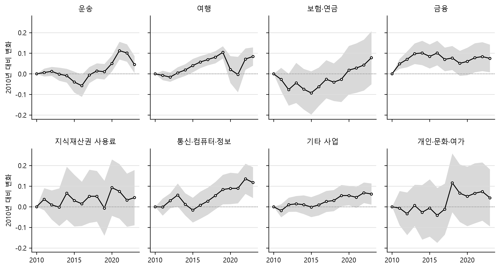

# 디지털 서비스 교역에서 거리의 효과는 약해졌는가

Has the Distance Effect Weakened in Digital Services Trade?

작성일: 2026-10-02

---

## 요약

디지털 서비스의 거리 탄력성에 대해서는 두 방향의 예상이 가능하다. 통신 기술이 발달하면서 디지털 서비스의 교역이 다른 서비스보다 빠르게 거리에 덜 민감해질 것이라는 예상과, 거리가 주로 정보, 신뢰, 제도의 차이를 반영하므로 디지털 서비스도 거리에 민감하고 그 정도가 빠르게 줄지 않을 것이라는 예상이다. 본 연구는 OECD-WTO BaTIS의 2010\~2023년 양자 서비스 교역 가운데 상대국별 보고치가 있는 교역만으로 EBOPS 2010의 8개 서비스 범주에 대한 중력식을 PPML로 추정하고, 디지털 서비스 6개 범주의 거리 탄력성을 운송, 여행과 비교했다. 그 결과 디지털 서비스 6개 범주 가운데 3개는 운송, 여행보다 거리에 덜 민감했지만 통신·컴퓨터·정보를 포함한 3개는 이들과 구분되지 않았다. 거리 탄력성은 8개 범주 모두에서 약해지는 방향이었다. 이 약화는 같은 범주 안에서 같은 수출국과 수입국 사이의 변화로 측정한 것이므로, 서비스 전체의 약화를 범주 구성의 변화로 설명한 선행연구와 달리 범주 안에서도 약화가 일어나고 있음을 보여 준다. 그러나 디지털 서비스는 6개 범주를 묶어 보아도, 범주별로 보아도 운송, 여행보다 빠르게 약해졌다는 증거가 없었다. 이 결과는 값, 표본, 통제변수를 바꾸어도 같았다. 종합하면 본 연구의 결과는 앞의 예상보다 뒤의 예상에 더 가깝다.

---

## I. 서론

지리적 거리가 교역을 줄인다는 관계는 국제경제학에서 가장 안정적으로 재현되는 실증 결과 가운데 하나다. Disdier and Head (2008)는 103편의 논문에서 추정된 1,467개의 거리 효과를 종합해, 상품 교역에서 거리의 부정적 효과가 20세기 중반에 커진 뒤 그 수준에서 줄지 않았음을 보였다. 운송비가 크게 낮아진 기간에도 거리의 효과가 남아 있다는 이 결과는 거리가 운송비만이 아니라 정보, 신뢰, 선호의 차이를 함께 반영한다는 해석으로 이어졌다.

서비스 교역은 거리가 운송비 말고 무엇을 반영하는가라는 물음을 상품 교역과 다른 조건에서 살펴볼 수 있게 한다. 서비스의 상당 부분은 국경을 넘는 물리적 이동 없이 통신망으로 전달되므로, 상품 교역에서 거리 탄력성(거리가 1% 멀어질 때 교역이 몇 % 줄어드는가)을 설명하던 운송비의 몫이 작다. 이처럼 원격으로 전달될 수 있는 서비스, 즉 디지털 전달 가능 서비스(digitally deliverable services, 이하 디지털 서비스)는 서비스 교역에서 차지하는 비중도 커지고 있다. OECD와 WTO가 작성하는 양자 서비스 교역의 BaTIS(Balanced Trade in Services) 통계(수출국과 수입국의 보고를 맞춘 균형치 기준)로 보면, 개별 경제 사이의 서비스 수출에서 디지털 서비스에 속하는 6개 범주가 차지하는 비중은 2010년 46.5%에서 2023년 54.7%로 높아졌고, 그 가운데 통신·컴퓨터·정보는 6.6%에서 10.7%가 되었다. 반면, 같은 기간 운송과 여행의 비중은 45.5%에서 38.3%로 낮아졌다.

디지털 서비스의 거리 탄력성에 대해서는 두 방향의 예상이 가능하다. 하나는 통신 기술의 발달로 원격 공급 비용이 낮아지면서 디지털 서비스의 거리 탄력성이 다른 서비스보다 더 크게 약화될 것이라는 예상이다. 다만 통신 기술이 거리 탄력성을 약화시키려면 시간대 차이나 대면 접촉의 필요처럼 거리가 멀수록 커지는 비용을 줄여야 한다(Head et al., 2009). 다른 하나는 거리가 주로 정보, 신뢰, 제도의 차이를 반영한다면 디지털 서비스도 화물이나 사람이 이동해야 하는 서비스만큼 거리에 민감하고, 전달 비용이 낮아져도 거리 탄력성이 빠르게 약해지지 않을 것이라는 예상이다. Blum and Goldfarb (2006)는 운송비가 없는 디지털 재화의 교역도 거리에 민감함을 보였는데, 미국 이용자가 음악, 게임처럼 취향에 좌우되는 디지털 재화를 제공하는 해외 웹사이트를 방문하는 빈도는 언어와 소득을 통제한 뒤에도 거리가 멀수록 낮았다. 어느 예상이 맞는가는 서비스 일자리의 해외 이전, 그리고 멀리 떨어진 나라의 서비스 수출 기회와도 이어진다. 디지털 서비스에서 거리 탄력성이 빠르게 약해진다면 먼 나라의 공급자도 원격으로 경쟁할 수 있게 되기 때문이다.

서비스 교역에서 거리 탄력성의 추세를 추정한 선행연구는 이 두 예상을 직접 비교하지 않았다. Head et al. (2009)는 1992\~2006년 Eurostat 자료에서 기타 상업서비스의 거리 탄력성이 상품보다 빠르게 약해졌음을 보였지만, 추정 대상에서 운송과 여행을 제외했다. 그래서 디지털 서비스의 거리 탄력성이 화물이나 사람이 직접 이동해야 하는 서비스보다 빠르게 약해졌는지는 보여 주지 않는다. Li et al. (2025)는 BaTIS의 보고치를 바탕으로 1985\~2023년의 서비스 교역 자료를 새로 구축하고 서비스 전체의 거리 탄력성이 약해졌음을 보인 뒤 그 대부분을 거리에 덜 민감한 범주의 비중 확대로 해석했다. 그들의 범주별 추정에서는 통신·컴퓨터·정보(-0.37)가 운송(-0.54)보다 거리에 덜 민감했다. 그러나 범주 안의 추세는 범주 비중을 고정한 반사실(counterfactual) 계산으로 간접적으로 보였고, 범주 사이의 차이는 검정하지 않았다.

본 연구의 목적은 디지털 서비스의 거리 탄력성을 화물이나 사람이 직접 이동해야 하는 운송과 여행(이하 비교 범주)과 비교해 위의 두 예상을 검증하는 것이다. 검증할 질문은 세 가지다. 첫째, 디지털 서비스는 비교 범주보다 거리에 덜 민감한가. 둘째, 거리 탄력성은 분석 기간인 2010\~2023년에 약해지는 추세를 보이는가. 셋째, 디지털 서비스의 거리 탄력성이 약해진다면, 그 추세는 비교 범주보다 빠른가. 자료는 BaTIS다. BaTIS는 200개가 넘는 경제의 서비스 교역을 EBOPS 2010 범주별 수출국×수입국 행렬로 제공하므로, 디지털 서비스와 비교 범주를 같은 경제들 사이에서 같은 기간에 비교할 수 있다.

다만 이 자료로 거리 탄력성을 추정할 때는 자료의 구성이 문제가 된다. BaTIS는 상대국별 보고치(각국이 교역 상대국마다 나누어 보고한 값)가 없는 교역을 주로 중력모형(gravity model)으로 채우며, 그 모형의 교역비용 변수는 거리, 국경 인접, 공용어, 식민 관계다(OECD and WTO, 2025b). 이렇게 채운 값을 종속변수에 포함하고 같은 변수로 중력식을 추정하면, 거리 탄력성 추정치에는 실제로 보고된 교역에서 나온 관계와 BaTIS의 추정 모형이 채운 값에 부여한 관계가 섞인다. 또한 BaTIS가 값을 채우는 데 쓴 중력모형은 거리 탄력성을 모든 연도에 같게 두므로, 채운 값이 섞일수록 추정한 거리 탄력성의 추세는 0 쪽으로 줄어든다. 본 연구는 이 문제를 표본 구성으로 통제한다. 즉, BaTIS는 관측마다 그 값이 보고치인지 추정값인지를 방법론 코드로 밝히므로, 수출국이 그 수입국으로의 수출을 보고했거나 수입국이 그 수출국으로부터의 수입을 보고한 교역만 골라내 그 보고치를 값으로 쓴다. 이것이 본 연구의 보고표본이다.

분석은 중력모형을 사용하며, 수출국×연도 및 수입국×연도의 고정효과(fixed effects)를 넣고 PPML(Poisson pseudo-maximum likelihood)로 추정한다. 거리 탄력성의 수준은 범주별로 2010\~2023년의 관측을 모두 한 식에 넣어 합동(pooled) 추정하고, 추세는 나라쌍 고정효과를 추가로 포함해 같은 수출국과 수입국 사이의 변화로 측정한다. 디지털 서비스와 비교 범주의 수준 차이와 추세 차이는 디지털 범주와 비교 범주의 관측만 골라낸 부분표본으로 검정한다. 같은 나라쌍이 여러 범주에 함께 나오므로 범주별 추정치는 서로 상관되는데, 한 식으로 추정하면 이 상관이 두 범주의 차이를 검정하는 표준오차에 반영된다. 추세 차이는 디지털 서비스 전체에 관한 질문이므로, 6개 디지털 범주를 하나로 묶은 추정으로도 검정한다. 결과의 강건성은 값을 균형치로 바꾸거나 거리의 정의, 통제변수, 표본을 바꾸어 확인한다.

---

## II. 가장 가까운 두 선행연구와의 비교

서론에서 소개한 연구 가운데 설계와 자료에서 본 연구와 가장 가까운 것은 Head et al. (2009)와 Li et al. (2025)다. 앞의 연구는 서비스 교역에서 거리 탄력성의 추세를 범주별로 추정한 초기 연구이고, 뒤의 연구는 BaTIS의 보고치를 바탕으로 서비스 교역의 거리 탄력성을 추정한 최근 연구다. 표 1은 두 선행연구와 본 연구의 설계를 항목별로 함께 제시한 것이다.

**표 1. 두 선행연구와 본 연구의 설계**

| 항목 | Head et al. (2009) | Li et al. (2025) | 본 연구 |
|---|---|---|---|
| 질문 | 기타 상업서비스의 거리 탄력성 추세와 해외 이전 | 서비스 전체 거리 탄력성의 약화와 구성 변화 | 디지털 서비스와 운송, 여행의 수준과 추세 차이 |
| 자료 | Eurostat 보고 자료 | BaTIS 보고치에 UNCTAD-WTO, Eurostat, UN Comtrade를 더한 자료 | BaTIS 보고치 |
| 기간 | 1992\~2006년 | 1985\~2023년(거리 탄력성은 2000년 이후) | 2010\~2023년 |
| 범주 | 총서비스, 기타 상업서비스, 금융, 컴퓨터·정보, 기타 사업 | 서비스 전체(범주별은 선택 연도만) | 운송, 여행과 디지털 서비스 6개 범주 |
| 추정량 | 로그 선형 OLS(연도별 PPML과 음이항 준최우 추정으로 강건성 확인) | PPML | PPML |
| 고정효과 | 수출국×연도, 수입국×연도 | 수출국, 수입국(연도별 추정) | 수출국×연도, 수입국×연도, 나라쌍 |
| 통제변수 | 공용어, 식민 관계, 법체계 공통 기원, 시간대 차이 | 국경 인접, 공용어, 법체계 공통 기원, 무역협정, EU 동반 가입 | 국경 인접, 공용어, 식민 관계(수준 추정) |
| 추세 측정 | 로그 거리×선형 추세 | 연도별 계수의 기간 평균 비교 | 로그 거리×연도 더미, 로그 거리×선형 추세 |
| 범주 간 차이 검정 | 없음 | 없음 | 디지털 범주별, 6개 디지털 범주 전체와 비교 범주(운송, 여행)의 수준과 추세 차이 |

자료: Head et al. (2009), Li et al. (2025)의 본문과 표에서 정리.

Head et al. (2009)는 Eurostat의 1992\~2006년 양자 서비스 교역에 중력식을 추정해, 운송, 여행, 정부 서비스를 뺀 기타 상업서비스의 거리 탄력성이 시간이 지나면서 상품보다 빠르게 약해졌다고 보고했다. 본 연구는 수출국×연도 및 수입국×연도의 고정효과와 로그 거리에 선형 시간 추세를 곱한 항이라는 설계를 그들과 같이 쓴다. 다른 점은 둘이다. 첫째, 그들이 다루지 않은 운송과 여행을 비교 범주로 두고 디지털 범주와의 차이를 검정한다. 둘째, 로그 선형 OLS 대신 PPML로 추정하고(Correia et al., 2020), 나라쌍 고정효과를 더해 보고되는 나라쌍의 구성 변화를 통제한다.

Li et al. (2025)는 BaTIS에서 추정값과 균형치를 빼고 보고치만 남긴 뒤, 보고치가 없는 교역을 다른 세 자료로 보충해 1985\~2023년의 서비스 교역 자료를 만들었다. 그리고 해마다 수출국과 수입국 고정효과를 넣은 PPML로 서비스 전체의 거리 탄력성이 약해진 것을 보인 뒤 그 대부분을 범주 구성의 변화로 해석했다. 본 연구는 BaTIS의 보고치로 PPML 중력식을 추정한다는 점에서 그들과 같다. 다른 점은 둘이다. 첫째, 그들은 해마다 따로 추정한 계수를 비교하므로 보고되는 나라쌍의 구성 변화가 계수의 변화에 섞일 수 있고, 범주 안의 추세는 범주 비중을 고정한 반사실 계산으로 간접적으로 보였다. 본 연구는 나라쌍 고정효과로 같은 범주 안에서 같은 수출국과 수입국 사이의 추세를 직접 추정한다. 둘째, 그들은 범주 사이의 차이를 검정하지 않았다.

---

## III. 자료와 추정

### 1. 보고표본

교역 자료는 OECD-WTO BaTIS 2025년 12월판(2005\~2024년)이다(OECD and WTO, 2025a). 값의 단위는 명목 백만 달러다. 서비스 교역의 범주는 EBOPS 2010 대분류 총 12개 가운데 8개 범주에 초점을 맞춘다. 운송과 여행 2개 범주를 디지털 서비스에 속하지 않는 비교 범주로 두고, 보험·연금, 금융, 지식재산권 사용료, 통신·컴퓨터·정보, 기타 사업, 개인·문화·여가의 6개 범주를 디지털 서비스로 둔다. 이 구분은 IMF et al. (2023)의 디지털 전달 가능 서비스 정의를 대분류 수준에서 따른 것이다.[^1] 본 연구가 다루는 8개 범주는 개별 경제 사이 서비스 수출의 92\~93%(2010년 92.0%, 2023년 93.0%)를 차지한다.

[^1]: IMF et al. (2023)은 컴퓨터 네트워크를 통해 원격으로 전달될 수 있는 서비스를 디지털 전달 가능 서비스로 정의한다. 이 정의는 실제로 디지털로 전달되었는지가 아니라 전달될 수 있는지를 기준으로 하므로, 같은 대분류 안에도 공급자나 소비자가 이동해야 하는 거래가 섞여 있다. 예컨대 기타 사업에는 폐기물 처리, 농업·광업 서비스처럼 현장에서 이루어지는 거래가 있고, 개인·문화·여가에는 의료·교육 인력이 해외로 가서 제공하는 서비스가 들어 있다. 실제로 디지털로 전달된 몫을 나누려면 기업 조사 같은 별도의 자료가 필요하고 BaTIS에는 이 구분이 없으므로, 본 연구의 디지털 서비스는 디지털로 전달될 가능성이 높은 대분류로 간주해야 한다.

두 비교 범주의 성격은 같지 않다. 여행은 소비자가 공급국으로 이동해 소비하는 서비스다. 반면 운송 수출은 운송을 제공한 사업자의 거주지를 기준으로 기록되므로, 화물이 실제로 오간 경로와 일치하지 않을 수 있고, 그 거리 탄력성에는 상품 교역이 거리에 따라 줄어드는 효과와 운임이 거리에 따라 커지는 효과가 함께 들어 있다. 그래서 본 연구는 어느 한 범주의 특성이 비교 기준을 좌우하지 않도록, 디지털 범주와의 차이를 검정할 때는 운송과 여행의 거리 탄력성과 그 추세를 공통값 하나로 두어 비교 기준으로 쓴다(III.3절).

각 관측은 경제 $i$에서 경제 $j$로의 범주별 연간 수출이다. 이하에서 수출국과 수입국의 순서쌍 $(i, j)$를 나라쌍(country pair)이라 부르며, $(i, j)$와 $(j, i)$는 서로 다른 나라쌍이다. 홍콩, 마카오, 대만처럼 국가가 아닌 경제도 한 나라로 센다. 한 나라쌍은 범주와 연도마다 관측 하나를 가진다. BaTIS에서 각 관측에는 수출국이 보고한 값과 수입국이 보고한 값이 따로 있고, 어느 쪽이 보고하지 않았으면 그 값은 보간이나 중력모형으로 채운 추정값이다. 균형치는 이 두 값을 가중평균해 관측마다 하나로 정한 값이다. 본 연구는 수출국이나 수입국 가운데 한쪽이라도 보고치가 있는 관측(보고표본)만 골라 쓰고, 값도 보고치를 쓴다. 같은 교역에 대한 수출국과 수입국의 보고는 거주성 판정과 범주 분류의 차이로 서로 다를 수 있다. 두 나라가 모두 보고했으면 수출국의 보고를, 한쪽만 보고했으면 그쪽의 보고를 쓴다. 보고 여부는 BaTIS의 방법론 코드로 판정하며, 코드가 `R_`로 시작하면 보고치다. 균형치를 쓰지 않는 것은 한쪽만 보고한 관측의 균형치에 보고하지 않은 쪽의 추정값이 0.75 또는 0.5의 가중치로 섞이기 때문이다(OECD and WTO, 2025b). 세계, EU, OECD처럼 여러 경제를 묶은 합계와 어느 경제에도 배정되지 않은 나머지 세계(Rest of the world)는 뺀다.

분석 기간은 2010\~2023년이다. BaTIS가 제공하는 2005년이 아니라 2010년부터 시작하는 이유는 보고표본의 크기가 이 해에 급변하기 때문이다. 총서비스에서 보고표본의 관측 수는 2009년 1,641개에서 2010년 7,481개로 한 해에 4.6배가 되는데, 2010년 보고치 가운데 81.7%가 이 해부터 들어오는 Eurostat 국제서비스교역통계에서 나온다. 2010년 전후를 함께 쓰면 추정한 거리 탄력성의 추세가 교역의 실제 변화가 아니라 보고하는 나라의 구성이 바뀐 것을 반영할 수 있다. 끝을 2023년으로 둔 것은 2024년의 보고가 덜 들어와 관측이 2,658개로 2023년 10,987개의 4분의 1에 그치기 때문이다.

보고표본의 관측은 범주마다 39,207\~53,780개이고, 나라쌍은 4,212\~5,975개다. 해당 범주를 한 해라도 상대국별로 보고한 경제는 51\~58개이고 그 가운데 26\~27개가 EU 회원국이다. 균형치로 측정한 BaTIS 전체 금액에서 보고표본이 차지하는 비중은 범주에 따라 65.3\~86.2%이며, 8개 범주를 합치면 관측 수로는 8.5%에 그치지만 금액으로는 74.7%에 이른다. 큰 교역은 대부분 보고되고 추정으로 채운 값은 대체로 금액이 작은 교역이기 때문이다. 보고표본 가운데 수출국과 수입국이 모두 보고한 관측은 19.8\~27.9%이고 나머지는 한쪽만 보고한 관측이다. 중국과 인도는 보고하지 않으므로 이 두 나라의 교역은 상대국이 보고한 경우에만 표본에 들어온다.

### 2. 거리와 통제변수

거리와 통제변수는 CEPII의 Gravity 데이터베이스(V202211, 이하 CEPII 자료)에서 가져온다(Conte et al., 2022). 거리는 두 나라 안의 도시 간 거리를 인구로 가중한 조화평균 거리이고, 통제변수는 국경 인접, 공용어(공식 언어 기준), 식민 관계(한 번이라도 식민 관계였는지)이다. 이 네 개 변수는 BaTIS가 보고치 없는 교역을 추정할 때 쓴 교역비용 변수와 같다. 추정값만 있는 관측을 종속변수에 넣으면 이 변수들과 교역의 관계에 BaTIS의 추정 모형이 섞이므로, 본 연구는 서론에서 밝힌 대로 보고표본만 쓴다.

두 자료의 경제 코드는 ISO 3자리 코드로 맞추며, 분석에는 두 자료에 모두 있는 201개 경제를 쓴다. 거리와 통제변수는 나라쌍마다 2010\~2021년 가운데 가장 늦은 해의 값 하나로 고정해 모든 연도에 쓴다. CEPII 자료는 중국과 홍콩, 중국과 대만 사이의 식민 관계를 비워 두었는데, 두 방향씩 네 나라쌍이 보고표본 금액의 2.17%를 차지하므로 빼지 않고 0(식민 관계 없음)으로 채운다. 강건성 확인에는 대표 도시 간 거리와 수도 간 거리, 그리고 Li et al. (2025)가 쓴 법체계의 공통 기원, WTO에 통보된 무역협정, 두 나라의 EU 동반 가입을 CEPII 자료에서 가져온다.

### 3. 추정식

중력식은 서비스 교역에도 잘 들어맞는다는 결과가 일찍부터 보고되었다(Kimura and Lee, 2006). 본 연구는 서비스 교역 범주 $k$의 거리 탄력성을 다음 식으로 추정한다.

$$X_{ijt}^{k} = \exp\left(\beta^{k} \ln D_{ij} + \gamma^{k\prime} Z_{ij} + \alpha_{it}^{k} + \mu_{jt}^{k}\right) \varepsilon_{ijt}^{k} \quad (1)$$

여기에서 $X_{ijt}^{k}$는 $t$년 $i$에서 $j$로의 범주 $k$ 수출이고, $D_{ij}$는 거리, $Z_{ij}$는 국경 인접, 공용어, 식민 관계다. $\beta^{k}$는 범주 $k$의 거리 탄력성으로서 음수이며, 절댓값이 클수록 교역이 거리에 민감하다는 뜻이다. $\alpha_{it}^{k}$와 $\mu_{jt}^{k}$는 수출국×연도 및 수입국×연도의 고정효과로, 해마다 달라지는 각국의 경제 규모와 한 나라가 모든 상대국과 교역할 때 드는 전반적인 비용, 즉 다자간 저항(multilateral resistance)을 통제한다. 추정은 PPML로 한다. PPML은 로그 선형화에 따른 편의가 없고 0인 관측을 버리지 않는다(Santos Silva and Tenreyro, 2006). 표준오차는 같은 나라쌍의 관측이 해마다 서로 상관될 수 있으므로 나라쌍으로 한다.

거리 탄력성이 시간에 따라 어떻게 변했는지는 식 (1)을 두 가지로 바꾸어 추정한다. 식 (1)은 분석 기간의 거리 탄력성을 하나로 두므로 그 변화를 보여 주지 못하기 때문이다. 다음 두 식은 식 (1)의 로그 거리 항이 연도에 따라 달라지게 하고, 나라쌍 고정효과 $\eta_{ij}^{k}$를 더한 것이다.

$$X_{ijt}^{k} = \exp\left(\sum_{s=2011}^{2023} \delta_{s}^{k} \ln D_{ij} \cdot \mathbf{1}[t = s] + \alpha_{it}^{k} + \mu_{jt}^{k} + \eta_{ij}^{k}\right) \varepsilon_{ijt}^{k} \quad (2)$$

$$X_{ijt}^{k} = \exp\left(\theta^{k} \ln D_{ij} \cdot (t - 2010) + \alpha_{it}^{k} + \mu_{jt}^{k} + \eta_{ij}^{k}\right) \varepsilon_{ijt}^{k} \quad (3)$$

구체적으로 식 (2)는 로그 거리에 연도 더미를 곱해 해마다 따로 계수를 두고, 식 (3)은 로그 거리에 2010년부터의 경과 연수를 곱해 그 변화를 연간 선형 추세 하나로 요약한다. 보고표본은 나라가 보고를 시작하거나 빠뜨림에 따라 나라쌍마다 관측된 해의 수가 다른 불균형 패널(unbalanced panel)이다. 나라쌍 고정효과를 더하는 것은 표본에 들어오고 나가는 나라쌍이 원래 가진 교역 규모와 거리 민감도가 추세에 섞이지 않도록, 같은 수출국과 수입국 사이의 변화만으로 거리 탄력성의 변화를 측정하기 위해서다. 나라쌍 고정효과가 거리의 수준과 시간 불변 통제변수를 모두 흡수하므로 두 식에는 로그 거리 자체와 통제변수가 따로 들어가지 않는다. 식 (2)의 $\delta_{s}^{k}$는 $s$년의 거리 탄력성이 2010년에 비해 얼마나 달라졌는지를, 식 (3)의 $\theta^{k}$는 거리 탄력성이 해마다 평균적으로 얼마나 달라지는지를 같은 수출국과 수입국 사이의 변화로 측정한다. 본 연구의 추정에서 거리 탄력성은 8개 범주 모두에서 음수이므로(IV.1절), $\delta_{s}^{k}$와 $\theta^{k}$가 양수이면 거리 탄력성의 절댓값이 작아졌다는 것이다. 이는 거리 탄력성이 약해졌다는 뜻이다.

두 계수가 측정하는 것은 국제 교역 안의 변화, 즉 먼 상대와의 교역이 가까운 상대에 비해 어떻게 변했는가이다. 국제 교역 전체가 국내 교역에 비해 늘었는지는 측정하지 않는다. 본 연구처럼 국내 교역이 없는 자료에서는 그런 전반적인 변화가 수출국×연도 및 수입국×연도의 고정효과에 흡수되기 때문이다(Yotov, 2012).

한편, 디지털 범주와 비교 범주의 차이는 디지털 범주 하나와 비교 범주(운송, 여행)의 관측만 골라낸 부분표본으로 검정한다. 디지털 범주를 $k$라 하고, 부분표본의 세 범주를 $c \in \{k, \text{운송}, \text{여행}\}$, $c = k$이면 1인 더미변수를 $d_{c}$라 하자. 범주의 차이는 다음 두 식을 6개 디지털 범주마다 따로 추정하여 구한다.

$$X_{ijt}^{c} = \exp\left(\beta \ln D_{ij} + \beta^{\Delta} \ln D_{ij} \cdot d_{c} + \gamma^{c\prime} Z_{ij} + \alpha_{it}^{c} + \mu_{jt}^{c}\right) \varepsilon_{ijt}^{c} \quad (4)$$

$$X_{ijt}^{c} = \exp\left(\theta \ln D_{ij} \cdot (t - 2010) + \theta^{\Delta} \ln D_{ij} \cdot (t - 2010) \cdot d_{c} + \alpha_{it}^{c} + \mu_{jt}^{c} + \eta_{ij}^{c}\right) \varepsilon_{ijt}^{c} \quad (5)$$

고정효과와 통제변수의 계수는 범주마다 다른 값을 갖게 하되, 거리 탄력성과 그 추세는 운송과 여행에 공통인 값 $\beta$와 $\theta$로 둔다. 따라서 $\beta^{\Delta}$와 $\theta^{\Delta}$는 디지털 범주의 거리 탄력성과 그 추세가 비교 범주의 공통값과 다른 정도다. 하나의 식으로 추정하면 같은 나라쌍이 여러 범주에 함께 나와 생기는 추정치 사이의 상관이 표준오차에 반영된다. 표준오차는 범주를 구분하지 않은 나라쌍으로 군집한다. $\beta^{\Delta}$가 양수이면 디지털 범주의 거리 탄력성이 비교 범주보다 절댓값이 작다, 즉 거리 민감도가 낮다는 뜻이다. 또한 $\theta^{\Delta}$가 양수이면 디지털 범주의 거리 탄력성이 비교 범주보다 빠르게 약해졌다는 뜻이다. 셋째 질문은 디지털 서비스 전체에 관한 것이므로, 6개 디지털 범주와 운송, 여행의 관측을 함께 쓰고 6개 범주 모두에서 $d_{c} = 1$로 두어 디지털 서비스 전체에 공통인 $\theta^{\Delta}$도 추정한다(IV.3절). 고정효과를 세 겹으로 넣은 PPML은 Correia et al. (2020)의 알고리즘을 구현한 pyfixest(The PyFixest Authors, 2025)로 추정했다.

---

## IV. 분석 결과

### 1. 범주별 거리 탄력성

표 2는 식 (1)을 범주별로 2010\~2023년 합동 추정한 결과다. 첫째 열은 거리 탄력성 $\beta^{k}$이고 다음 세 열은 통제변수 계수이며, 각 계수 아래 괄호 안은 표준오차다. 마지막 두 열은 추정에 쓰인 관측 수와 나라쌍 수이다.

<!-- Word 변환 지침 (표 2):
- 범주마다 두 행이다. 윗행은 계수, 아랫행은 괄호 안의 표준오차다.
- 범주 이름 셀과 관측 수, 나라쌍 셀은 두 행을 세로로 병합한다(rowspan=2). 마크다운의 빈 셀이 병합될 자리다.
- 숫자 열은 우측 정렬, 소수 자릿수 현행 유지.
-->

**표 2. 범주별 거리 탄력성(2010\~2023년 합동)**

| 범주 | 거리 탄력성 | 국경 인접 | 공용어 | 식민 관계 | 관측 수 | 나라쌍 |
|---|---:|---:|---:|---:|---:|---:|
| 운송 | -0.615\*\*\* | 0.169\* | 0.236\*\*\* | 0.228\*\* | 53,107 | 5,931 |
| | (0.028) | (0.093) | (0.080) | (0.098) | | |
| 여행 | -0.919\*\*\* | 0.395\*\*\* | 0.521\*\*\* | 0.271\*\* | 47,930 | 5,240 |
| | (0.035) | (0.084) | (0.087) | (0.121) | | |
| 보험·연금 | -0.649\*\*\* | -0.087 | 0.651\*\*\* | -0.383 | 39,312 | 3,929 |
| | (0.068) | (0.211) | (0.196) | (0.282) | | |
| 금융 | -0.566\*\*\* | 0.062 | 0.496\*\*\* | -0.120 | 41,975 | 4,213 |
| | (0.062) | (0.157) | (0.118) | (0.128) | | |
| 지식재산권 사용료 | -0.438\*\*\* | -0.216 | 0.084 | -0.393\*\* | 38,351 | 4,006 |
| | (0.071) | (0.188) | (0.162) | (0.190) | | |
| 통신·컴퓨터·정보 | -0.758\*\*\* | -0.184\* | 0.147 | -0.224\*\* | 46,500 | 5,212 |
| | (0.035) | (0.106) | (0.128) | (0.110) | | |
| 기타 사업 | -0.526\*\*\* | 0.067 | 0.513\*\*\* | -0.280\*\*\* | 48,918 | 5,459 |
| | (0.029) | (0.097) | (0.116) | (0.107) | | |
| 개인·문화·여가 | -0.744\*\*\* | 0.092 | 0.495\*\*\* | 0.106 | 37,518 | 4,335 |
| | (0.051) | (0.134) | (0.146) | (0.119) | | |

주: 식 (1)의 PPML 추정치이며 수출국×연도 및 수입국×연도의 고정효과를 넣었다. 괄호 안은 나라쌍으로 군집한 표준오차다. 관측 수와 나라쌍은 추정에 쓰인 것이며, 교역이 모두 0인 고정효과 집단의 관측은 제외된다. 거리는 인구 가중 조화평균 거리의 로그다. \*\*\*, \*\*, \*는 각각 1%, 5%, 10% 수준에서 유의함을 뜻한다.\
자료: OECD-WTO BaTIS 2025년 12월판과 CEPII Gravity V202211에서 계산.

표에서 모든 범주의 거리 탄력성은 음수이고 1% 수준에서 유의하다. 여행이 -0.919로 거리 탄력성의 절댓값이 가장 크다. 여행 서비스는 소비자가 공급국으로 이동해야 소비되므로 이 결과는 거리 탄력성에 사람의 이동 비용이 반영된다는 해석과 일치한다. 6개 디지털 범주의 거리 탄력성은 -0.438\~-0.758로 모두 여행보다 절댓값이 작다. 운송(-0.615)과 비교하면 지식재산권 사용료(-0.438), 기타 사업(-0.526), 금융(-0.566)은 절댓값이 더 작고, 보험·연금(-0.649), 개인·문화·여가(-0.744), 통신·컴퓨터·정보(-0.758)는 더 크다. 원격 공급이 가장 쉬울 것으로 보이는 통신·컴퓨터·정보도 운송보다 거리에 더 민감하게 추정된 것을 알 수 있다. 비교 범주와의 차이가 유의한지는 이 장의 3절에서 검정한다.

통제변수 가운데 공용어는 8개 범주 모두에서 양수이며 여행, 보험·연금, 금융, 기타 사업, 개인·문화·여가에서 0.49 이상이다. 식민 관계는 운송과 여행에서 5% 수준에서 유의한 양수이고, 지식재산권 사용료, 통신·컴퓨터·정보, 기타 사업에서는 5% 수준에서 유의한 음수다.

### 2. 거리 탄력성의 추세

이 절은 2010년 이후 거리 탄력성의 변화를 나라쌍 고정효과를 넣은 식 (2)로 연도마다 추정하고, 그 변화를 식 (3)의 연간 추세 하나로 요약한다. 그림 1은 식 (2)의 연도별 계수 $\delta_{s}^{k}$를 서비스 범주별로 그린 것이다. 가로축은 연도, 세로축은 2010년 대비 거리 탄력성의 변화로 0이 2010년 수준이며, 회색 띠는 95% 신뢰구간이다. 거리 탄력성은 음수이므로 연도별 계수 $\delta_{s}^{k}$가 양수이면 거리 탄력성의 절댓값이 2010년보다 작아진 것, 즉 거리 탄력성이 약해졌다는 뜻이다.

**그림 1. 연도별 거리 탄력성의 변화(2010년 대비)**

주: 식 (2)의 나라쌍 고정효과를 넣은 PPML의 로그 거리×연도 계수다.\
자료: OECD-WTO BaTIS 2025년 12월판과 CEPII Gravity V202211에서 계산.

그림에서 2023년의 계수는 8개 범주 모두 0보다 큰 것을 알 수 있다. 변화의 시점과 형태는 범주마다 다르다. 통신·컴퓨터·정보의 경우, 2016년 무렵부터 대체로 해마다 계수가 커졌으며, 거리 탄력성은 2019년에 이미 2010년보다 0.083 약해졌다. 즉, 이 범주의 변화는 코로나 기간의 원격 전환 이전에 시작되었다. 운송은 2016년까지 오히려 거리 탄력성이 강해졌다가(-0.058) 2019년에도 2010년 수준(0.010)에 머물렀고, 2021년에 0.113까지 커진 뒤 2023년에 0.045로 내려왔다. 운송의 약화는 대부분 2020년 이후에 나타난 것을 볼 수 있다. 여행은 2019년까지 꾸준히 커져 0.104에 이르렀다가 2020\~2021년에 0 근처로 내려간 뒤 2022년 이후 다시 커졌다. 코로나 기간에 먼 곳으로의 여행이 가까운 곳으로의 여행보다 더 크게 줄어든 것이다. 금융은 2014년 무렵 0.1 근처에 이른 뒤 더 커지지 않았다. 비교 범주와의 추세 차이가 유의한지는 다음 절에서 검정한다.

표 3은 식 (3)의 연간 추세 $\theta^{k}$이다. 첫째 열은 추정치이고 그 아래 괄호 안은 표준오차이며, 둘째 열은 추정치에 13을 곱해 2010\~2023년의 누적 변화를 구한 것이다. 마지막 두 열은 추정에 쓰인 관측 수와 나라쌍 수이다.

<!-- Word 변환 지침 (표 3):
- 범주마다 두 행이다. 윗행은 계수, 아랫행은 괄호 안의 표준오차다.
- 범주 이름 셀과 13년 누적, 관측 수, 나라쌍 셀은 두 행을 세로로 병합한다(rowspan=2). 마크다운의 빈 셀이 병합될 자리다.
- 숫자 열은 우측 정렬, 소수 자릿수 현행 유지.
-->

**표 3. 거리 탄력성의 연간 추세**

| 범주 | 연간 추세 | 13년 누적 | 관측 수 | 나라쌍 |
|---|---:|---:|---:|---:|
| 운송 | 0.0080\*\*\* | 0.104 | 52,054 | 5,442 |
| | (0.0017) | | | |
| 여행 | 0.0074\*\*\* | 0.096 | 46,792 | 4,907 |
| | (0.0019) | | | |
| 보험·연금 | 0.0094\* | 0.123 | 33,561 | 3,138 |
| | (0.0051) | | | |
| 금융 | 0.0011 | 0.014 | 37,040 | 3,416 |
| | (0.0027) | | | |
| 지식재산권 사용료 | 0.0030 | 0.039 | 34,377 | 3,204 |
| | (0.0052) | | | |
| 통신·컴퓨터·정보 | 0.0109\*\*\* | 0.142 | 44,401 | 4,609 |
| | (0.0031) | | | |
| 기타 사업 | 0.0061\*\*\* | 0.080 | 47,702 | 5,030 |
| | (0.0019) | | | |
| 개인·문화·여가 | 0.0078\* | 0.102 | 33,453 | 3,419 |
| | (0.0047) | | | |

주: 식 (3)의 나라쌍 고정효과를 넣은 PPML의 로그 거리×(연도-2010) 계수다. 괄호 안은 나라쌍으로 군집한 표준오차다. 관측 수와 나라쌍은 추정에 쓰인 것이며, 한 해만 관측된 나라쌍과 교역이 모두 0인 고정효과 집단의 관측은 제외된다. \*\*\*, \*\*, \*는 각각 1%, 5%, 10% 수준에서 유의함을 뜻한다.\
자료: OECD-WTO BaTIS 2025년 12월판과 CEPII Gravity V202211에서 계산.

표의 첫째 열에서 추세는 8개 범주 모두 양수이고, 운송, 여행, 통신·컴퓨터·정보, 기타 사업 4개에서 5% 수준에서 유의하다. 이들 범주에서는 거리 탄력성의 절댓값이 해마다 작아져 교역이 거리에 덜 민감해지고 있다. 비교 범주인 운송(0.0080)과 여행(0.0074)도 유의하게 양수이므로, 거리 탄력성의 약화는 디지털 서비스에 한정된 현상이 아니다. 13년 누적으로 운송과 여행의 거리 탄력성은 둘 모두 약 0.10 약해졌고, 이는 표 2의 수준 -0.615와 -0.919에 비해 각각 17%와 10%다. 디지털 범주 가운데 통신·컴퓨터·정보(0.0109)는 비교 범주보다 크게, 기타 사업(0.0061)은 작게 추정되었다. 보험·연금(0.0094)과 개인·문화·여가(0.0078)는 10% 수준에서만 유의하고, 금융(0.0011)과 지식재산권 사용료(0.0030)는 유의하지 않다. 디지털 범주와 비교 범주의 추세 차이가 유의한지는 다음 절에서 검정한다.

Head et al. (2009)가 1992\~2006년에 대해 보고한 서비스 교역의 거리 탄력성 약화는 본 연구의 분석 기간인 2010\~2023년에도 같은 방향으로 나타나며, 그들이 다루지 않은 운송과 여행에서도 유의하다. 그들의 범주별 추정에서 금융의 연간 추세(0.035)는 5% 수준에서 유의한 양수였으나, 본 연구에서는 0에 가깝다. 약화의 속도가 본 연구에서 훨씬 느린 것이다. 그들의 컴퓨터·정보 추세는 1992년 거리 탄력성 -1.882의 3.1%인 반면, 본 연구의 통신·컴퓨터·정보 추세는 표 2의 수준 -0.758의 1.4%다. 다만 이 비율의 기준이 그들에서는 1992년의 수준이고 본 연구에서는 2010\~2023년 평균 수준이다. 본 연구와 그들의 연구는 II장에서 정리한 대로 자료와 기간, 범주, 추정 방법, 통제변수가 다르고, 그들의 컴퓨터·정보는 통신을 포함하지 않는다. 본 연구는 속도의 차이가 이 가운데 어디에서 오는지를 분해하지 않았다.

Li et al. (2025)는 서비스 전체의 거리 탄력성이 2000\~2004년 평균 -0.62에서 2020\~2023년 -0.50으로 약해진 것을 보이고, 범주별 비중을 2000\~2004년에 고정하면 약화 폭이 줄어든다는 점을 근거로 그 대부분을 거리에 덜 민감한 범주의 비중 확대, 즉 범주 구성의 변화로 해석했다. 본 연구는 범주와 나라쌍을 고정한 채로도 운송과 여행에서 13년 동안 약 0.10, 통신·컴퓨터·정보에서 약 0.14의 약화를 측정했다. 두 결과는 서로 배타적이지 않다. 서비스 전체의 약화에는 범주 구성의 변화와 범주 안의 약화가 함께 기여할 수 있기 때문이다. 다만 본 연구는 기간과 표본이 그들과 달라 두 몫을 나누어 추정하지 않았다.

### 3. 디지털 범주와 비교 범주의 차이

표 2와 표 3의 추정치는 각 서비스 범주별로 따로 구한 것이고, 같은 나라쌍이 여러 범주에 함께 나오므로 서로 다른 범주의 추정치는 독립이 아니다. 따라서 두 표의 추정치를 서로 빼는 것만으로는 디지털 범주와 비교 범주의 차이를 제대로 검정할 수 없으므로, III.3절에서 설명한 대로 식 (4)와 식 (5)를 추정한다. 표 4는 디지털 범주 하나와 운송, 여행의 관측만 골라낸 부분표본을 추정한 결과다. 마지막 행은 6개 디지털 범주와 운송, 여행의 관측을 함께 쓴 부분표본에서 디지털 범주에 공통인 추세 차이를 추정한 것이다. 표에서 첫째 열은 거리 탄력성의 수준 차이인 식 (4)의 $\beta^{\Delta}$이고, 둘째 열은 연간 추세의 차이인 식 (5)의 $\theta^{\Delta}$이다. 각 추정치 아래 괄호 안은 표준오차다. 수준 차이가 양수이면 디지털 범주의 거리 민감도가 비교 범주보다 낮다는 뜻이고, 추세 차이가 양수이면 디지털 범주의 거리 탄력성이 비교 범주보다 빠르게 약해졌다는 뜻이다.

<!-- Word 변환 지침 (표 4):
- 범주마다 두 행이다. 윗행은 계수, 아랫행은 괄호 안의 표준오차다.
- 범주 이름 셀은 두 행을 세로로 병합한다(rowspan=2). 마크다운의 빈 셀이 병합될 자리다.
- 마지막 "디지털 6개 전체" 행의 수준 차이 칸은 병합하지 않고 두 행 모두 비워 둔다. 그 위에 가는 가로줄을 하나 긋는다.
- 숫자 열은 우측 정렬, 소수 자릿수 현행 유지.
-->

**표 4. 디지털 범주와 비교 범주의 차이**

| 범주 | 수준 차이 | 추세 차이 |
|---|---:|---:|
| 보험·연금 | 0.093 | 0.0016 |
| | (0.069) | (0.0051) |
| 금융 | 0.176\*\*\* | -0.0067\*\* |
| | (0.065) | (0.0029) |
| 지식재산권 사용료 | 0.304\*\*\* | -0.0048 |
| | (0.073) | (0.0052) |
| 통신·컴퓨터·정보 | -0.017 | 0.0032 |
| | (0.038) | (0.0032) |
| 기타 사업 | 0.216\*\*\* | -0.0017 |
| | (0.034) | (0.0021) |
| 개인·문화·여가 | -0.003 | 0.0000 |
| | (0.051) | (0.0048) |
| 디지털 6개 전체 | | -0.0020 |
| | | (0.0017) |

주: 수준 차이는 식 (4)의 $\beta^{\Delta}$, 추세 차이는 식 (5)의 $\theta^{\Delta}$다. 비교 범주는 운송과 여행이며, 두 범주의 거리 탄력성과 추세를 공통값 하나로 두고 추정했다. 수준 차이는 디지털 범주의 거리 탄력성에서, 추세 차이는 디지털 범주의 연간 추세에서 각각 비교 범주의 값을 뺀 것이다. 디지털 6개 전체는 6개 디지털 범주에 공통의 추세 차이를 두고 추정한 것이다. 괄호 안은 나라쌍으로 군집한 표준오차다. \*\*\*, \*\*, \*는 각각 1%, 5%, 10% 수준에서 유의함을 뜻한다.\
자료: OECD-WTO BaTIS 2025년 12월판과 CEPII Gravity V202211에서 계산.

표에서 수준 차이를 먼저 보면, 금융, 지식재산권 사용료, 기타 사업 3개 범주는 비교 범주보다 거리 탄력성의 절댓값이 1% 수준에서 유의하게 작다. 반면 보험·연금, 통신·컴퓨터·정보, 개인·문화·여가는 비교 범주와 구분되지 않고, 비교 범주보다 유의하게 더 민감한 디지털 범주는 없다. 원격 공급이 가장 쉬울 것으로 보이는 통신·컴퓨터·정보의 거리 민감도가 화물과 사람이 이동해야 하는 비교 범주와 구분되지 않는다는 점은 이 범주의 거리 탄력성이 전달 비용보다 서론의 둘째 예상처럼 정보, 신뢰, 제도의 차이를 반영할 가능성을 시사한다. 다만 본 연구는 정보, 신뢰, 제도의 차이를 측정하는 변수를 넣어 그 몫을 따로 추정하지 않았으므로, 이 해석은 가능성으로 남는다.

다음으로 추세 차이는 디지털 서비스 전체에 관한 질문이므로, 6개 디지털 범주에 공통의 추세 차이를 두고 추정한 결과를 먼저 본다. 범주별 추세 차이는 표준오차가 0.0021\~0.0052로 커서 하나씩으로는 상당한 차이도 검출하지 못할 수 있기 때문이다. 표의 마지막 행에서 그 값은 -0.0020이고 95% 신뢰구간은 -0.0054\~0.0013으로, 디지털 서비스 전체는 비교 범주보다 유의하게 빠르게 약해지지 않았다. 신뢰구간의 상한 0.0013은 운송과 여행의 연간 추세(0.0080, 0.0074)의 약 6분의 1이다. 추세 차이가 유일하게 유의한 음수인 금융이 묶은 추정치를 끌어내린 것은 아닌지 확인하려고 금융을 빼고 5개 범주를 묶어도 추세 차이는 -0.0009로 유의하지 않으며, 신뢰구간의 상한은 0.0026으로 두 범주 추세의 3분의 1이다.

범주별로도 비교 범주보다 유의하게 빠르게 약해진 디지털 범주는 없다. 표 3에서 비교 범주보다 크게 추정된 통신·컴퓨터·정보도 차이가 0.0032이고 $p$값이 0.317이다. 유의한 차이는 금융 하나로, 금융의 추세는 오히려 비교 범주보다 0.0067 작다. 다만 이 차이는 V.2절에서 보듯 표본에 따라 유의성이 달라진다.

---

## V. 결과의 강건성

### 1. 거리 탄력성 수준의 강건성

표 5는 식 (1)에서 값, 거리의 정의, 통제변수를 바꾸어 다시 추정한 거리 탄력성이다. 첫째 열은 비교 기준이 되는 표 2의 추정치를 다시 적어 놓은 것으로, 여기에서 사용된 통제변수는 국경 인접, 공용어, 식민 관계다. 둘째 열은 값을 보고치 대신 BaTIS 균형치로 바꾼 것이다. 셋째와 넷째 열은 거리를 인구 가중 조화평균 거리 대신 대표 도시 간 거리와 수도 간 거리로 바꾼 것이다. 다섯째 열은 기준 통제변수에 EU 동반 가입을 더한 것이다. 여섯째 열은 Li et al. (2025)의 통제변수 조합, 즉 식민 관계를 빼고 법체계의 공통 기원, 무역협정, EU 동반 가입을 더한 조합을 쓴 것이다. 각 추정치 아래 괄호 안은 표준오차다.

<!-- Word 변환 지침 (표 5):
- 범주마다 두 행이다. 윗행은 계수, 아랫행은 괄호 안의 표준오차다.
- 범주 이름 셀은 두 행을 세로로 병합한다(rowspan=2). 마크다운의 빈 셀이 병합될 자리다.
- 숫자 열은 우측 정렬, 소수 자릿수 현행 유지.
-->

**표 5. 값, 거리 정의, 통제변수별 거리 탄력성**

| 범주 | 기준 | BaTIS 균형치 | 대표 도시 간 거리 | 수도 간 거리 | EU 동반 가입 추가 | Li et al. 통제변수 |
|---|---:|---:|---:|---:|---:|---:|
| 운송 | -0.615\*\*\* | -0.591\*\*\* | -0.599\*\*\* | -0.618\*\*\* | -0.581\*\*\* | -0.563\*\*\* |
| | (0.028) | (0.023) | (0.028) | (0.028) | (0.033) | (0.035) |
| 여행 | -0.919\*\*\* | -0.847\*\*\* | -0.800\*\*\* | -0.826\*\*\* | -0.848\*\*\* | -0.867\*\*\* |
| | (0.035) | (0.031) | (0.041) | (0.040) | (0.039) | (0.043) |
| 보험·연금 | -0.649\*\*\* | -0.682\*\*\* | -0.569\*\*\* | -0.579\*\*\* | -0.559\*\*\* | -0.592\*\*\* |
| | (0.068) | (0.056) | (0.069) | (0.069) | (0.073) | (0.087) |
| 금융 | -0.566\*\*\* | -0.582\*\*\* | -0.511\*\*\* | -0.522\*\*\* | -0.517\*\*\* | -0.540\*\*\* |
| | (0.062) | (0.055) | (0.057) | (0.058) | (0.061) | (0.071) |
| 지식재산권 사용료 | -0.438\*\*\* | -0.404\*\*\* | -0.428\*\*\* | -0.440\*\*\* | -0.358\*\*\* | -0.347\*\*\* |
| | (0.071) | (0.075) | (0.063) | (0.066) | (0.067) | (0.068) |
| 통신·컴퓨터·정보 | -0.758\*\*\* | -0.681\*\*\* | -0.714\*\*\* | -0.730\*\*\* | -0.672\*\*\* | -0.622\*\*\* |
| | (0.035) | (0.029) | (0.034) | (0.035) | (0.033) | (0.040) |
| 기타 사업 | -0.526\*\*\* | -0.539\*\*\* | -0.506\*\*\* | -0.515\*\*\* | -0.481\*\*\* | -0.463\*\*\* |
| | (0.029) | (0.026) | (0.028) | (0.029) | (0.038) | (0.035) |
| 개인·문화·여가 | -0.744\*\*\* | -0.708\*\*\* | -0.671\*\*\* | -0.695\*\*\* | -0.687\*\*\* | -0.658\*\*\* |
| | (0.051) | (0.041) | (0.057) | (0.056) | (0.056) | (0.060) |

주: 식 (1)의 PPML 추정치이며 수출국×연도 및 수입국×연도의 고정효과를 넣었다. 괄호 안은 나라쌍으로 군집한 표준오차다. \*\*\*, \*\*, \*는 각각 1%, 5%, 10% 수준에서 유의함을 뜻한다.\
자료: OECD-WTO BaTIS 2025년 12월판과 CEPII Gravity V202211에서 계산.

표에서 거리 탄력성은 모든 열과 범주에서 1% 수준에서 유의한 음수이고, 어느 열에서나 절댓값은 여행이 가장 크고 지식재산권 사용료가 가장 작으며, 통신·컴퓨터·정보가 운송보다 크다. EU 동반 가입을 더하면 절댓값은 8개 범주 모두에서 0.03\~0.09 작아진다. EU 역내 교역은 거리가 짧고 교역이 많으므로, 표 2의 거리 탄력성에는 EU 동반 가입의 효과가 섞여 있었던 것으로 볼 수 있다. Li et al. (2025)의 통제변수로 바꾸어도 절댓값은 8개 범주 모두에서 작아진다. 이 통제변수를 쓴 추정에서 운송(-0.563)과 금융(-0.540)은 그들이 선택 연도 평균으로 보고한 범주별 값(-0.54, -0.50)과 가깝지만, 여행(-0.867), 통신·컴퓨터·정보(-0.622), 기타 사업(-0.463)은 그들의 -0.73, -0.37, -0.35보다 절댓값이 크다. 남은 차이는 그들이 UNCTAD-WTO와 UN Comtrade 자료를 더해 보고국과 기간을 넓힌 데서 올 수 있으나, 본 연구는 이를 확인하지 않았다. 이 통제변수로 식 (4)를 다시 추정해도 비교 범주와의 수준 차이는 금융(0.147), 지식재산권 사용료(0.340), 기타 사업(0.224)에서만 5% 수준에서 유의하고, 통신·컴퓨터·정보를 포함한 나머지 3개 범주에서는 유의하지 않아 표 4와 같다.

정리하면, 값, 거리의 정의, 통제변수를 바꾸면 거리 탄력성의 크기는 다소 달라지지만, 여행이 가장 크고 지식재산권 사용료가 가장 작으며 통신·컴퓨터·정보가 운송보다 크다는 범주 사이의 관계는 유지된다. 비교 범주와의 수준 차이도 통제변수 조합을 바꾸어 다시 검정한 결과가 표 4와 같으므로, IV장의 수준에 관한 결론은 이러한 설정에 좌우되지 않는다.

### 2. 추세의 강건성

IV.2절의 추세는 나라쌍 고정효과를 넣음으로써, 서로 다른 나라쌍의 교역 규모를 비교하지 않고 같은 나라쌍의 교역이 해마다 달라진 정도만으로 추정했다. 그래서 어떤 나라쌍이 표본에 새로 들어오거나 빠져도, 그 나라쌍의 교역이 원래 크거나 작다는 사실은 추세에 영향을 주지 않는다. 그러나 보고표본은 불균형 패널이어서 몇 해만 관측된 나라쌍도 그 몇 해 동안의 교역 변화로 추세 추정에 기여하므로, 그런 나라쌍이 특정 시기에 몰려 있으면 추세가 달라질 수 있다. 이런 점을 포함해 추세가 값, 표본, 통제변수에 따라 달라지는지 확인하려고 식 (3)과 식 (5)를 다시 추정했으며, 그 결과를 표 6에 제시한다. 패널 A는 범주별 연간 추세이고, 패널 B는 비교 범주와의 추세 차이다. 첫째 열은 비교 기준이 되는 표 3과 표 4의 추정치를 다시 적어 놓은 것이다. 둘째 열은 값을 BaTIS 균형치로 바꾸고, 셋째 열은 수출국과 수입국이 모두 보고한 관측만 쓴다. 넷째 열은 코로나 기간을 빼고 2010\~2019년만 쓰며, 다섯째 열은 14년 모두 관측된 나라쌍만 쓴 균형 패널이다. 여섯째 열은 금액이 크고 거리가 짧은 중국, 홍콩, 마카오, 대만 사이의 교역을 뺀다. 마지막 열은 표본을 그대로 두고, 두 나라 사이의 무역협정 발효 여부와 EU 동반 가입 여부를 나타내는 연도별 더미를 통제변수로 더한 것이다. 나라쌍 고정효과는 기간 내내 변하지 않는 나라쌍의 특성만 흡수하므로, 분석 기간 중에 협정이 발효되거나 두 나라가 함께 EU 회원국이 된 나라쌍에서는 이 두 변수의 효과가 거리 탄력성의 추세와 구분되어 추정된다. 패널 B의 마지막 행은 6개 디지털 범주를 묶은 추세 차이다.

<!-- Word 변환 지침 (표 6):
- 패널 A와 B의 머리 행은 첫 열부터 끝 열까지 가로로 병합한다(colspan=8).
- 범주마다 두 행이다. 윗행은 계수, 아랫행은 괄호 안의 표준오차다.
- 범주 이름 셀은 두 행을 세로로 병합한다(rowspan=2). 마크다운의 빈 셀이 병합될 자리다.
- 숫자 열은 우측 정렬, 소수 자릿수 현행 유지.
-->

**표 6. 값, 표본, 통제변수별 연간 추세와 추세 차이**

| 범주 | 기준 | BaTIS 균형치 | 양쪽 보고 | 2010\~2019년 | 균형 패널 | 중화권 제외 | 연도별 통제변수 |
|---|---:|---:|---:|---:|---:|---:|---:|
| A. 연간 추세 | | | | | | | |
| 운송 | 0.0080\*\*\* | 0.0040\*\*\* | 0.0055\*\* | -0.0003 | 0.0069\*\*\* | 0.0064\*\*\* | 0.0083\*\*\* |
| | (0.0017) | (0.0014) | (0.0027) | (0.0022) | (0.0026) | (0.0018) | (0.0018) |
| 여행 | 0.0074\*\*\* | 0.0042\*\*\* | 0.0076\*\*\* | 0.0141\*\*\* | 0.0095\*\*\* | 0.0062\*\*\* | 0.0062\*\*\* |
| | (0.0019) | (0.0015) | (0.0018) | (0.0018) | (0.0025) | (0.0020) | (0.0021) |
| 보험·연금 | 0.0094\* | 0.0084\*\*\* | 0.0147\*\*\* | 0.0010 | 0.0065 | 0.0094\* | 0.0092\* |
| | (0.0051) | (0.0032) | (0.0055) | (0.0063) | (0.0056) | (0.0054) | (0.0051) |
| 금융 | 0.0011 | -0.0044\* | 0.0028 | 0.0021 | 0.0020 | 0.0021 | -0.0009 |
| | (0.0027) | (0.0025) | (0.0038) | (0.0033) | (0.0029) | (0.0028) | (0.0026) |
| 지식재산권 사용료 | 0.0030 | 0.0089\* | 0.0035 | 0.0018 | 0.0010 | 0.0031 | 0.0052 |
| | (0.0052) | (0.0053) | (0.0061) | (0.0070) | (0.0057) | (0.0052) | (0.0049) |
| 통신·컴퓨터·정보 | 0.0109\*\*\* | 0.0075\*\*\* | 0.0052 | 0.0060 | 0.0090\*\* | 0.0101\*\*\* | 0.0116\*\*\* |
| | (0.0031) | (0.0023) | (0.0037) | (0.0044) | (0.0040) | (0.0031) | (0.0031) |
| 기타 사업 | 0.0061\*\*\* | 0.0032\*\* | 0.0024 | 0.0051\* | 0.0035 | 0.0046\*\* | 0.0057\*\*\* |
| | (0.0019) | (0.0015) | (0.0027) | (0.0030) | (0.0041) | (0.0019) | (0.0020) |
| 개인·문화·여가 | 0.0078\* | 0.0103\*\*\* | 0.0008 | 0.0105 | 0.0014 | 0.0053 | 0.0044 |
| | (0.0047) | (0.0039) | (0.0046) | (0.0074) | (0.0061) | (0.0047) | (0.0052) |
| B. 비교 범주와의 추세 차이 | | | | | | | |
| 보험·연금 | 0.0016 | 0.0043 | 0.0084 | -0.0050 | -0.0016 | 0.0030 | 0.0017 |
| | (0.0051) | (0.0033) | (0.0057) | (0.0061) | (0.0059) | (0.0055) | (0.0052) |
| 금융 | -0.0067\*\* | -0.0085\*\*\* | -0.0036 | -0.0039 | -0.0061\* | -0.0043 | -0.0084\*\*\* |
| | (0.0029) | (0.0025) | (0.0042) | (0.0036) | (0.0033) | (0.0030) | (0.0029) |
| 지식재산권 사용료 | -0.0048 | 0.0048 | -0.0029 | -0.0042 | -0.0071 | -0.0032 | -0.0023 |
| | (0.0052) | (0.0054) | (0.0064) | (0.0071) | (0.0059) | (0.0052) | (0.0050) |
| 통신·컴퓨터·정보 | 0.0032 | 0.0034 | -0.0012 | 0.0001 | 0.0009 | 0.0038 | 0.0040 |
| | (0.0032) | (0.0025) | (0.0040) | (0.0046) | (0.0042) | (0.0033) | (0.0032) |
| 기타 사업 | -0.0017 | -0.0008 | -0.0040 | -0.0009 | -0.0046 | -0.0017 | -0.0018 |
| | (0.0021) | (0.0017) | (0.0031) | (0.0034) | (0.0042) | (0.0022) | (0.0022) |
| 개인·문화·여가 | 0.0000 | 0.0062 | -0.0055 | 0.0045 | -0.0067 | -0.0010 | -0.0031 |
| | (0.0048) | (0.0040) | (0.0050) | (0.0074) | (0.0063) | (0.0048) | (0.0053) |
| 디지털 6개 전체 | -0.0020 | -0.0003 | -0.0025 | -0.0019 | -0.0047\* | -0.0012 | -0.0020 |
| | (0.0017) | (0.0015) | (0.0026) | (0.0025) | (0.0024) | (0.0018) | (0.0017) |

주: 패널 A는 식 (3)의 연간 추세이고, 패널 B는 비교 범주(운송과 여행의 추세를 공통값 하나로 둔 것)와의 추세 차이인 식 (5)의 $\theta^{\Delta}$다. 디지털 6개 전체는 6개 디지털 범주에 공통의 추세 차이를 두고 추정한 것이다. 괄호 안은 나라쌍으로 군집한 표준오차다. \*\*\*, \*\*, \*는 각각 1%, 5%, 10% 수준에서 유의함을 뜻한다.\
자료: OECD-WTO BaTIS 2025년 12월판과 CEPII Gravity V202211에서 계산.

표의 패널 A에서 연간 추세는 대부분 양수다. BaTIS 균형치 열에서는 운송과 여행의 추세가 0.0040과 0.0042로 기준의 절반쯤인데, 균형치에 섞인 BaTIS의 추정값이 거리 탄력성을 모든 연도에 같게 둔 중력모형에서 나와 거리 탄력성의 추세를 작게 만들기 때문이다. 2010\~2019년 열에서는 운송의 추세가 0에 가까워(-0.0003), 그림 1에서 본 것처럼 운송의 약화가 2020년 이후에 나타났음을 보여 준다. 균형 패널 열에서도 운송, 여행, 통신·컴퓨터·정보의 추세는 5% 수준에서 유의하다.

패널 B에서 비교 범주보다 유의하게 빠르게 약해진 디지털 범주는 어느 열에도 없으며, 운송의 추세가 거의 없는 2010\~2019년 열도 마찬가지다. 디지털 6개 전체 행에서는 추세 차이가 모든 열에서 음수이고, 균형 패널 열에서만 10% 수준에서 유의하다(-0.0047). 이 열에서도 디지털 서비스는 비교 범주보다 느리게 약해지는 방향이다. 금융 행에서는 추세 차이가 기준, BaTIS 균형치, 균형 패널, 연도별 통제변수 열에서 유의한 음수지만, 양쪽 보고, 2010\~2019년, 중화권 제외 열에서는 유의하지 않다. 따라서 금융이 비교 범주보다 느리게 약해졌다는 결과는 표본에 따라 달라진다.

정리하면, 값, 표본, 통제변수를 바꾸면 추세의 크기와 유의성은 범주에 따라 달라지지만, 어느 설정에서도 비교 범주보다 유의하게 빠르게 약해진 디지털 범주는 없다. 표의 마지막 행에서 6개 디지털 범주를 묶은 추세 차이도 모든 열에서 음수이며 5% 수준에서 유의하지 않다. 따라서 디지털 서비스가 운송, 여행보다 빠르게 약해졌다는 증거가 없다는 IV장의 결론은 이러한 설정에 좌우되지 않는다.

---

## VI. 결론

본 연구는 BaTIS의 양자 서비스 교역 가운데 상대국별 보고치가 있는 교역만으로, 그 보고치를 값으로 써서 2010\~2023년 범주별 거리 탄력성의 수준과 추세를 추정하고, 디지털 서비스 6개 범주를 화물과 사람이 직접 이동해야 하는 운송, 여행과 비교했다. 결과는 세 가지로 요약할 수 있다.

첫째, 디지털 서비스 6개 범주 가운데 금융, 지식재산권 사용료, 기타 사업은 비교 범주보다 거리에 유의하게 덜 민감하지만, 통신·컴퓨터·정보를 포함한 나머지 3개는 비교 범주와 구분되지 않는다. 범주 사이의 이 관계는 값, 거리의 정의, 통제변수를 바꾸어도 유지되며, 비교 범주와의 수준 차이는 통제변수를 Li et al. (2025)의 조합으로 바꾸어 다시 검정해도 같다.

둘째, 거리 탄력성은 8개 범주 모두에서 약해지는 방향이고, 운송, 여행, 통신·컴퓨터·정보, 기타 사업에서 그 추세가 유의하다. 서비스 전체의 약화를 주로 범주 구성의 변화로 해석한 Li et al. (2025)와 달리, 본 연구의 결과는 같은 범주 안에서 같은 수출국과 수입국 사이에서도 약화가 일어나고 있음을 보여 준다.

셋째, 디지털 서비스의 거리 탄력성이 비교 범주보다 빠르게 약해졌다는 통계적 증거는 없다. 6개 디지털 범주를 묶은 추정에서도, 범주별 추정에서도 추세 차이는 유의하지 않고, 묶은 추정의 95% 신뢰구간 상한은 운송과 여행의 연간 추세의 약 6분의 1이다. 이 결과는 값, 표본, 통제변수를 바꾸어도 같다.

이 결과를 서론의 두 예상에 비추어 보면 다음과 같다. 통신 기술의 발달로 디지털 서비스가 다른 서비스보다 빠르게 거리에 덜 민감해질 것이라는 예상은 지지되지 않는다. 디지털 서비스 전체로 보면 비교 범주보다 빨랐더라도 그 차이는 작다. 따라서 이 자료로는 원격 공급을 통한 먼 나라 공급자의 기회가 디지털 서비스에서 다른 서비스보다 빠르게 넓어졌다고 보기 어렵다. 다만 앞의 상한은 6개 범주를 묶은 평균에 대한 것이므로, 개별 범주의 추세 차이가 이보다 클 가능성은 배제되지 않는다. 거리가 주로 정보, 신뢰, 제도의 차이를 반영하므로 디지털 서비스도 거리에 민감할 것이라는 예상은 범주에 따라 다르게 나타난다. 통신·컴퓨터·정보는 원격 공급이 가장 쉬울 것으로 보이는 범주인데도 거리 민감도가 수준에서 비교 범주와 구분되지 않았고, 이는 이 범주의 거리 탄력성이 전달 비용보다 정보, 신뢰, 제도의 차이를 반영한다는 해석과 부합한다(Portes and Rey, 2005; Guiso et al., 2009; Head and Mayer, 2013). 반면 금융, 지식재산권 사용료, 기타 사업은 비교 범주보다 거리에 덜 민감하므로, 이 예상이 디지털 서비스 전체에 들어맞는 것은 아니다.

본 연구의 결과를 해석할 때 유의해야 할 점들이 있다. 첫째, BaTIS에는 국내 교역이 없으므로 추정치는 국제 교역 안에서 가까운 상대와 먼 상대 사이의 상대적 변화이며, 국제 교역 전체가 국내 교역에 비해 늘었는지는 말하지 않는다. 국내 교역을 표본에 넣으면 이 변화까지 식별할 수 있고(Bergstrand et al., 2015), 서비스 교역에서도 그런 추정이 시도되었으나(Anderson et al., 2018), BaTIS만으로는 할 수 없다. 둘째, 교역액이 명목 금액이므로 추정된 추세에는 거래량이 아닌 가격의 변화가 섞여 있을 수 있다. 먼 상대와의 거래 가격이 가까운 상대보다 더 많이 오르면, 거래량이 그대로여도 거리 탄력성이 약해진 것처럼 나타난다. 운송의 약화가 2020년 이후에 몰려 있다는 점도 이런 가능성과 함께 읽어야 한다. 셋째, 국제수지 통계는 해외 현지법인을 통한 공급을 포함하지 않으므로, 디지털 서비스 기업이 현지법인으로 공급하는 몫은 이 자료에 나타나지 않는다. 넷째, 결과는 보고하는 경제가 한쪽에라도 포함된 교역에 한정된다. 상대국별로 보고하는 경제는 51\~58개이고 그 절반가량이 EU 회원국이며, 중국과 인도는 보고하지 않아 두 나라의 교역은 상대국이 보고한 경우에만 표본에 들어온다.

---

## 참고문헌

- Anderson, J. E., I. Borchert, A. Mattoo, and Y. V. Yotov (2018), "Dark Costs, Missing Data: Shedding Some Light on Services Trade," *European Economic Review* 105, 193–214.
- Bergstrand, J. H., M. Larch, and Y. V. Yotov (2015), "Economic Integration Agreements, Border Effects, and Distance Elasticities in the Gravity Equation," *European Economic Review* 78, 307–327.
- Blum, B. S., and A. Goldfarb (2006), "Does the Internet Defy the Law of Gravity?" *Journal of International Economics* 70(2), 384–405.
- Conte, M., P. Cotterlaz, and T. Mayer (2022), "The CEPII Gravity Database," CEPII Working Paper 2022-05.
- Correia, S., P. Guimarães, and T. Zylkin (2020), "Fast Poisson Estimation with High-Dimensional Fixed Effects," *Stata Journal* 20(1), 95–115.
- Disdier, A.-C., and K. Head (2008), "The Puzzling Persistence of the Distance Effect on Bilateral Trade," *Review of Economics and Statistics* 90(1), 37–48.
- Guiso, L., P. Sapienza, and L. Zingales (2009), "Cultural Biases in Economic Exchange?" *Quarterly Journal of Economics* 124(3), 1095–1131.
- Head, K., and T. Mayer (2013), "What Separates Us? Sources of Resistance to Globalization," *Canadian Journal of Economics* 46(4), 1196–1231.
- Head, K., T. Mayer, and J. Ries (2009), "How Remote Is the Offshoring Threat?" *European Economic Review* 53(4), 429–444.
- IMF, OECD, UNCTAD, and WTO (2023), *Handbook on Measuring Digital Trade*, Second Edition, International Monetary Fund, Organisation for Economic Co-operation and Development, United Nations Conference on Trade and Development, and World Trade Organization.
- Kimura, F., and H.-H. Lee (2006), "The Gravity Equation in International Trade in Services," *Review of World Economics* 142(1), 92–121.
- Li, N., S. Meleshchuk, Q. Yin, D. Zhao, and R. Zymek (2025), "Bilateral Trade in Services: Insights from A New Research Dataset," IMF Working Paper WP/25/163, International Monetary Fund.
- OECD and WTO (2025a), *The OECD-WTO Balanced Trade in Services Database (BaTIS)*, December 2025 edition, OECD Publishing.
- OECD and WTO (2025b), "The OECD-WTO Balanced Trade in Services Database (BaTIS)," methodology note, January 2025.
- Portes, R., and H. Rey (2005), "The Determinants of Cross-Border Equity Flows," *Journal of International Economics* 65(2), 269–296.
- The PyFixest Authors (2025), *pyfixest: Fast High-Dimensional Fixed Effect Estimation in Python*, version 0.60.0, https://github.com/py-econometrics/pyfixest.
- Santos Silva, J. M. C., and S. Tenreyro (2006), "The Log of Gravity," *Review of Economics and Statistics* 88(4), 641–658.
- Yotov, Y. V. (2012), "A Simple Solution to the Distance Puzzle in International Trade," *Economics Letters* 117(3), 794–798.
