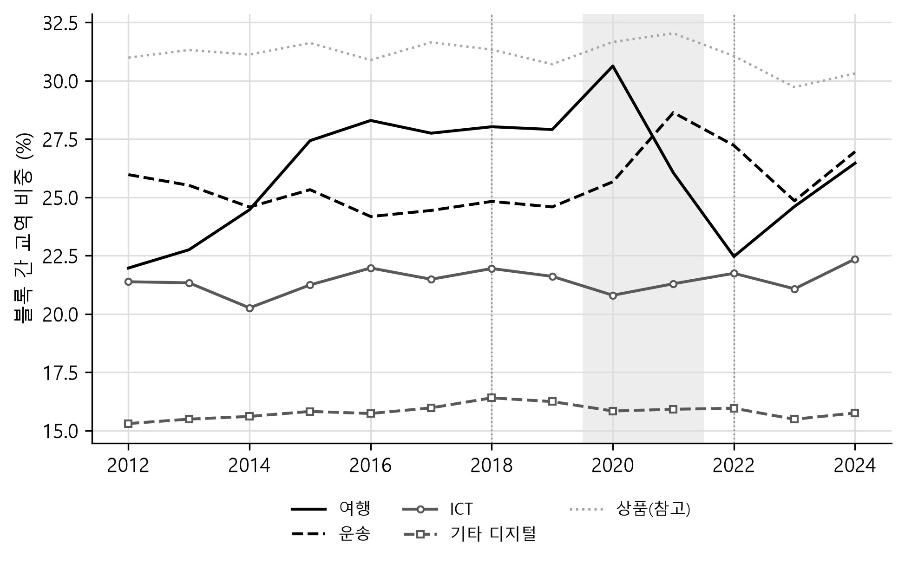
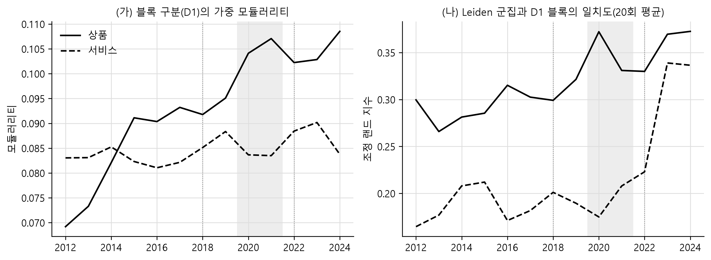

# 서비스 교역의 지경학적 분절화는 측정 선택에 좌우되는가

Does Measured Fragmentation in Services Trade Depend on Measurement Choices?

작성일: 2026-09-16

---

## 요약

미중 갈등과 러시아의 우크라이나 침공 이후 상품 교역이 지정학적 블록을 따라 재편되는 지경학적 분절화가 여러 연구에서 확인되었으나, 서비스 교역에서 같은 현상이 나타나는지는 검증되지 않았다. 본 연구는 OECD가 각국 보고치의 비대칭을 같은 방식으로 조정해 만든 서비스 교역 자료(BaTIS)와 상품 교역 자료(BIMTS)를 같은 국가쌍에 대응시켜, 미국 측과 중국 측 두 블록에 속한 경제 사이의 교역 가운데 블록을 넘는 흐름의 비중을 측정한다. 표본은 2015\~2017년과 2022\~2023년 다섯 해 모두 어느 한쪽이라도 서비스 교역을 보고한 9,192개 수출 흐름으로 고정했고, 블록은 UN 총회 표결로 추정한 이념점수와 2022년의 공식 기록(러시아의 비우호국 지정과 UN 총회 결의 표결)으로 네 가지를 정의했다.

서비스의 블록 간 교역 비중은 2022\~2024년에 사전 대비 네 가지 정의에서 0.84\~2.74%포인트 낮아져 상품의 하락폭(1.02\~2.66%포인트)과 같은 크기이고, 비중이 원래 낮은 서비스에서는 상대적 하락이 같거나 더 큰 것으로 나타났다. 미중 관세 분쟁기인 2018\~2019년에는 두 교역 모두 뚜렷한 변화가 없었고, 하락의 시점은 상품과 서비스가 서로 달라 상품은 2022년 이후에 내려갔으나 기준안 D1의 서비스는 코로나 충격기인 2020년에 이미 한 단계 내려앉았으며, 러시아와 벨라루스가 사후 하락의 절반가량을 차지하되 두 나라를 제외해도 하락은 남는다. 서비스 안에서 하락을 주도한 것은 여행이고, 통신·컴퓨터·정보서비스의 블록 간 비중은 네 가지 정의 모두에서 변하지 않아 디지털 서비스가 상품보다 먼저 분절된다는 가설은 확인되지 않는다. 다만 블록의 교역 규모 변화를 통제한 집약도로 보면 서비스의 하락은 사라지고 교역망이 블록을 따라 군집화되는 정도도 상품에서만 높아지므로, 서비스의 비중 하락은 블록 사이의 연결이 약해져서라기보다 중국 측 블록의 서비스 교역 자체가 위축된 결과에 가깝다.

---

## I. 서론

지경학적 분절화(geoeconomic fragmentation)는 시장 조건이 아니라 지경학적 요인, 곧 안보와 동맹 관계를 고려한 정책으로 세계 경제의 통합이 후퇴하는 현상을 가리킨다(Aiyar et al., 2023). 관세와 수출 통제, 투자 심사, 제재가 그런 정책이다. 세계 교역의 규모 자체는 줄지 않았으므로 분절화를 다루는 국제경제학 문헌이 주목하는 것은 총량이 아니라 교역 상대의 재편이다. Gopinath et al. (2025)는 러시아의 우크라이나 침공 이후 지정학적으로 먼 블록 사이의 상품 교역이 같은 블록 안의 교역보다 약 12% 더 줄었다고 추정했고, WTO (2023)는 UN 총회 표결로 두 블록을 가정했을 때 침공 이후 블록 사이의 상품 교역이 블록 안의 교역보다 4\~6% 느리게 늘었다고 보고했다. 두 연구가 다룬 것은 모두 상품 교역이다. 서비스 교역에서 같은 재편이 나타나는지는 자료의 제약 때문에 거의 검증되지 않았다.

가설은 서로 반대 방향으로 두 가지를 세울 수 있다. 첫째, 서비스는 관세와 원산지 규정을 받지 않으므로 교역 상대를 정책으로 구분할 수단이 상품보다 적고, 그만큼 분절화가 약하게 나타날 수 있다. 둘째, 데이터 현지화, 클라우드 규제, 보안 심사처럼 디지털 서비스를 겨냥한 조치는 2018년 이후 늘었으므로, 디지털로 전달되는 서비스가 오히려 상품보다 먼저 분절될 수 있다. 두 가설은 블록 간 교역 비중이 어떻게 움직일지를 반대로 예측한다. 본 연구는 어느 쪽이 자료와 맞는지를 기술적 사실의 수준에서 확인한다.

두 가설을 같은 자료에서 구분하려면 상품과 서비스를 같은 조건에서 측정해야 한다. 본 연구의 기여는 그 비교 가능성을 확보한 데 있다. 상품과 서비스의 분절화를 따로 측정할 경우 서로 다른 자료, 다른 국가 표본, 다른 균형화 방식을 쓰게 되므로 두 결과의 차이가 현상의 차이인지 측정의 차이인지를 구분하기 어렵다. 본 연구가 사용하는 서비스 교역 자료인 BaTIS와 상품 교역 자료인 BIMTS는 OECD가 각국 보고치의 비대칭을 같은 방식으로 조정해 만든 짝이다. 두 자료를 같은 국가쌍에 대응시키면 국가 표본과 연도를 고정한 채 상품과 서비스의 블록 간 교역 비중을 직접 비교할 수 있다.

분석은 세 가지 원칙을 따른다. 첫째, 두 블록에 속한 경제 사이의 교역을 파악할 때 금액 수준이 아니라 전체에서 차지하는 비중, 즉 블록을 넘는 흐름의 몫을 본다. 명목 달러 금액에는 환율과 가격 변동이 섞이지만 분자와 분모가 같은 연도의 값인 비중에서는 그 영향이 크게 줄어든다. 둘째, 인과 추정이 아니라 기술적 사실을 정립한다. 정치적 거리가 교역 관계 자체의 영향을 받는 역인과가 있기 때문이다. 셋째, 결론이 연구자의 한 가지 선택에 기대지 않게 한다. 블록을 어떻게 정의할지, 어느 자료로 측정할지, 러시아와 대만·홍콩을 어느 블록에 둘지는 자료가 답을 정해 주지 않는 선택이므로, 하나를 골라 그 결과만 보이는 대신 블록 정의 네 가지와 교역 계열 다섯 가지의 결과를 모두 제시하고 러시아와 대만·홍콩을 제외한 결과도 함께 둔다.

---

## II. 자료와 측정

### 1. 교역 자료와 분석 표본

서비스는 BaTIS(OECD and WTO, 2025)의 총서비스와 12개 대분류를, 상품은 BIMTS(OECD, 2025)의 전 품목 합계를 쓴다. 모두 백만 달러 단위이고 세계나 EU처럼 여러 경제를 묶은 집계 항목은 빼고 개별 경제만 남긴다. 자료가 개별 경제로 분류하는 코드 가운데 나머지 세계(rest of the world)는 보고되지 않은 상대를 묶은 잔여 항목이므로 함께 뺀다. BaTIS는 한 흐름을 수출국이 보고한 수출 행과 수입국이 보고한 수입 행 두 개에 담으므로, 수출 방향 행을 관측으로 삼아 한 흐름을 한 번만 세고 수입 행의 값은 그 흐름의 수입국 보고로 붙여 둔다. 문헌에서는 이것을 거울상 통계(mirror statistics)라 부른다. 반면 BIMTS는 원래 수출국 기준의 단일 기록이다.

두 자료가 싣는 금액은 균형치(balanced value)다. 균형치는 수출국 보고와 수입국 보고의 차이를 조정하고 보고가 없는 칸은 추정해, 세계 합이 맞아떨어지도록 만든 값이다. BaTIS는 각국이 적어 낸 보고치도 함께 싣지만 BIMTS는 균형치만 싣고, 그 균형치도 재수출을 생산국으로 재배분하기 전과 후로 둘이다. 재수출(re-export)은 들여온 물건을 실질적인 가공 없이 다시 내보내는 것으로, 통관 기록은 마지막으로 내보낸 나라를 수출국으로 적는다. 중국산 제품이 홍콩을 거쳐 미국으로 가면 원자료에는 홍콩의 대미 수출로 남고, 재수출 조정은 그 금액을 중국의 대미 수출로 되돌린다. 또 BaTIS가 모든 칸을 채우는 것과 달리 BIMTS는 교역이 있는 흐름만 행으로 두는데, 교역이 없는 흐름은 비중의 분자와 분모에 0으로 들어갈 값이므로 빠져도 결과가 달라지지 않는다.

두 자료 모두 수출국 기준이므로 각 관측은 한 경제가 다른 경제로 내보내는 수출 흐름이다. 한국의 대미 수출과 미국의 대한 수출은 방향이 반대인 서로 다른 흐름이고, 이 연구는 둘을 각각 센다. BaTIS는 어느 쪽도 보고하지 않은 칸을 중력모형(gravity model) 추정으로 채우므로, 자료에 값이 있다고 해서 그 흐름이 실제로 보고된 것은 아니다. 이 연구는 그 가운데 사전 기간과 사후 기간 양쪽에서 보고가 이어지는 흐름만 골라 쓰고 나머지는 분석에서 뺀다. 이유는 둘이다. 하나는 채워 넣은 값이 경제 규모와 거리처럼 모형에 넣은 요인만 반영한다는 점이다. 블록 사이의 교역이 실제로 줄어도 추정으로 채운 칸은 그 감소를 담지 못하므로, 그런 칸을 함께 세면 분절화가 희석된다. 다른 하나는 어느 흐름에 보고가 있는지가 해마다 바뀐다는 점이다. 상대별로 보고한 수출 칸의 비중으로 보면 미국은 2015\~2017년 35.5%에서 2022\~2023년 94.0%로 올라 전에는 추정으로만 있던 미국의 흐름이 대거 보고로 바뀌었고, 러시아는 96.5%에서 0%로 떨어져 보고가 있던 흐름이 모두 사라졌다. 대상을 해마다 새로 고르면 이런 보고의 변화가 교역 구성의 변화로 잘못 읽힌다.

표본은 네 단계로 정한다. 첫째, 어느 해에 보고가 있다는 것은 그 흐름을 수출국이 수출로 보고했거나 수입국이 수입으로 보고한 것 가운데 하나라도 있는 경우를 말한다. 두 보고는 같은 흐름을 양쪽에서 적은 것이므로 어느 한쪽만 있어도 그 해의 교역이 실제로 관측된 것으로 본다. 여기서 달라지는 것은 흐름의 방향이 아니라 그 흐름을 적은 쪽이다. 관측은 언제나 수출국에서 수입국으로 가는 흐름 하나이고, 수입국의 기록을 쓸 때도 그 흐름의 방향은 그대로다. 보고 여부는 추론한 것이 아니라 자료에 기록된 것이다. BaTIS는 칸마다 보고치와 균형치를 따로 싣고 그 칸을 어떤 방법으로 만들었는지도 코드로 남기는데, 보고가 없는 칸은 보고치가 비어 있고 추정 방법 코드가 붙는다. 둘째, 총서비스를 기준으로 2015, 2016, 2017, 2022, 2023년 다섯 해 모두 그 조건이 성립하는 흐름만 남긴다. 사전 기간과 사후 기간 양쪽에서 끊기지 않고 관측되는 흐름만 쓰겠다는 뜻이다. 셋째, 그렇게 고른 목록을 2012\~2024년 모든 연도와 다섯 가지 교역 계열, 서비스 12개 대분류에 그대로 적용한다. 상품도 같은 목록으로 제한하므로 상품과 서비스가 같은 흐름에서 측정된다. 보고를 요구하는 해는 위의 다섯 해뿐이므로 나머지 해에는 보고가 빠진 흐름이 섞일 수 있는데, 표본 안에서 보고가 있는 금액의 비중은 2014\~2023년 내내 99%를 넘고 2012년 91.4%, 2013년 95.5%, 2024년 72.9%다. 넷째, 서비스 보고치 계열은 흐름마다 보고의 출처를 하나로 고정한다. 다섯 해 모두 수출국 보고가 있으면 수출국 보고를 쓰고, 그렇지 않은데 다섯 해 모두 수입국 보고가 있으면 수입국 보고를 쓴다. 이렇게 고른 출처는 2012\~2024년 내내 그대로 쓰므로, 수입국 보고를 고른 흐름은 수출국 보고가 있는 해에도 수입국 보고를 쓴다. 표본에서 수출국 보고가 5,293개, 수입국 보고가 3,862개이고, 어느 쪽도 다섯 해를 채우지 못한 37개 흐름은 보고치 계열에서 뺀다. 이 37개도 균형치 계열에는 그대로 남는다. 한 흐름 안에서 출처가 바뀌면 두 보고의 비대칭이 교역의 변화로 섞여 들어오기 때문이다.

이 규칙으로 남은 것이 200개 경제 사이의 9,192개 수출 흐름이고, 이 집합이 세계 서비스 교역의 82.2%(2019년)와 83.8%(2023년), 상품 교역의 75.8%와 74.1%를 차지한다. 미국과 중국 사이의 두 방향은 모두 포함된다. 표본이 보고가 있는 흐름으로 치우치므로, 본 연구의 수치는 세계 전체가 아니라 보고가 이어지는 흐름을 대상으로 측정한 값이다.

다섯 가지 교역 계열은 모두 이 표본에서 측정한다. 기준 계열은 BaTIS 균형치와 BIMTS 재수출 조정 균형치다. 여기에 세 가지 비교 계열을 더한다. 서비스 보고치는 균형화를 거치지 않은 값이며, 흐름마다 출처(수출국 보고 또는 수입국 보고)를 하나로 고정해 출처가 바뀌면서 비대칭이 섞이는 것을 막았다. 상품 총 균형치(`B`)는 재수출을 생산국으로 재배분하기 전의 값이다. 마지막으로 CEPII가 만드는 상품 교역 자료 BACI를 더한다. UN Comtrade의 통관 보고를 BIMTS와는 다른 방식으로 조정한 것이므로, 새로운 관측이 아니라 균형화 방식이 결과를 바꾸는지 확인하는 장치다. 상품에서 비교할 수 있는 것은 BIMTS의 재수출 조정 균형치와 총 균형치, BACI인데 셋 다 균형치이고 조정 방식만 다르다.

### 2. 블록 정의

블록은 미국과 중국을 두 극으로 놓고 나눈다. 관세와 수출 통제, 투자 심사 같은 조치가 대부분 그 축에서 나왔기 때문이고, 상품 교역의 분절화를 보고한 연구들이 같은 축을 썼기 때문이기도 하다. Gopinath et al. (2025)은 UN 총회 표결로 미국 측과 중국 측, 비동맹을 나누었고 WTO (2023)도 같은 표결로 두 블록을 가정했다. 축이 다르면 서비스의 결과를 그들의 상품 결과와 비교할 수 없다. 블록 간 교역 비중을 측정하려면 각 경제가 어느 쪽에 속하는지를 먼저 정해야 하는데, 블록은 공식 기구가 아니어서 자료에 적혀 있지 않으므로 기준을 세워 배정한다. 이 연구가 쓰는 기준은 둘이다. 하나는 UN 총회 표결에서 드러나는 정치적 위치이고, 다른 하나는 2022년의 공식 기록이다. 공식 기록은 러시아가 그해 지정한 비우호국 목록과 우크라이나 침공을 규탄한 UN 총회 결의의 표결이다.

정치적 위치는 이념점수(ideal point)로 나타낸다. Bailey et al. (2017)이 UN 총회의 최종 통과 표결에서 추정한 1946\~2025년 값으로, 경제마다 해마다 하나씩 주어지는 1차원 수치이며 높을수록 미국과 서방 민주국가에 가깝다. 이념점수가 없는 경제에는 규칙을 따로 정했다. 해외 영토는 주권국을 따르고(버뮤다와 케이맨 제도는 영국, 아루바와 퀴라소는 네덜란드), 홍콩과 마카오는 중국을 따른다. 대만은 기준안에서 미국 측에 두었는데, 2022년 비우호국 지정에 포함되었고 안보 정렬이 분명하기 때문이다. 다만 이 점수로 블록을 구분하는 방식은 추정 기간과 표결 선택에 민감하다는 비판을 받는다(Airaudo et al., 2025). 그래서 이념점수에만 기대지 않고 공식 기록으로도 블록을 만들어, 네 가지 정의의 결과를 모두 제시한다. 표 1이 그 네 가지다. 규칙 열은 두 블록을 구분하는 기준이고, 오른쪽 세 열은 그 기준으로 표본의 200개 경제가 각 블록에 몇 개씩 배정되는지다. 정의마다 두 블록을 부르는 이름은 다르지만, 표에서는 미국이 속한 쪽을 미국 측 열에, 중국이 속한 쪽을 중국 측 열에 적는다. 앞의 둘(D1, D2)은 이념점수로, 뒤의 둘(D3, D4)은 2022년의 공식 기록으로 블록을 나눈다.

**표 1. 네 가지 블록 정의 및 배정된 경제 수**

| 정의 | 규칙 | 미국 측 블록 | 중국 측 블록 | 비동맹 |
|---|---|---|---|---|
| D1 근접 사분위(기준안) | 2015\~2017년 평균 이념점수로 미국에 가장 가까운 25% 대 중국에 가장 가까운 25% | 54 | 51 | 93 |
| D2 근접 사분위(사후) | 같은 규칙, 2022\~2024년 평균 이념점수 | 54 | 50 | 93 |
| D3 좁은 블록 | 러시아가 지정한 비우호국 대 중국(홍콩·마카오 포함)과 침공 규탄 결의에 반대한 5개국 | 54 | 8 | 138 |
| D4 서방 대 비서방 | D3의 미국 측 대 나머지 배정 가능한 경제 전부 | 54 | 144 | 0 |

주: 경제 수는 표본 200개 경제 가운데 센 값이다. 해당 기간의 이념점수가 없거나 배정 규칙이 닿지 않는 경제는 그 정의에서 제외되므로 세 열의 합은 정의마다 다르다.\
자료: Bailey et al. (2017)의 이념점수 2026년판, 러시아 정부 명령 430-r호(2022-03-05), UN 총회 결의 ES-11/1 표결 기록에서 작성.

표를 읽는 법은 이렇다. 첫 행의 D1 근접 사분위는 2015\~2017년 평균 이념점수로 각 경제가 미국과 중국에서 얼마나 떨어져 있는지를 구한 뒤, 미국에 가장 가까운 25%를 미국 측, 중국에 가장 가까운 25%를 중국 측, 나머지를 비동맹으로 둔다는 뜻이다. 두 사분위가 겹치면 더 가까운 쪽에 배정하도록 했으나 실제로 겹치는 경제는 없다. 사분위의 경계는 2015\~2017년 이념점수가 있는 193개 경제에서 구하고 그 결과를 표본에 적용한다. D1 기준으로 나누면 표본의 200개 경제 가운데 미국 측이 54개, 중국 측이 51개, 비동맹이 93개가 되고, 이념점수가 없는 팔레스타인과 코소보 둘은 어느 블록에도 배정하지 않는다. 두 사분위는 이념점수 축의 양 끝을 뜻하지 않는다. 미국은 점수가 가장 높은 쪽 끝에 있어 미국 측 블록도 그 끝에 모이지만, 중국은 축의 가운데 아래에 있어 중국 측 블록은 중국의 점수를 둘러싼 좁은 구간이 된다. 그래서 중국보다 점수가 더 낮은 쿠바나 이란 같은 경제는 중국과의 거리가 멀어 비동맹에 남는다. 결국 비동맹은 성격이 고른 집단이 아니라는 뜻이다. 어느 쪽과도 표결이 비슷하지 않은 경제와 미국에서 가장 먼 경제가 함께 들어간다. 뒤에서 보겠지만 본 연구에서 사용하는 핵심 지표는 두 블록에 속한 경제 사이의 교역만 쓰고 비동맹이 포함된 흐름은 분자와 분모에서 모두 배제하므로, 이 이질성이 측정에 섞이지는 않는다. 요컨대 D1의 결과는 서방과 반미 진영 사이가 아니라 미국에 가까운 사분위와 중국 주변 구간 사이의 교역을 측정한 것이다.

네 가지 가운데 D1을 기준안으로 둔다. 2015\~2017년의 표결로 정한 배정은 2018년의 관세와 2022년의 침공보다 앞서 있으므로, 측정하려는 교역 변화가 배정에 영향을 줄 수 없다. 사후 기간의 표결로 정하면 관측된 교역 변화 가운데 어디까지가 교역의 재편이고 어디까지가 분류의 산물인지 구분할 수 없다. 교역과 표결이 같은 기간의 사건에 함께 반응하기 때문이다. 교역이 줄어든 나라가 표결에서도 멀어지는 경우가 그 한 예이고, 침공과 제재처럼 둘을 한꺼번에 움직이는 사건도 있다. 그 대신 러시아처럼 뒤늦게 정렬이 뚜렷해진 나라를 비동맹에 두게 되므로, D1은 분절화를 작게 잡는 쪽으로 기운 선택이다.

D2는 다른 것은 D1과 모두 같고 사후 기간의 이념점수를 쓴다는 점만 다르다. 두 정의의 배정 결과는 크게 다르다. 양쪽 모두에 배정된 203개 경제 가운데 88개가 다른 블록으로 옮겨 간다. 러시아는 2015\~2017년 이념점수가 중간 부근이어서 D1에서는 비동맹이고 D2에서는 중국 측이다. 인도는 반대로 D1에서 중국 측, D2에서 비동맹이다.

한편 D3은 이념점수를 쓰지 않고 2022년의 공식 기록만으로 정의한 좁은 블록이다. 미국 측은 러시아 정부가 그해 3월 5일 명령 430-r호로 지정한 비우호국 목록으로, EU 27개국과 미국, 영국, 일본, 한국, 호주, 캐나다, 스위스, 노르웨이, 싱가포르, 대만, 그리고 이들의 해외 영토를 더한 56개다. 중국 측은 중국과 홍콩, 마카오, 그리고 사흘 앞선 3월 2일 UN 총회 결의 ES-11/1에 반대한 러시아, 벨라루스, 북한, 에리트레아, 시리아를 더한 8개다. 어느 명단에도 없는 147개는 비동맹이 된다. 이 정의는 연속적인 점수를 자르지 않고 명단으로 정하므로 경계가 분명한 대신, 중국 측이 8개뿐이라 블록이 가장 좁다. 침공 관련 표결이나 제재 명단으로 블록을 나누는 방식 자체는 분절화 문헌에서 쓰여 왔다. Campos et al. (2023)은 러시아의 인권이사회 자격 정지 결의(ES-11/3) 표결로 찬성을 서방, 반대를 동방, 기권을 중립으로 나누어 블록 간 교역이 끊길 때의 손실을 추정한다.

마지막으로 D4는 D3의 미국 측 56개를 그대로 두고 배정 가능한 나머지를 모두 상대편으로 묶은 것이다. 정의의 이름은 서방 대 비서방이지만, 표에서는 서방이 미국 측 열에, 비서방이 중국 측 열에 온다. 중국과 러시아만이 아니라 인도, 브라질, 사우디아라비아, 인도네시아처럼 어느 쪽과도 거리를 두는 경제가 모두 그쪽에 들어가 148개가 된다. 비동맹을 두지 않으므로 네 가지 가운데 가장 많은 교역을 포괄하고, 앞에서 말한 비동맹의 이질성도 여기서는 문제가 되지 않는다.

### 3. 지표와 기간

핵심 지표는 블록 간 교역 비중 $S$다. 미국 측 블록을 $U$, 중국 측 블록을 $C$라 하고 $X_{ij}$를 $i$에서 $j$로의 교역액이라 할 때, 두 블록에 속한 경제 사이의 교역만 모아 다음과 같이 정의한다.

$$
S = \frac{\sum_{i \in U, j \in C} X_{ij} + \sum_{i \in C, j \in U} X_{ij}}{\sum_{i, j \in U \cup C} X_{ij}} \qquad (1)
$$

분자는 블록을 넘는 흐름, 곧 미국 측 블록의 경제가 중국 측 블록의 경제로 내보낸 교역과 그 반대 방향의 교역을 더한 값이다. 분모는 두 블록에 속한 경제 사이의 교역 전체로서, 분자에 미국 측 안의 교역과 중국 측 안의 교역을 더한 값이다. 따라서 $S$는 두 블록이 관여한 교역 가운데 블록 경계를 넘는 몫이고, 모든 교역이 경계를 넘으면 1, 블록 안에서만 이루어지면 0이 된다. 분절화가 진행되면 이 값이 내려간다. 비동맹 경제가 포함된 교역은 분자와 분모 모두에서 제외한다. 기간에 대해 산출한 값은 연도별 비중의 평균이 아니라 기간 동안의 합산 비율이다. 서비스의 블록 간 비중은 상품보다 낮은 수준에서 출발하므로 같은 %포인트 변화라도 상대적 크기가 다르다. 두 교역을 같은 척도로 비교하려고 $\Delta \ln[S/(1-S)]$를 보조 지표로 둔다. 이 값은 블록 간 교역의 증가율에서 블록 내 교역의 증가율을 뺀 것과 같다.

$S$는 블록 간 비중이지만 블록의 교역 규모가 바뀌기만 해도 값이 변한다. 식 (1)의 분모는 블록 간 교역, 중국 측 내부 교역, 미국 측 내부 교역 셋으로 이루어지는데, 가령 중국 측 경제가 관여하는 교역이 위축되면 앞의 둘은 줄어들지만 미국 측 내부 교역은 그대로 남는다. 예를 들어 블록 간 교역이 30, 미국 측 내부가 40, 중국 측 내부가 30이면 $S$는 30%다. 여기서 중국 측이 관여하는 교역이 모두 절반으로 줄면 블록 간은 15, 중국 측 내부는 15가 되고 미국 측 내부는 40 그대로이므로 $S$는 21%로 내려간다. 교역 상대를 고르는 방식은 하나도 달라지지 않았는데 비중만 낮아진 것이다. 이런 규모 효과를 통제하는 표준적인 방법은 관측된 교역을 규모만으로 기대되는 교역과 비교하는 것이다. 나라쌍 수준에서는 교역집약도 지수(trade intensity index)가 그 일을 한다. 한 나라의 수출 가운데 상대국이 차지하는 몫을 그 상대국이 세계 수입에서 차지하는 몫으로 나누어, 두 나라의 크기에서 오는 부분을 덜어 내고 남는 밀착도를 보는 지표다(Drysdale and Garnaut, 1982).

본 연구는 위의 발상을 블록 수준으로 옮겨 집약도 $I = S/E$를 계산한다. 여기에서 $E$는 교역 상대가 무작위로 정해졌을 때 기대되는 블록 간 비중이다. 두 블록에 속한 경제 사이의 교역액 가운데 미국 측이 수출한 몫을 $x_U$, 미국 측이 수입한 몫을 $m_U$라 하자. 나머지가 중국 측의 몫이므로 중국 측이 수출한 몫은 $1-x_U$, 수입한 몫은 $1-m_U$다. 수출 쪽 몫과 수입 쪽 몫을 그대로 두고 수출국과 수입국을 무작위로 짝지으면 블록을 넘는 흐름의 비중은 $E = x_U(1-m_U) + (1-x_U)m_U$가 된다. 앞 항은 미국 측이 수출하고 중국 측이 수입하는 경우이고 뒤 항은 그 반대다. 가령 미국 측이 수출의 60%와 수입의 60%를 차지하면 $E$는 0.48이다. 실제 $S$가 0.30이라면 규모만 보면 48%가 블록을 넘어야 하는데 실제로는 30%에 그쳤기 때문에, 집약도가 0.63으로 1을 밑돈다. $I$가 1보다 크면 그 반대로 읽는다. III.6절에서 쓰는 교역망의 모듈러리티(modularity)도 관측된 블록 내 교역을 무작위 배분에서 기대되는 값과 비교한다는 점에서 같은 발상이다.

본 연구는 분석 기간을 넷으로 나눈다. 사전 기간은 미국의 대중 관세 부과 이전인 2015\~2017년, 무역분쟁기는 2018\~2019년, 코로나 충격기는 2020\~2021년, 사후 기간은 2022\~2024년이다. 모든 변화는 사전 기간 대비로 계산한다. 사전 추세를 확인하려고 2012\~2014년에서 2015\~2017년으로의 변화도 함께 적는다.

---

## III. 분석 결과

### 1. 블록 간 교역 비중의 추이

먼저 식 (1)의 블록 간 교역 비중을 상품과 서비스에 대해 2012년부터 해마다 계산했다. 기간 단위 표가 아니라 연 단위 그림으로 제시하는 것은, 변화가 있다면 그 크기뿐 아니라 시점까지 드러나기 때문이다.

그림 1이 그 계열이다. 표 1의 네 가지 정의 가운데 기준안인 D1을 (가)에, 명단으로 정해 성격이 가장 다른 D3을 (나)에 실었다. 시점은 정의를 바꾸어도 같으므로 둘만 그렸고, D2와 D4의 결과는 기간별 변화로 표 2에 있다. 각 칸에는 다섯 가지 계열 가운데 상품 균형치(실선), 서비스 균형치(파선), 서비스 보고치(원 표지) 셋을 함께 그렸다. 세로 점선은 2018년과 2022년, 회색 띠는 2020\~2021년이다. 서비스 보고치는 보고 완결도가 99%를 넘는 2014\~2023년만 그렸다.

**그림 1. 같은 국가쌍에서 측정한 블록 간 교역 비중 (%)**

자료: OECD-WTO BaTIS 2025년 12월판과 OECD BIMTS 2026년 5월 파일에서 계산.

네 가지가 보인다. 첫째, 무역분쟁기에는 두 교역 모두 뚜렷한 변화가 없다. 기준안 D1에서 서비스 균형치는 2017년 20.65%에서 2018년 21.01%로 오히려 올랐고, 상품은 2019년 30.71%까지 완만하게 내렸다가 2021년 32.03%로 그 이전 수준을 넘어섰다. D3에서도 마찬가지로 2018\~2019년에 움직임이 없다.

둘째, 상품의 하락은 2022년 이후에 나타나고 명단으로 정한 D3에서 더 크다. D1에서 2021년 32.03%가 2023년 29.72%로, D3에서 같은 기간 29.19%가 24.68%로 내려갔다. 셋째, 서비스의 하락 시점은 정의에 따라 다르다. D3에서는 상품과 같은 시점에, 2021년 14.19%에서 2023년 11.74%로 내려간다. 그러나 D1에서는 2020년에 19.50%로 한 단계 내려앉은 뒤 2023년 19.33%까지 낮아졌다가 2024년 20.39%로 되돌아왔다. D1에서 측정한 서비스의 사후 하락에는 2022년 이후의 움직임만이 아니라 코로나 충격기에 생긴 수준 변화가 함께 들어 있다는 뜻이다. 그 수준 변화가 어느 범주와 관련되는지는 III.4절에서 다룬다.

넷째, 서비스 보고치는 균형치보다 낮은 수준에서 같은 방향으로 움직이고 2022년 이후 하락폭은 더 크다. 서비스의 분절화가 균형화 절차에서 생긴 것이 아니라는 뜻이다.

### 2. 사전 대비 사후 변화

표 2는 네 가지 정의와 다섯 가지 계열에서 사전 기간 대비 변화를 정리한 것이다. 사전 수준 열은 식 (1)의 $S$를 2015\~2017년 합산으로 구한 값이고, 이어지는 세 열은 그 값이 기간마다 사전 대비 얼마나 달라졌는지다. 사전 추세는 2012\~2014년 대비 2015\~2017년의 변화, 무역분쟁은 2018\~2019년, 사후는 2022\~2024년(서비스 보고치는 2022\~2023년)의 변화다. 마지막 열은 사후 변화를 $\Delta \ln[S/(1-S)]$로 바꾼 값으로, 문헌이 보고한 증가율 차이와 비교할 수 있게 한 것이다.

**표 2. 블록 간 교역 비중의 변화 (사전 2015\~2017년 대비, %포인트)**

| 정의 | 계열 | 사전 수준 (%) | 사전 추세 | 무역분쟁 | 사후 | 로그 오즈 |
|---|---|---|---|---|---|---|
| D1 | 서비스 균형치 | 20.70 | +0.86 | +0.14 | -0.84 | -0.052 |
| D1 | 서비스 보고치 | 18.84 | . | +0.02 | -1.55 | -0.104 |
| D1 | 상품 재수출 조정 | 31.39 | +0.25 | -0.37 | -1.02 | -0.048 |
| D1 | 상품 총 균형치 | 31.64 | +0.45 | -0.33 | -0.81 | -0.038 |
| D1 | 상품 BACI | 32.86 | +0.43 | -0.14 | -0.43 | -0.019 |
| D2 | 서비스 균형치 | 19.94 | +0.46 | -0.54 | -2.74 | -0.181 |
| D2 | 서비스 보고치 | 18.01 | . | -0.67 | -3.50 | -0.258 |
| D2 | 상품 재수출 조정 | 34.00 | -1.21 | -0.17 | -2.08 | -0.094 |
| D2 | 상품 총 균형치 | 34.12 | -1.03 | -0.10 | -1.76 | -0.079 |
| D2 | 상품 BACI | 35.33 | -1.05 | +0.10 | -1.57 | -0.069 |
| D3 | 서비스 균형치 | 14.56 | +0.51 | -0.04 | -2.18 | -0.187 |
| D3 | 서비스 보고치 | 12.73 | . | +0.05 | -2.25 | -0.220 |
| D3 | 상품 재수출 조정 | 28.28 | -0.23 | -0.24 | -2.66 | -0.135 |
| D3 | 상품 총 균형치 | 28.61 | -0.01 | -0.23 | -2.44 | -0.123 |
| D3 | 상품 BACI | 29.59 | +0.06 | -0.13 | -2.44 | -0.120 |
| D4 | 서비스 균형치 | 31.03 | +0.17 | -0.24 | -1.06 | -0.050 |
| D4 | 서비스 보고치 | 28.86 | . | -0.53 | -1.97 | -0.098 |
| D4 | 상품 재수출 조정 | 44.26 | -0.92 | -0.37 | -1.43 | -0.058 |
| D4 | 상품 총 균형치 | 44.16 | -0.80 | -0.32 | -1.17 | -0.048 |
| D4 | 상품 BACI | 45.49 | -0.70 | -0.13 | -0.89 | -0.036 |

주: 사전 수준은 사전 기간의 블록 간 교역 비중이고, 이어지는 세 열은 %포인트 단위의 변화다. 로그 오즈 열은 무차원이다. 서비스 보고치만 사후를 2022\~2023년으로 두었다. 2024년의 보고 완결도가 72.9%에 그치기 때문이다. 같은 이유로 이 계열의 사전 추세는 2012\~2013년 완결도가 낮아(91.4%, 95.5%) 계산하지 않고 점으로 적었다.\
자료: OECD-WTO BaTIS 2025년 12월판, OECD BIMTS 2026년 5월 파일, CEPII BACI V202601에서 계산.

첫째, 사후 하락은 네 가지 정의와 다섯 가지 계열에서 예외 없이 나타난다. 기준안 D1에서 서비스 균형치는 0.84%포인트, 상품 재수출 조정 균형치는 1.02%포인트 낮아졌다. 나머지 정의에서는 크기만 커져 서비스가 0.84\~2.74%포인트, 상품이 1.02\~2.66%포인트로 같은 범위에 들어간다.

둘째, 상대적 크기로는 서비스의 하락이 같거나 더 크다. 앞에서 밝힌 대로 서비스는 더 낮은 수준에서 출발하므로 같은 %포인트 하락이 더 큰 상대적 변화다. D1의 로그 오즈 변화는 서비스 -0.052, 상품 -0.048로 거의 같고, 나머지 정의에서는 서비스가 같거나 크다. 하락이 가장 큰 D3에서 이를 증가율 차이로 바꾸면 서비스는 블록 간 교역이 블록 내 교역보다 17.1%, 상품은 12.6% 덜 늘어난 것이며, 상품의 값은 Gopinath et al. (2025)의 약 12%와 가깝다. 다만 그쪽은 중력모형으로 각국의 교역 추세를 통제한 추정치이고 이 값은 조건을 걸지 않은 차이이므로, 크기가 비슷하다는 것 이상은 말하지 않는다.

셋째, 무역분쟁기에는 변화가 없다. 2018\~2019년의 변화는 모든 칸에서 -0.67\~+0.14%포인트로 사후 하락보다 작고 방향도 일정하지 않다. 미중 관세가 두 나라 사이의 교역에 미친 영향은 이 자료로 측정하지 않았으며, 블록 전체의 교역 구성에서는 그 효과가 나타나지 않는다.

넷째, 사전 추세는 서비스와 상품에서 반대였다. 서비스의 블록 간 비중은 네 가지 정의 모두에서 2015\~2017년까지 올라가고 있었고, 상품은 D2와 D4에서 이미 내려가고 있었다. 서비스의 사후 하락은 상승 추세를 역전시킨 것이고, 상품의 사후 하락 일부는 기존 추세의 연장일 수 있다.

다섯째, 상품의 균형화 방식은 크기를 바꾸지만 방향은 바꾸지 않는다. 재수출을 재배분하기 전의 총 균형치와 CEPII의 BACI에서도 사후 하락은 모든 정의에서 나타난다. D1에서는 BACI의 하락폭이 BIMTS의 절반 이하로 가장 작고, 하락이 큰 D3에서는 세 계열이 비슷하다.

두 교역의 차이가 통계적으로 구별되는지를 보려고 기준안 D1에서 수출국 105개를 복원추출하는 부트스트랩을 1,000회 수행했다. 사후 변화의 95% 구간은 서비스 균형치 -2.11\~+0.81, 상품 -2.44\~+0.47%포인트이고, 두 변화의 차이(서비스 빼기 상품)는 -1.09\~+1.77%포인트다. 기준안에서는 각 하락도, 두 교역의 차이도 0과 구별되지 않는다. 표 2의 일관성은 네 가지 정의와 다섯 가지 계열에서 방향이 같다는 데서 오며, 개별 추정치의 정밀도에서 오지 않는다.

### 3. 러시아의 몫

러시아는 2022년 이후 서비스 교역의 공표를 축소했고 제재로 서방과의 교역이 급감했다. 표 3은 세 계열마다 표 2의 사후 변화와, 러시아 또는 벨라루스가 포함된 흐름을 모두 제외하고 다시 계산한 사후 변화를 함께 제시한 것이다. 상품은 재수출 조정 균형치다. D1에서는 러시아가 비동맹이므로 차이가 없고, 러시아를 중국 측에 넣는 D2\~D4에서 차이가 난다.

**표 3. 러시아·벨라루스 제외의 효과 (사후 변화, %포인트)**

<!-- Word 변환 지침 (표 3):
- 헤더 2행 구조.
  · 1행: [정의 (1\~2행 rowspan=2 병합)] [서비스 균형치 (2\~3열 colspan=2)] [서비스 보고치 (4\~5열 colspan=2)] [상품 (6\~7열 colspan=2)]
  · 2행: [ (정의 셀과 rowspan=2 병합) ] [전체][제외] [전체][제외] [전체][제외]
- 마크다운의 "서비스 균형치 전체"·"서비스 균형치 제외"는 1행의 "서비스 균형치"와 2행의 "전체"·"제외"로 나눠 넣는다. 나머지 두 묶음도 같다.
- 병합 셀은 세로·가로 가운데 정렬.
- 숫자 열은 우측 정렬, 소수 자릿수 현행 유지.
-->

| 정의 | 서비스 균형치 전체 | 서비스 균형치 제외 | 서비스 보고치 전체 | 서비스 보고치 제외 | 상품 전체 | 상품 제외 |
|---|---|---|---|---|---|---|
| D1 | -0.84 | -0.82 | -1.55 | -1.53 | -1.02 | -1.00 |
| D2 | -2.74 | -1.82 | -3.50 | -2.78 | -2.08 | -0.99 |
| D3 | -2.18 | -1.11 | -2.25 | -1.42 | -2.66 | -1.44 |
| D4 | -1.06 | -0.38 | -1.97 | -1.44 | -1.43 | -0.67 |

주: 전체 열은 표 2의 사후 열과 같다. 제외 열은 러시아 또는 벨라루스가 수출국이거나 수입국인 흐름을 모두 제외한 뒤 다시 계산한 값이다.\
자료: OECD-WTO BaTIS 2025년 12월판과 OECD BIMTS 2026년 5월 파일에서 계산.

러시아를 중국 측에 넣는 세 가지 정의에서 러시아와 벨라루스를 제외하면 상품의 하락은 46\~53%, 서비스 균형치의 하락은 34\~64% 줄어든다. 러시아가 사후 하락의 절반가량을 차지한다는 점은 두 교역에서 같다. 그러나 러시아를 제외해도 하락은 남는다.

러시아 관련 서비스 흐름의 추정 의존도도 확인했다. 러시아가 포함된 총서비스 균형치 가운데 어느 쪽의 보고도 없는 흐름의 비중은 2015\~2017년 0.4%에서 2022\~2023년 43.4%로 올랐다. 그래서 러시아의 서비스 수출을 수입국 보고로 따로 확인했다. 수입국 보고가 있는 흐름에 한정하면 균형치는 2019년 277억 달러에서 2023년 157억 달러로 43.3% 줄었고, 같은 흐름의 수입국 보고치는 203억 달러에서 91억 달러로 55.2% 줄었다. 러시아 교역의 위축은 추정의 산물이 아니며, 보고치 기준으로는 오히려 더 크다.

### 4. 서비스 안에서 무엇이 움직였나

디지털 서비스가 먼저 분절된다면 서비스 전체의 블록 간 비중 하락은 디지털 범주에서 시작되어야 한다. 이를 확인하려고 서비스를 다섯 범주로 분류해 변화를 분해했다. 범주는 운송, 여행, 통신·컴퓨터·정보서비스(이하 ICT), 기타 디지털 전달 가능 서비스(보험, 금융, 지식재산권 사용료, 기타 사업, 개인·문화·여가), 기타(가공, 수리, 건설, 정부)다. 서비스 전체의 블록 간 비중은 범주별 교역 비중 $w_k$와 범주 내 블록 간 비중 $s_k$의 가중합 $S = \sum_k w_k s_k$이므로, 사전과 사후의 평균을 가중치로 써서 변화를 정확히 분해할 수 있다.

$$
\Delta S = \sum_k \bar{s}_k \Delta w_k + \sum_k \bar{w}_k \Delta s_k \qquad (2)
$$

첫 항은 구성 효과로 블록 간 비중이 높은 범주의 교역이 커지거나 작아져서 생기는 변화이고, 둘째 항은 범주 내 효과로 같은 범주 안에서 교역 상대가 재편되어 생기는 변화다. 표 4는 기준안 D1에서 이 분해를 수행한 것이다. 앞의 네 열은 각 범주의 교역 비중 $w_k$와 범주 내 블록 간 비중 $s_k$를 사전과 사후로 제시한다. 마지막 세 열은 그 범주가 서비스 전체의 변화 $\Delta S$에 기여한 몫으로, 앞의 둘은 식 (2)의 두 합에서 그 범주에 해당하는 항이고 셋째는 그 둘을 더한 값이다. 합계 행에서는 앞의 두 열이 식 (2)의 첫째 항과 둘째 항이 되고, 합 열이 $\Delta S$가 된다.

**표 4. 서비스 블록 간 비중 변화의 범주 분해 (D1, 균형치, 사전 2015\~2017년 대비 사후 2022\~2024년)**

<!-- Word 변환 지침 (표 4):
- 헤더 2행 구조.
  · 1행: [범주 (1\~2행 rowspan=2 병합)] [교역 비중(%) (2\~3열 colspan=2)] [블록 간 비중(%) (4\~5열 colspan=2)] [전체 변화 기여(%포인트) (6\~8열 colspan=3)]
  · 2행: [ (범주 셀과 rowspan=2 병합) ] [사전][사후] [사전][사후] [구성 효과 $\bar{s}_k \Delta w_k$][범주 내 효과 $\bar{w}_k \Delta s_k$][합]
- 마크다운의 "교역 비중(%) 사전"·"교역 비중(%) 사후"는 1행의 "교역 비중(%)"과 2행의 "사전"·"사후"로 나눠 넣는다. 블록 간 비중과 전체 변화 기여의 두 열도 같은 방식으로 나눈다.
- 기여 두 열의 2행 셀에는 수식(OMML)이 들어 있다. 병합 후처리에서 run이 쪼개지므로 변환한 DOCX에서 두 칸의 수식이 남아 있는지 확인한다.
- 병합 셀은 세로·가로 가운데 정렬.
- 숫자 열은 우측 정렬, 소수 자릿수 현행 유지.
-->

| 범주 | 교역 비중(%) 사전 | 교역 비중(%) 사후 | 블록 간 비중(%) 사전 | 블록 간 비중(%) 사후 | 전체 변화 기여(%포인트) 구성 효과 $\bar{s}_k \Delta w_k$ | 전체 변화 기여(%포인트) 범주 내 효과 $\bar{w}_k \Delta s_k$ | 전체 변화 기여(%포인트) 합 |
|---|---|---|---|---|---|---|---|
| 여행 | 21.73 | 16.36 | 27.83 | 24.79 | -1.41 | -0.58 | -1.99 |
| 운송 | 16.74 | 17.24 | 24.65 | 26.38 | +0.13 | +0.29 | +0.42 |
| ICT | 8.86 | 11.75 | 21.56 | 21.74 | +0.63 | +0.02 | +0.64 |
| 기타 디지털 | 46.97 | 49.14 | 15.84 | 15.72 | +0.34 | -0.06 | +0.29 |
| 기타 | 5.70 | 5.50 | 20.70 | 17.86 | -0.04 | -0.16 | -0.20 |
| 합계 | 100 | 100 | 20.70 | 19.87 | -0.35 | -0.48 | -0.84 |

주: 합 열의 합계 행 -0.84%포인트가 앞의 표 2에 나온 서비스 전체의 변화다. 기타 디지털은 보험, 금융, 지식재산권 사용료, 기타 사업, 개인·문화·여가를 묶은 것이고, 기타는 가공, 수리, 건설, 정부다.\
자료: OECD-WTO BaTIS 2025년 12월판에서 계산.

여행 한 범주의 기여 -1.99%포인트만으로 서비스 전체의 하락 -0.84%포인트를 넘어선다. 나머지 네 범주의 기여를 합하면 양수이기 때문이다. 여행은 블록 간 비중이 높은 범주인데 사후에 그 교역 비중이 줄었고 범주 안에서도 블록 간 비중이 내려갔다. ICT는 반대다. 범주 내 블록 간 비중이 21.56%에서 21.74%로 사실상 그대로인데 교역 비중이 커지면서 서비스 전체의 블록 간 비중을 0.63%포인트 끌어올렸다. 기타 디지털 서비스의 범주 내 효과도 -0.06%포인트에 그친다.

이 양상은 나머지 세 정의에서도 같다. 여행은 어디서나 가장 큰 음의 기여이고, ICT의 범주 내 효과는 -0.09\~+0.05%포인트로 0 부근이며 구성 효과는 모두 양수다. 기타 디지털 서비스는 D2와 D3에서 범주 내 하락이 있으나 여행의 절반에 못 미친다.

그림 2는 범주별 블록 간 비중의 연도별 추이로, 여행의 움직임이 언제 일어났는지를 보여 준다. 기준안 D1과 균형치로 측정했고, 비교를 위해 상품의 블록 간 비중을 옅은 점선으로 함께 그렸다. 여행의 블록 간 비중은 2020년 30.6%로 뛰었다가 2022년 22.5%로 떨어진 뒤 2024년 26.5%까지 회복했다. ICT는 전 기간 20.3\~22.4% 범위에 머문다.

**그림 2. 서비스 범주별 블록 간 교역 비중 (D1, 균형치, %)**

자료: OECD-WTO BaTIS 2025년 12월판과 OECD BIMTS 2026년 5월 파일에서 계산.

여행의 하락에는 지정학적 분절과 구분되지 않는 요인이 섞여 있다. 중국은 2023년 1월까지 방역을 이유로 출입국을 통제했으므로 2022년의 급락에는 코로나 정책이 섞여 있다. 그래서 사후 기간을 중국의 국경 재개 이후인 2023\~2024년으로만 잡아 다시 분해했다. 여행의 기여는 -1.57%포인트(구성 -1.13, 범주 내 -0.44)로 줄었지만 여전히 서비스 전체 하락의 대부분을 차지한다. 여행 교역의 위축이 방역 통제 해제 뒤에도 남아 있다는 뜻이지만, 그것이 러시아 관련 이동 제한, 중국인 해외여행의 더딘 회복, 정치적 요인 가운데 무엇에서 오는지는 이 자료로 구분되지 않는다.

### 5. 블록의 교역 규모를 통제하면

$S$의 하락이 교역 상대의 재편인지, 한 블록의 교역 규모가 줄어서 생긴 것인지는 집약도 $I$로 구분할 수 있다. 표 5는 II.3절에서 정의한 $I = S/E$를 다섯 가지 계열마다 사전 기간과 사후 기간에 대해 구한 뒤, 사후 값이 사전 값에서 몇 % 달라졌는지를 적은 것이다. 값이 음수이면 블록의 교역 규모 변화에서 기대되는 것보다 블록 간 교역이 줄었다는 뜻이고, 양수이면 그 반대다.

**표 5. 블록 간 교역 집약도의 변화율 (사전 대비 사후, %)**

| 정의 | 서비스 균형치 | 서비스 보고치 | 상품 재수출 조정 | 상품 총 균형치 | 상품 BACI |
|---|---|---|---|---|---|
| D1 | +1.71 | +7.29 | -1.39 | +1.01 | +0.70 |
| D2 | -1.53 | +5.66 | -4.09 | -1.99 | -1.97 |
| D3 | -0.73 | +8.92 | -1.24 | +1.10 | +0.42 |
| D4 | +1.35 | +4.35 | -3.39 | -2.13 | -1.92 |

주: 집약도는 블록 간 교역 비중을 수출국 블록과 수입국 블록의 교역 점유율에서 기대되는 비중으로 나눈 값이다. 사후 기간은 2022\~2024년이며 서비스 보고치만 2022\~2023년이다.\
자료: OECD-WTO BaTIS 2025년 12월판, OECD BIMTS 2026년 5월 파일, CEPII BACI V202601에서 계산.

서비스에서는 집약도의 하락이 없다. 기준안 D1에서 균형치는 1.71%, 보고치는 7.29% 올랐고, 나머지 정의에서도 균형치의 변화는 방향이 일정하지 않으며 보고치는 모두 올랐다. 서비스의 블록 간 비중 하락은 교역 상대가 재편되어서가 아니라 중국 측 블록이 서비스 교역에서 차지하는 비중이 줄어서 생긴 것으로 판단된다. 여행 수입의 위축과 러시아 교역의 붕괴가 그 비중 감소의 경로다. 상품은 BIMTS 재수출 조정 균형치에서 네 가지 정의 모두 하락(-1.24\~-4.09%)하지만, 총 균형치와 BACI에서는 D2와 D4에서만 하락한다. 규모를 통제한 뒤 남는 상품의 분절화는 블록을 넓게 잡는 정의에서만 일관되며 그 크기도 2\~4%에 그친다.

다만 이 결과는 보수적으로 읽어야 한다. 제재가 러시아의 교역 규모 자체를 줄였다면 그 규모 감소도 분절화의 결과인데, 집약도는 그것을 통제해 버리기 때문이다. 따라서 표 5는 서비스에서 분절화가 없다는 증거가 아니라, 서비스에서 관측된 비중 하락이 블록 규모의 변화 이상을 포함하지 않는다는 증거다.

### 6. 교역망의 구조

비중과 집약도는 두 블록 사이의 흐름만 본다. 교역망 전체의 군집 구조가 지정학적 블록과 가까워지는지를 보려고 서비스와 상품의 교역망을 해마다 만들었다. 노드는 2015\~2017년 서비스 교역 상위 80개 경제이고, 간선 가중치는 두 방향 교역의 합을 두 나라 총교역의 기하평균으로 나눈 값이다. 이 정규화가 없으면 미국과 중국 같은 대형 경제가 모든 군집을 흡수한다. 여기서는 전체 균형치를 쓴다. 보고 패널로 제한하면 교역망에 빈칸이 생겨 군집이 왜곡되기 때문이다.

두 가지 지표를 계산해 그림 3에 함께 제시했다. (가)는 D1 블록 구분(미국 측, 중국 측, 비동맹)을 교역망에 그대로 적용했을 때의 가중 모듈러리티다. 이 값이 오르면 교역이 같은 블록 안에 무작위 기대보다 더 몰린다는 뜻이다(Newman and Girvan, 2004). (나)는 Leiden 알고리즘(Traag et al., 2019)으로 찾은 군집과 D1 블록의 조정 랜드 지수(ARI)이며, 알고리즘이 확률적이므로 20개 시드의 평균을 쓴다.

**그림 3. 교역망 구조와 지정학적 블록 (상위 80개 경제)**

주: (가)는 가중 모듈러리티, (나)는 Leiden 군집과 D1 블록의 조정 랜드 지수이며 둘 다 무차원이다.\
자료: OECD-WTO BaTIS 2025년 12월판과 OECD BIMTS 2026년 5월 파일에서 계산.

상품 교역망의 블록 모듈러리티는 2012년 0.069에서 2024년 0.109로 꾸준히 올랐고, 사전 기간 평균 0.092에서 사후 0.105로 높아졌다. 서비스 교역망은 전 기간 0.081\~0.090 범위에 머물러 뚜렷한 추세가 없다. D3 블록 구분으로 바꾸어도 두 교역의 양상은 같다. 상품 교역망이 블록을 따라 구조화되는 변화는 2022년에 시작된 것이 아니라 2012년 이후 장기적으로 진행되었다.

ARI는 서비스에서 2022년 0.223에서 2023년 0.339로 급등한다. 그러나 같은 해 발견된 군집 수가 평균 4.9개에서 4.0개로 줄었고, 2개 집단으로 이루어진 블록 구분과의 ARI는 군집 수가 줄면 기계적으로 오른다. 모듈러리티에는 같은 변화가 나타나지 않으므로 이 급등은 구조 변화의 증거로 쓰지 않는다. 교역망의 군집은 전 기간 지정학보다 지리를 따른다.

---

## IV. 해석과 한계

### 1. 두 가설에 대한 답

첫 번째 가설, 관세와 원산지 규정을 받지 않는 서비스에서는 분절화가 약하다는 가설은 블록 간 비중으로 측정하면 기각된다. 서비스의 비중 하락은 상품과 같은 크기이고 상대적으로는 같거나 더 크다. 그러나 블록의 교역 규모를 통제한 집약도와 교역망의 모듈러리티로 측정하면 이 가설과 맞는다. 서비스에서는 규모 변화를 넘는 재편이 보이지 않고, 상품에서는 약하게나마 보인다. 두 측정이 다른 답을 내는 것은 서비스의 하락이 중국 측 블록의 서비스 교역 위축, 구체적으로 여행과 러시아에 집중되어 있기 때문이다.

두 번째 가설, 디지털 서비스가 상품보다 먼저 분절된다는 가설은 이 자료에서 지지되지 않는다. ICT의 블록 간 비중은 네 가지 정의 모두에서 변하지 않았고, 2018년 이후 데이터 규제가 늘어난 시기에도 추세가 없었다. 오히려 ICT 교역의 성장은 서비스 전체의 블록 간 비중을 높였다. 다만 이것이 디지털 서비스 규제가 효과가 없었다는 뜻은 아니다. BaTIS는 대분류에서 상대별 값의 보고 범위가 총서비스보다 좁다. 2019년 개별 경제 사이 균형치 가운데 어느 한쪽이라도 보고한 금액의 비중은 총서비스 88.0%, ICT 82.1%, 나머지 11개 대분류 77.5%다. 또한 규제가 가장 집중된 미중 사이의 디지털 교역은 금액이 작아 블록 전체의 비중에서 보이지 않을 수 있다.

### 2. 균형화 알고리즘의 차이

BIMTS는 품목 단위의 모듈식 조정과 재수출 재배분을 거치고, BaTIS는 결측 추정과 대칭지수 가중평균을 거친다. 두 균형치의 비교에서 나온 상품과 서비스의 차이 일부는 알고리즘에서 올 수 있다. 본 연구는 세 가지로 이를 점검했다. 서비스 보고치는 균형치와 같은 방향으로 더 크게 하락했고(표 2), 상품은 재배분 이전의 총 균형치와 독자적 방식의 BACI에서 같은 방향으로 하락했다. 균형화는 크기를 바꾸지만 결론의 방향을 바꾸지 않는다. 남는 한계는 상품의 보고치 원자료가 없다는 점이다. 서비스는 보고치까지 내려가 확인했지만 상품은 조정된 자료끼리만 비교했다.

### 3. 재수출 재배분과 연결국

분절화 문헌에서 연결국(connector)은 두 블록 사이의 교역을 중개하는 제3국이다. BIMTS의 재수출 조정은 홍콩 같은 중계지의 재수출을 원 생산국으로 되돌리므로, 연결국을 거치는 우회 교역을 직접 교역으로 바꿔 놓는다. BIMTS는 재배분 이전의 총 균형치를 함께 공표하므로 두 값을 비교할 수 있다. 총 균형치의 하락은 네 가지 정의 모두에서 재수출 조정 균형치보다 작다(D1 -0.81 대 -1.02, D3 -2.44 대 -2.66%포인트). 재배분을 거친 값에서 하락이 약간 크며, 연결국을 통한 우회가 재배분 이전 값에서 일부 드러난다는 해석과 맞는다. 본 연구는 비동맹 경제를 분석에서 제외하므로 연결국 경유 교역 자체는 측정하지 않았다. 연결국 분석은 비동맹 경제의 블록 양쪽 교역 점유율을 따로 측정하는 후속 과제다.

### 4. 역인과와 블록 정의

정치적 정렬은 교역 관계의 영향을 받는다. 교역이 줄어든 나라끼리 표결에서도 멀어질 수 있다. 기준안 D1이 사전 기간의 이념점수로 블록을 고정한 것은 이 경로를 막기 위해서이고, D2와의 비교는 그 선택의 비용을 보여 준다. 사후 이념점수를 쓰는 D2에서 하락폭은 서비스와 상품 모두 D1의 두 배를 넘는다. 이 차이의 일부는 교역이 줄어든 관계가 표결에서도 멀어진 결과를 블록 정의에 반영한 것일 수 있다. 네 가지 정의 가운데 어느 것도 기술적 사실을 넘는 인과 해석을 뒷받침하지 않는다.

이념점수 자체의 불안정성도 확인되었다. 사전과 사후의 이념점수로 같은 규칙을 적용했을 때 203개 경제 가운데 88개가 블록을 바꾼다. Airaudo et al. (2025)이 2023년 이념점수를 쓸 때 48%의 국가가 블록을 바꾼다고 보고한 것과 비슷한 크기다(본 연구에서는 43.3%). 러시아와 인도처럼 분절화 논의의 중심에 있는 나라가 정의에 따라 다른 블록에 들어가므로, 단일 정의의 결과만 인용하면 결론이 그 선택에 좌우된다.

### 5. 짧은 사후 기간과 코로나

사후 관측은 2022\~2024년 세 해이고 서비스 보고치는 두 해다. 이 기간은 코로나 이후의 교역 정상화, 에너지 가격 급등, 달러 강세와 겹친다. 비중 지표가 가격과 환율 효과를 줄이지만 제거하지는 못한다. 에너지 가격 상승은 러시아 상품 수출의 금액을 키웠다가 제재로 급감시켰으므로 상품 비중에 특히 큰 영향을 주었을 것이다. 기준 기간을 2015\~2017년으로 둔 것은 2018년 무역분쟁과 2020\~2021년 코로나를 모두 피하기 위해서다. 2020년에 교역 구성이 급변했으므로 코로나기를 기준으로 삼으면 사후 변화가 과장되거나 상쇄된다. 다만 그만큼 사전과 사후의 간격이 5\~7년으로 벌어져 그 사이의 구조 변화가 사후 변화에 섞인다. 사전 추세(표 2)를 함께 제시한 이유다.

---

## V. 결론

같은 국가쌍에서 측정하면 사후 기간의 블록 간 교역 비중은 서비스에서도 상품만큼 줄었다. 네 가지 블록 정의와 다섯 가지 교역 계열 모두에서 하락의 방향은 같았고, 서비스 보고치에서 하락은 더 컸다. 다만 하락의 시점은 상품과 서비스가 서로 달라, 기준안 D1에서 상품은 2022년 이후에 내려갔으나 서비스는 코로나 충격기인 2020년에 이미 한 단계 내려앉았다. 그러나 그 하락의 성격은 상품과 다르다. 서비스의 하락은 여행과 러시아 관련 교역에 집중되어 있고, 중국 측 블록의 서비스 교역 규모가 줄어든 것을 통제하면 사라진다. 교역망 전체의 블록 구조도 상품에서만 강화되었다. 디지털 서비스가 먼저 분절된다는 가설과 달리 ICT의 블록 간 비중은 변하지 않았다.

이 결과는 기술적 사실이며 두 가지 단서를 갖는다. 기준안의 부트스트랩 구간은 하락과 두 교역의 차이를 0과 구별하지 못한다. 그리고 사후 관측이 세 해뿐이다. 판이 갱신되어 2025년 이후의 자료가 들어오면 같은 절차로 다시 측정할 수 있도록 모든 수치를 재현 노트북에 묶어 두었다.

---

## 부록 A. 연구자 판단 항목

아래 선택은 결과에 영향을 줄 수 있으나 자료가 답을 정해 주지 않는다. 기준안의 선택과 대안의 결과를 함께 적는다.

### 1. 대만·홍콩

이념점수가 없는 두 경제를 기준안에서는 대만은 미국 측, 홍콩과 마카오는 중국 측에 두었다. 세 경제를 모두 제외하면 D1의 사후 변화는 서비스 균형치가 -0.84에서 -0.88%포인트로 거의 같고, 상품은 -1.02에서 -0.63%포인트로 38% 줄어든다. 대만과 중국, 홍콩 사이의 상품 교역이 D1 상품 하락의 일부를 차지한다는 뜻이며, 서비스 결과는 이 선택에 민감하지 않다.

### 2. 분석 표본

기준안은 사전과 사후 다섯 해 모두 어느 한쪽이라도 보고한 흐름이다. 보고국 단위의 기준(예: 상대별 수출 칸의 절반 이상을 보고한 나라)을 쓰면 미국처럼 보고 범위가 크게 바뀐 나라가 기간에 따라 들어오거나 빠져 구성 변화가 생긴다. 본 연구는 흐름 단위 고정 패널을 택했다.

### 3. D4의 정의

처음에는 D4를 미국과 중국 이념점수의 중간점으로 구분하려 했다. 그러나 미국의 이념점수가 극단값이어서 중간점(1.04)이 일본(0.64)과 한국(0.86)보다 높았고, 두 나라가 중국 측에 배정되었다. 1차원 이념점수를 둘로 구분하는 방식 자체에서 생기는 퇴화이므로 기준을 바꾸어, D3의 미국 측을 그대로 두고 나머지를 모두 상대편으로 묶었다. 그 결과 D4에는 비동맹이 없고 네 가지 정의 가운데 가장 많은 교역을 포괄한다.

### 4. 러시아

러시아는 D1에서 비동맹, D2\~D4에서 중국 측이다. 2015\~2017년 이념점수가 중간 부근이어서 사전 기간으로 고정한 기준안에서는 미국 측에도 중국 측에도 들어가지 않기 때문이다(II.2절). 러시아를 중국 측에 넣는 세 가지 정의에서 러시아와 벨라루스를 제외하면 사후 하락은 상품과 서비스 모두 절반가량으로 줄어들며, 포함한 결과와 제외한 결과를 표 3에 모두 두었다.

### 5. 집약도의 해석

집약도는 블록 규모의 변화를 통제하므로, 규모 변화가 분절화의 결과인 경우에는 분절화를 과소 측정한다. 비중과 집약도 가운데 어느 쪽을 주 지표로 삼을지는 연구 질문에 달려 있다.

## 부록 B. 재현

계산은 [`reproduce.ipynb`](reproduce.ipynb) 하나에 모두 있다. 위에서 아래로 실행하면 블록 정의부터 그림까지 다시 만들어지고, 결과는 `out/`의 CSV와 `out/stats.json`, `img/`의 그림 셋으로 남는다. 읽는 자료는 BaTIS와 BIMTS를 적재한 서비스 교역 DB(`svcdb.duckdb`)와 TradeNetworkAtlas 프로젝트의 BACI DuckDB(`baci_net.duckdb`)다. 이념점수 원자료는 하버드 데이터버스(doi:10.7910/DVN/LEJUQZ)의 `IdealpointestimatesFP_2026FP.csv`이며 없으면 노트북 §1이 `data/external/unga/`에 내려받는다. §11은 주 지표를 파이썬 논리 없이 SQL만으로 다시 계산해 맞춰 보고, §12는 본문이 인용한 수치를 `out/stats.json`에서 다시 읽어 하나씩 대조한다.

부트스트랩과 Leiden 군집은 시드를 고정했으므로 같은 자료에서는 같은 값이 나온다. 판이 바뀌면 수치도 바뀐다. 이 문서는 BaTIS 2025년 12월판, BIMTS 2026년 5월 파일, BACI V202601, 이념점수 2026년 판(1946\~2025)을 쓴다.

## 참고문헌

- Airaudo, F. S., F. de Soyres, K. Richards, and A. M. Santacreu (2025), "Fragmentation? Revisiting the Ideal Point Distance Measure of Geopolitical Distance," FEDS Notes, Board of Governors of the Federal Reserve System, March 21.
- Aiyar, S., J. Chen, C. Ebeke, R. Garcia-Saltos, T. Gudmundsson, A. Ilyina, A. Kangur, T. Kunaratskul, S. Rodriguez, M. Ruta, T. Schulze, G. Soderberg, and J. Trevino (2023), "Geoeconomic Fragmentation and the Future of Multilateralism," IMF Staff Discussion Note SDN/2023/001.
- Bailey, M. A., A. Strezhnev, and E. Voeten (2017), "Estimating Dynamic State Preferences from United Nations Voting Data," *Journal of Conflict Resolution* 61(2), 430–456.
- Campos, R. G., J. Estefania-Flores, D. Furceri, and J. Timini (2023), "Geopolitical Fragmentation and Trade," *Journal of Comparative Economics* 51(4), 1289–1315.
- Drysdale, P., and R. Garnaut (1982), "Trade Intensities and the Analysis of Bilateral Trade Flows in a Many-Country World: A Survey," *Hitotsubashi Journal of Economics* 22, 62–84.
- Gaulier, G., and S. Zignago (2010), "BACI: International Trade Database at the Product-Level. The 1994-2007 Version," CEPII Working Paper 2010-23.
- Gopinath, G., P.-O. Gourinchas, A. F. Presbitero, and P. Topalova (2025), "Changing Global Linkages: A New Cold War?" *Journal of International Economics* 153. IMF Working Paper 24/76(2024)의 학술지판.
- Newman, M. E. J., and M. Girvan (2004), "Finding and Evaluating Community Structure in Networks," *Physical Review E* 69, 026113.
- OECD and WTO (2025), *The OECD-WTO Balanced Trade in Services Database (BaTIS)*, OECD Publishing.
- OECD (2025), *The OECD Balanced International Merchandise Trade Dataset (BIMTS)*, OECD Publishing.
- Traag, V. A., L. Waltman, and N. J. van Eck (2019), "From Louvain to Leiden: Guaranteeing Well-Connected Communities," *Scientific Reports* 9, 5233.
- WTO (2023), *World Trade Report 2023: Re-globalization for a Secure, Inclusive and Sustainable Future*, World Trade Organization.
