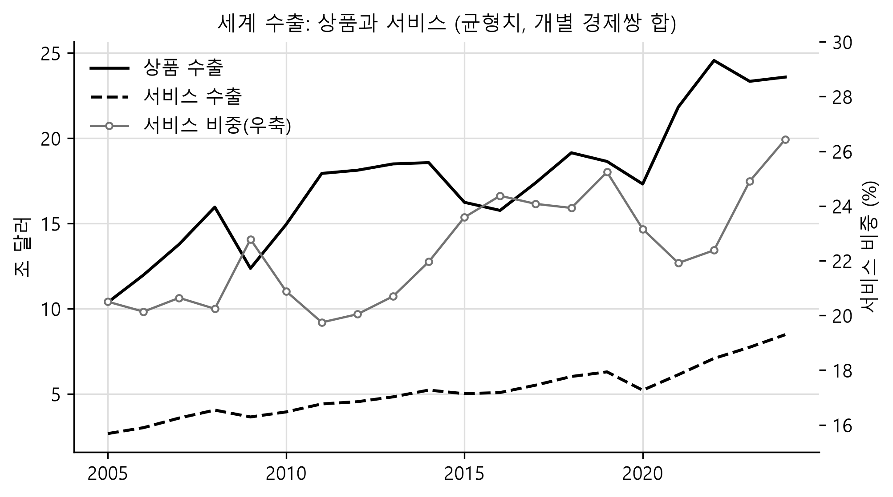
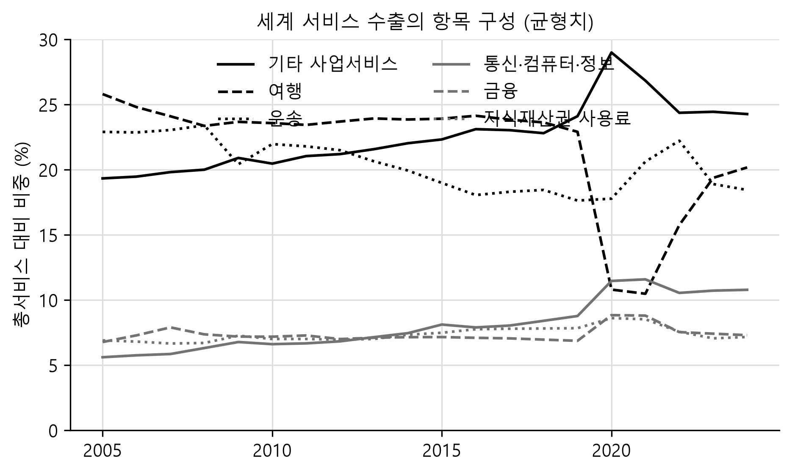
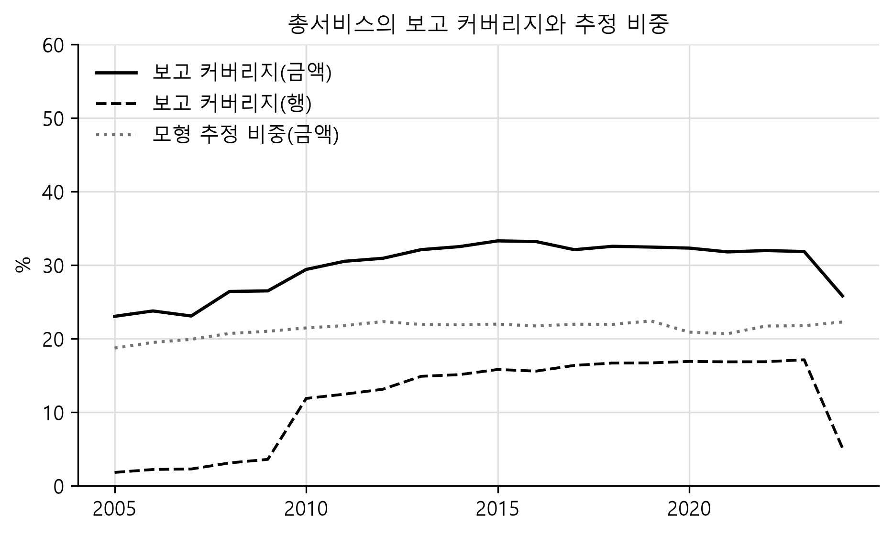
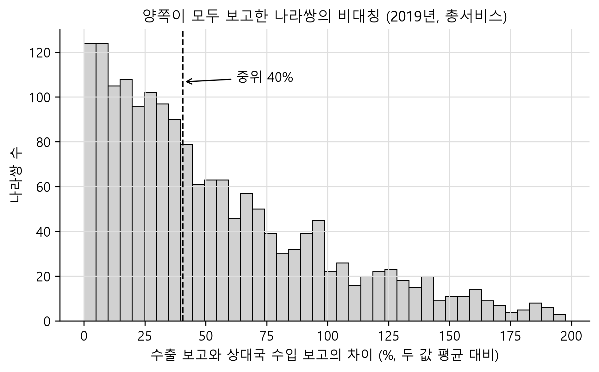
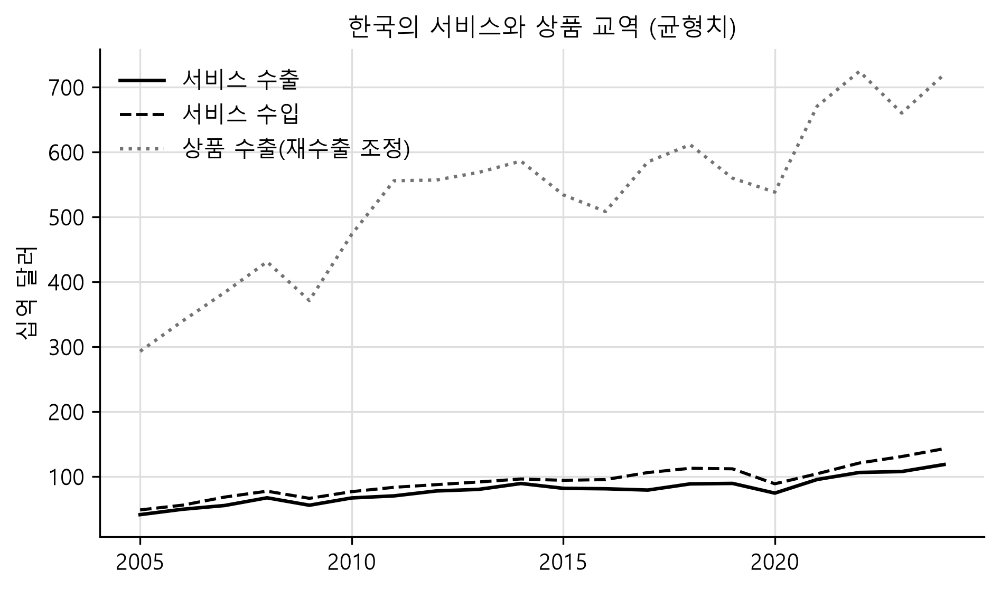

# 서비스 교역 자료의 구조와 기술적 개관

OECD-WTO BaTIS와 OECD BIMTS, 그리고 한국의 서비스 교역 통계

작성일: 2026-09-16
자료: OECD-WTO BaTIS (BPM6, 2025-12판) · OECD BIMTS (2026-05 파일) · 한국은행 경제통계시스템
재현: [`overview.ipynb`](overview.ipynb) · 수치 산출 [`analysis.py`](analysis.py)

---

## 요약

이 문서는 나라쌍 서비스 교역 자료인 OECD-WTO BaTIS와 그 상품 짝인 OECD BIMTS를 소개하고, 두 자료로 답할 수 있는 기초적인 사실을 정리한다. 세 가지를 다룬다. 첫째는 두 자료의 구조다. BaTIS는 같은 칸에 보고치, 조정치, 균형치 세 값과 그 값이 어떻게 만들어졌는지를 밝히는 방법론 코드를 함께 담고, BIMTS는 균형치 둘만 담는다. 둘째는 다른 자료와의 관계다. 국제기구가 내는 서비스 교역 자료 여섯 종과 한국은행이 공표하는 국내 통계 네 종을 무엇을 답할 수 있는지에 따라 구분하고, BaTIS의 한국 보고치가 한국은행 지역별 경상수지와 어떤 관계인지를 실측으로 확인한다. 셋째는 기술적 개관이다. 세계 서비스 교역의 규모와 구성, 실제로 보고되는 비율, 보고치끼리의 비대칭, 한국의 위치를 측정한다.

측정 결과 가운데 자료를 쓰는 데 직접 영향을 주는 것은 넷이다. 나라쌍 서비스 교역은 금액 기준으로 3분의 1만 보고되고 나머지는 추정이다. 양쪽이 모두 보고한 나라쌍에서도 수출 보고와 상대국 수입 보고의 차이가 중위 40.4%에 이른다. 한국은 200개 상대국 가운데 미국, 중국, 일본 셋만 공식 보고하며 나머지 197개는 전부 중력모형 추정이다. 그리고 BaTIS의 한국 보고치는 한국은행 지역별 경상수지와 2019년까지는 소수점까지 일치하지만 최근 연도로 올수록 어긋나는데, 이는 오류가 아니라 자료를 뽑아 간 시점의 차이다.

---

## I. 서론

### 1. 나라쌍 서비스 교역 자료의 문제

상품 교역에는 세관이 있다. 수출입 신고서가 품목과 상대국을 기록하므로 어느 나라가 어느 나라에 무엇을 얼마나 팔았는지가 원장 수준에서 남고, UN Comtrade나 한국의 관세청 통계처럼 품목 10단위까지 내려가는 자료가 성립한다. 서비스 교역에는 그런 원장이 없다. 국제수지 통계는 거주자와 비거주자 사이의 거래를 기록하지만 그 거래가 어느 나라를 상대로 한 것인지는 별도의 조사나 행정자료가 있어야 알 수 있고, 조사 비용과 응답 부담 때문에 대부분의 국가가 상대국 구분을 만들지 않거나 소수의 주요국에 한정한다. 그 결과 전 세계의 나라쌍 서비스 교역 행렬은 관측되지 않은 채로 남아 있었다.

OECD와 WTO가 함께 만드는 BaTIS는 이 빈칸을 채워 완전한 행렬을 만드는 것을 목표로 한다. 각국이 보고한 값을 모으고, 보고되지 않은 칸은 중력모형으로 추정하며, 수출 보고와 거울상 수입 보고가 어긋나는 곳은 양쪽을 화해시켜 하나의 값으로 만든다. 이 작업의 결과가 205개 경제와 그 상대국을 EBOPS 2010 기준 27개 항목으로 덮는 2005\~2024년 행렬이다. 같은 기관이 같은 철학으로 만든 상품 교역판이 BIMTS이고, 이쪽은 1995\~2024년을 HS2017 기준으로 덮는다.

이 문서가 답하려는 질문은 소개에 그치지 않는다. 추정으로 채운 자료를 연구에 쓰려면 어디까지가 관측이고 어디부터가 추정인지, 그 비율이 나라와 연도에 따라 어떻게 다른지, 그리고 추정을 뒷받침하는 보고치 자체가 얼마나 서로 어긋나는지를 알아야 한다. 자료 소개와 기술적 개관을 한 문서에 둔 이유가 여기에 있다.

### 2. 범위와 규약

분석은 이 저장소가 구축한 DuckDB(`svcdb.duckdb`)를 쓴다. 적재 절차와 검증 결과는 [`docs/DB_구축_원칙.md`](../../docs/DB_구축_원칙.md)에 있고, 이 문서가 인용하는 모든 수치는 [`analysis.py`](analysis.py)가 산출해 [`out/stats.json`](out/stats.json)에 남긴다. 금액은 원자료 단위인 백만 달러로 적되 세계 총계처럼 큰 값은 조 달러로 환산해 병기한다. 별도로 밝히지 않으면 서비스 금액은 균형치(`balanced_value`)이고 상품 금액은 재수출 조정 균형치(`B_ADJ_RX`)이며, 집계 코드(세계, EU27, OECD 등)는 제외한 개별 경제만 더한 값이다.

용어는 원자료의 구분을 그대로 쓴다. 보고치는 통계당국이 실제로 보고한 값, 조정치는 거기에 추정과 조정을 더해 내부 정합을 맞춘 값, 균형치는 수출과 거울상 수입을 화해시킨 값이다. 영문 문헌의 reported, final, balanced에 대응한다.

---

## II. BaTIS의 구조

### 1. 무엇을 담는가

BaTIS의 한 행은 보고국, 상대국, 방향(수출 또는 수입), 서비스 항목, 연도의 다섯 값으로 식별된다. 2025년 12월판은 보고국 205개와 상대국 208개, 2005\~2024년의 20개 연도, 31개 항목을 담아 모두 5,017만 행이다. 항목 31개는 EBOPS 2010의 표준 항목 27개와 파생 항목 4개로 이루어진다. 표준 항목은 총서비스(S)와 그 아래 열두 개 대분류, 그리고 운송, 여행, 통신·컴퓨터·정보, 기타 사업서비스 등의 하위 분류다. 파생 항목은 상업서비스(SOX)처럼 표준 항목의 합이나 차로 정의되며 산식이 코드표에 명시돼 있다.

주목할 점은 이 행렬이 완전하다는 것이다. 205개 보고국이 208개 상대국 전부에 대해, 12개 대분류 전부에 대해, 20개 연도 전부에 값을 갖는다. 관측되지 않은 칸이 비어 있지 않고 추정치로 채워져 있다는 뜻이다. 따라서 이 자료에서 결측의 위치를 보려면 값이 아니라 방법론 코드를 봐야 한다.

### 2. 세 값과 방법론 코드

BaTIS의 특징은 한 칸에 값이 셋이라는 점이다. 각 값이 무엇을 답하고 어디서 어긋나는지를 정리하면 다음과 같다.

**표 1. BaTIS가 한 칸에 담는 세 값**

| 열 | 정의 | 있는 비율 | 쓸 자리 |
|---|---|---|---|
| `reported_value` | 통계당국이 보고한 값 | 전체 행의 3.5% | 각국 공표치와 대조할 때, 보고 여부 자체를 분석할 때 |
| `final_value` | 보고치에 추정·조정을 더해 내부 정합을 맞춘 값 | 98.9% | 결측 없는 완전한 행렬이 필요하되 대칭은 요구하지 않을 때 |
| `balanced_value` | 수출과 거울상 수입을 화해시킨 값 | 98.9% | 나라쌍 행렬이 닫혀야 하는 분석 |
| `methodology` | 그 칸이 만들어진 방법의 37개 코드 | 전 행 | 추정분을 구분하거나 비중을 측정할 때 |

방법론 코드 37개는 접두사에 따라 네 범주로 구분된다. `R_`로 시작하는 여덟 개는 보고치의 출처를 밝힌다(OECD 국제서비스교역통계, 유로스탓, IMF 국제수지, UN 통계국, 국가 자료 등). `M`으로 시작하는 열두 개는 중력모형 추정이며 총서비스 추정(M1.x)과 항목별 추정(M2.x)을 구분한다. `E`로 시작하는 열다섯 개는 보고치로부터의 단순 도출, 시계열 보간, 음수 보험료 보정 같은 조정이다. 나머지는 국가 그룹의 집계(A)와 분석 시점에 상대국을 확인할 수 없었던 경우(Z)다. 이 저장소는 네 범주를 `dim_methodology.mclass`에 적어 두었는데, 이는 OECD의 공식 구분이 아니라 접두사에 따른 분류다.

### 3. 균형화가 하는 일

균형화는 같은 거래에 대한 두 나라의 보고가 어긋날 때 하나의 값으로 만드는 절차다. A국이 B국에 판 서비스 수출과 B국이 A국에서 산 서비스 수입은 원리상 같은 거래이지만 실제 보고는 자주 다르다. BaTIS는 두 값의 대칭 정도를 가중치로 삼아 가중평균을 구하고 그 값을 양쪽에 같이 써 넣는다. 결과적으로 균형치에서는 수출과 거울상 수입이 정확히 같아진다.

이 저장소의 검증은 그 항등이 실제로 성립하는지를 전 행에서 측정했다. 개별 경제쌍 2,483만 쌍에서 수출 균형치와 상대국 수입 균형치의 차이는 최대 0이다. 반올림 오차조차 없다. 어긋나는 620건은 전부 그룹끼리의 쌍이며, 세계 총계는 집계 방식상 수출과 수입이 같을 이유가 없으므로 결함이 아니다.

여기서 따라 나오는 제약이 있다. 균형치로는 수출입 비대칭을 연구할 수 없다. 비대칭은 정의상 제거된 상태이고, 남아 있는 곳은 보고치뿐이다. 보고치는 전체의 3.5%이므로 비대칭 연구의 모집단은 그만큼 좁아진다. V.4절에서 그 모집단의 크기와 비대칭의 크기를 측정한다.

### 4. 판이 바뀌면 과거도 바뀐다

BaTIS는 새 판이 나올 때 최근 연도만 덧붙이는 것이 아니라 과거 연도의 추정을 전부 다시 수행한다. 보고치가 갱신되고 중력모형이 다시 적합되므로 2005년 값도 판마다 달라진다. 배포 URL은 고정돼 있고 파일만 교체되기 때문에, 판을 기록해 두지 않으면 같은 코드가 다른 숫자를 내놓는 상황이 생긴다. 이 저장소가 모든 사실표에 `edition` 열을 두고 받은 원본의 크기와 해시를 보존하는 이유다. 연구 결과를 인용할 때 판을 함께 밝혀야 한다는 규칙도 여기서 나온다.

---

## III. BIMTS — 상품 교역의 짝

### 1. 구조

BIMTS는 BaTIS와 같은 균형화 철학을 상품 교역에 적용한 자료다. 1995\~2024년의 30개 연도, 수출국과 수입국 각각 205개, HS2017 2단위 98종(97개 장과 총계)으로 5,238만 행이며, 같은 자료를 CPA 2.1 분류로 본 판이 4,014만 행이다. 4단위와 6단위 파일도 공개되지만 이 저장소는 2단위까지만 담았다.

구조에서 BaTIS와 다른 점이 셋이다. 첫째, 방향이 하나다. 참조 경제가 수출국이고 상대 경제가 수입국이며, 균형화 결과이므로 한 흐름이 한 번만 기록된다. 수입국 기준으로 질의하려면 두 열의 자리를 바꾸어야 한다. 둘째, 보고치가 없다. 배포되는 값은 균형치 둘뿐이라 상품에서 보고치와 균형치를 비교하려면 UN Comtrade 원자료가 따로 필요하다. 셋째, 0인 거래는 행 자체가 없다. OECD가 파일 크기를 줄이려고 결측으로 표기했기 때문인데, 값이 정확히 0인 행이 HS 2단위에 3,546건 남아 있으므로 규약이 완전히 일관되지는 않는다.

### 2. 두 균형치

BIMTS가 내는 균형치는 둘이다. 총 균형치(`B`)는 재수출을 포함한 값이고, 재수출 조정 균형치(`B_ADJ_RX`)는 중계무역 흐름을 식별해 생산국으로 되돌린 값이다. OECD는 후자를 권한다. 생산자와 최종 사용자 사이의 흐름이 이미 잡혀 있는데 중계지를 거친 흐름을 다시 세면 이중계상이 되기 때문이다.

세계 총액에서 두 값의 차이는 크지 않다. 2024년 기준 총 균형치 23조 5,834억 달러에 대해 재수출 조정 균형치는 22조 9,453억 달러로 2.7% 작다. 그러나 나라별로는 차이가 벌어지고, 중계무역 비중이 큰 경제일수록 총액 자체가 각국 공표치와 크게 달라진다. 홍콩의 2024년 수출 총액이 1,547억 달러로 잡히는 것이 그 예다. 국별 총액을 인용하기 전에 방법론 문서를 확인해야 한다.

### 3. 분류의 계층

HS2017 2단위 표는 평평하다. 총계와 97개 장이 전부이고 총계를 뺀 나머지를 더하면 총계가 된다. CPA 2.1 표는 그렇지 않다. 섹션(`CPA_2_1_A`), 분류(`C10`), 묶음(`C10T12`)이 한 열에 섞여 있어 전부 더하면 여러 번 센다. 총계와 맞추려면 섹션과 미분류(`_X`)만 더해야 하고, 섹션만 더하면 미분류가 있는 쌍에서 어긋난다. 이 저장소의 검증은 두 경우를 모두 측정해 규칙을 확정했다.

---

## IV. 다른 자료와의 관계

### 1. 국제기구의 서비스 교역 자료

서비스 교역을 다루는 국제 자료는 여러 종이지만 답할 수 있는 질문이 서로 다르다. 다음 표는 상대국 구분의 유무, 자료의 성격(보고 또는 추정), 분류와 기간을 기준으로 정리한 것이다. 상대국 구분이 없는 자료는 나라쌍 분석에 쓸 수 없고, 보고만 담은 자료는 전 세계를 덮지 못한다. BaTIS의 자리는 이 두 제약을 모두 푸는 대신 추정을 받아들인 지점에 있다.

**표 2. 서비스 교역 관련 국제 자료**

| 자료 | 제공 | 상대국 | 성격 | 분류·기간 | 이 DB와의 관계 |
|---|---|---|---|---|---|
| BaTIS | OECD·WTO | 있음(완전) | 보고 + 추정 + 균형화 | EBOPS 2010 27항목, 2005\~2024 | 이 DB의 본체 |
| ITSS (국제서비스교역통계) | OECD | 있음(부분) | 보고만 | EBOPS 2010 확장, 보고국 48개 | BaTIS 보고치의 주요 원천 |
| 국제수지 통계 | IMF | 없음 | 보고 | BPM6 서비스 12항목 | 상대국 구분이 없어 나라쌍 분석 불가 |
| 유로스탓 국제서비스교역 | 유럽연합 | 있음 | 보고 | EBOPS 2010, EU 회원국 | BaTIS 보고치의 원천 |
| TiSMOS | WTO | 있음 | 추정 | 공급 형태(Mode 1\~4) 55개 부문, 2005\~2022 | 공급 형태 구분이 필요하면 이쪽 |
| TiVA (2025판) | OECD | 있음 | 투입산출 기반 추정 | 산업 분류, 부가가치 기준 | 총액이 아닌 부가가치 기준 분석 |
| STRI | OECD | 해당 없음 | 정책 지표 | 51개 경제(디지털 STRI는 129개) | 교역량이 아니라 제한 정도 |
| UN Comtrade | UN | 있음 | 보고 | HS 품목, 상품만 | BIMTS의 보고치 대응물 |

세 가지를 덧붙인다. 첫째, ITSS는 BaTIS의 보고치가 어디서 오는지를 보여 준다. 보고국이 48개에 그치고 관측치가 1,471만 개인데, 이는 전 세계 205개 경제를 덮는 BaTIS와의 차이를 그대로 보여 준다. 둘째, TiSMOS는 BaTIS와 경쟁하는 자료가 아니라 다른 질문에 답하는 자료다. GATS의 네 가지 공급 형태별로 서비스 교역을 나누므로 상업적 주재(Mode 3)까지 포함하는 반면, 기간이 2022년까지이고 항목 분류도 다르다. 셋째, TiVA는 총액이 아니라 부가가치 기준이므로 서비스가 상품 수출에 체화된 몫까지 잡아낸다. 이 저장소의 자매 DB인 [GVC 지표 DB](https://pilsunchoi.github.io/GVC/)가 같은 계통의 자료를 다룬다.

### 2. 한국의 서비스 교역 통계

한국에서 서비스 교역을 공표하는 기관은 한국은행이다. 상품 교역에서 관세청이 맡는 자리를 서비스에서는 국제수지 통계가 대신하며, 세관 신고가 없으므로 자료의 성격도 다르다. 다음 표는 한국은행 경제통계시스템에서 실제로 받을 수 있는 통계표를 상대국 구분과 항목 상세도, 주기를 기준으로 정리한 것이다. 통계표 번호와 기간은 2026년 9월 16일에 조회한 값이다.

**표 3. 한국은행이 공표하는 서비스 교역 관련 통계**

| 통계표 | 번호 | 주기·기간 | 상대국 | 항목 상세도 |
|---|---|---|---|---|
| 국제수지 | 301Y013 | 월, 1980\~ | 없음 | 서비스수지와 12개 대분류 |
| 서비스무역세분류통계 | 301Y014 | 월·분기·연, 2006\~ | 없음 | EBOPS 세분류 146개 항목 |
| 지역별 경상수지 | 301Y015 | 연, 1998\~ | 8개 권역 | 서비스 9개 항목(운송, 여행, 보험, 지식재산권사용료, 통신·컴퓨터·정보, 기타사업, 정부, 가공, 기타) |
| 지식서비스 무역통계(지역별) | 304Y104 | 분기·반기·연, 2010\~ | 지역·주요국 | 지식서비스에 한정 |

한국의 서비스 교역 통계에서 상대국 구분은 지역별 경상수지에만 있고, 그 구분은 미국, 중국, 일본, EU, 동남아, 중동, 중남미, 기타의 여덟 권역이다. 개별 국가 단위로 내려가는 서비스 교역 통계는 지식서비스 무역통계를 빼면 공표되지 않는다. 국가데이터처의 KOSIS와 한국무역협회가 제공하는 서비스 교역 수치도 원자료는 한국은행 국제수지이므로 같은 제약을 물려받는다.

이 제약은 BaTIS에 그대로 드러난다. 2019년 총서비스 수출에서 한국의 200개 상대국 가운데 보고치가 있는 칸은 셋뿐이고, 그 셋은 중국, 미국, 일본이다. 나머지 197개는 중력모형 추정(M1.1, M1.3, M1.5)이거나 잔여 귀속(M8.3)이다. 보고된 세 나라가 한국의 총서비스 수출 균형치에서 차지하는 비중은 45.1%이므로, 금액의 절반 이상이 추정으로 배분된 셈이다.

### 3. BaTIS 보고치와 한국은행 공표치의 대조

BaTIS의 한국 보고치가 한국은행의 어느 통계와 대응하는지는 문서에 명시돼 있지 않다. 그래서 두 자료를 직접 대조했다. 한국은행 지역별 경상수지(301Y015)에서 서비스수입(수출에 해당)과 서비스지급(수입에 해당)을 권역별로 받아 BaTIS의 `reported_value`와 맞추면 다음과 같다. 대조 대상은 BaTIS에 보고치가 있는 세 상대국과 세계 총계이며, 단위는 백만 달러다.

**표 4. BaTIS 한국 보고치와 한국은행 지역별 경상수지 (2019년)**

| 상대 | 방향 | BaTIS 보고치 | 한국은행 | 차이 |
|---|---|---|---|---|
| 중국 | 수출 | 20,338 | 20,338 | 0 |
| 미국 | 수출 | 17,974 | 17,974 | 0 |
| 일본 | 수출 | 9,364 | 9,364 | 0 |
| 세계 | 수출 | 103,839 | 103,839 | 0 |
| 미국 | 수입 | 31,312 | 31,312 | 0 |
| 중국 | 수입 | 17,127 | 17,127 | 0 |
| 일본 | 수입 | 10,198 | 10,198 | 0 |
| 세계 | 수입 | 130,684 | 130,684 | 0 |

두 자료는 같은 숫자다. BaTIS의 한국 보고치는 한국은행 지역별 경상수지를 OECD 국제서비스교역통계를 거쳐 받은 것으로 판단된다. 방법론 코드가 `R_OECD`인 것도 이 해석과 맞는다. 다만 이 일치는 과거 연도에 한정된다. 최근 연도로 올수록 두 값이 벌어지는데, 그 크기는 다음과 같다.

**표 5. 연도별 괴리 (총서비스, 백만 달러)**

| 연도 | 수출 BaTIS | 수출 한국은행 | 차이 | 수입 BaTIS | 수입 한국은행 | 차이 |
|---|---|---|---|---|---|---|
| 2019 | 103,839 | 103,839 | 0.00% | 130,684 | 130,684 | 0.00% |
| 2020 | 89,596 | 91,232 | -1.79% | 104,266 | 105,350 | -1.03% |
| 2021 | 119,949 | 120,174 | -0.19% | 125,235 | 129,168 | -3.04% |
| 2022 | 131,637 | 132,682 | -0.79% | 138,890 | 143,432 | -3.17% |
| 2023 | 125,666 | 127,042 | -1.08% | 152,490 | 157,784 | -3.36% |
| 2024 | 138,953 | 142,034 | -2.17% | 162,654 | 171,462 | -5.14% |

괴리는 오류가 아니라 시점의 차이다. 국제수지 통계는 사후에 계속 수정되고 한국은행은 그 수정을 반영해 공표치를 갱신하는 반면, BaTIS의 2025년 12월판은 그 이전 어느 시점에 자료를 받아 고정해 둔 것이다. 수입 쪽 괴리가 수출보다 크고 최근 연도일수록 커지는 양상이 이 해석과 일치한다. 실무적 함의는 분명하다. 한국의 서비스 교역 총액을 다루는 분석이라면 한국은행 공표치를 쓰고, BaTIS는 상대국 배분이 필요할 때 쓰되 총액이 국내 공표치와 다를 수 있음을 밝혀야 한다.

---

## V. 기술적 개관

### 1. 세계 서비스 교역의 규모

세계 수출 총액을 서비스와 상품으로 나누어 보면 두 계열의 수준과 변동이 크게 다르다. 그림 1은 개별 경제쌍만 더한 균형치 기준으로 두 계열을 왼쪽 축에, 서비스가 전체(상품과 서비스의 합)에서 차지하는 비중을 오른쪽 축에 놓은 것이다. 서비스는 2005년 2조 6,739억 달러에서 2024년 8조 4,751억 달러로 3.2배가 되었고 같은 기간 상품은 10조 3,685억 달러에서 23조 5,834억 달러로 2.3배가 되었다.

**그림 1. 세계 수출: 상품과 서비스**



서비스 비중은 2005년 20.5%에서 2024년 26.4%로 올라갔으나 그 경로는 단조롭지 않다. 2009년의 상승(22.8%)은 금융위기로 상품 교역이 더 크게 줄어든 결과이고, 2011\~2012년의 하락은 원자재 가격 상승기에 상품 금액이 팽창한 결과다. 2020년에는 서비스가 여행과 운송의 중단으로 직접 타격을 받아 비중이 23.2%로 내려갔고, 2021년에는 상품 교역이 먼저 회복하면서 21.9%로 더 내려갔다. 서비스 비중이 위기 이전 수준을 넘어선 것은 2023년이다. 이 계열은 서비스가 상품보다 경기에 둔감하다는 통념과 2020년의 경험이 어긋난다는 점을 보여 준다.

### 2. 항목 구성

서비스 교역의 구성은 20년 동안 크게 바뀌었다. 그림 2는 총서비스 대비 비중이 큰 여섯 항목의 추이를 보여 준다. 기타 사업서비스(전문·경영컨설팅, 연구개발, 기술·무역관련 서비스를 포함)는 2005년 19.3%에서 2024년 24.3%로 올라 최대 항목이 되었고, 여행은 25.8%에서 20.2%로, 운송은 22.9%에서 18.4%로 내려갔다. 통신·컴퓨터·정보서비스는 5.6%에서 10.8%로 거의 두 배가 되었다.

**그림 2. 세계 서비스 수출의 항목 구성**



2020년의 급변은 따로 읽어야 한다. 여행 비중이 22.9%에서 10.8%로 한 해 만에 반토막이 났고 기타 사업서비스가 29.0%로 뛰었다. 후자는 그 항목의 금액이 늘어서가 아니라 분모가 줄어서 생긴 변화다. 비중을 다룰 때 분모의 변화를 함께 보지 않으면 잘못 읽게 되는 전형적인 경우다.

디지털로 전달될 수 있는 서비스의 비중도 측정할 수 있다. 국제기구의 통상적 정의(보험, 금융, 지식재산권 사용료, 통신·컴퓨터·정보, 기타 사업, 개인·문화·여가의 합)를 따르면 이 비중은 2005년 43.2%에서 2019년 52.1%로 올랐고, 2020년에는 여행이 무너지면서 63.4%까지 치솟았다가 2024년 54.6%로 내려왔다. 이것은 항목 분류에 근거한 대리지표이고 실제 전달 방식을 관측한 값이 아니다.

### 3. 무엇이 보고되고 무엇이 추정되는가

이 자료를 쓰는 데 가장 중요한 사실은 보고와 추정의 비율이다. 그림 3은 총서비스에 대해 보고치가 있는 칸의 비율을 두 가지로 측정한 것이다. 하나는 행 기준으로 전체 칸 가운데 보고된 칸의 수이고, 다른 하나는 금액 기준으로 균형치 총액 대비 보고된 금액의 크기다. 여기에 개별 경제쌍에 한정한 중력모형 추정의 금액 비중을 겹쳐 놓았다.

**그림 3. 총서비스의 보고 커버리지와 추정 비중**



세 가지를 읽을 수 있다. 첫째, 행 기준과 금액 기준이 크게 다르다. 2019년에 보고된 칸은 전체의 16.7%이지만 금액으로는 32.5%다. 큰 나라쌍일수록 보고되기 때문이다. 둘째, 커버리지는 2005년 이후 뚜렷이 개선되었다. 행 기준 1.8%에서 2015년 15.8%로, 금액 기준 23.0%에서 33.3%로 올라갔고 그 뒤로는 정체 상태다. 셋째, 최신 연도에서 커버리지가 급락한다. 2022년 16.9%였던 행 기준 커버리지가 2024년에는 5.1%다. 자료의 질이 나빠진 것이 아니라 보고가 아직 도착하지 않은 것이며, 최신 연도를 추세 분석에 그대로 넣으면 추정 비중이 급등한 구간을 실제 변화로 오독하게 된다.

방법론 코드를 네 범주로 구분해 개별 경제쌍에 한정해 측정하면 행과 금액의 괴리가 더 뚜렷해진다.

**표 6. 방법론 분류별 비중 (총서비스, 개별 경제쌍, 행% / 금액%)**

| 연도 | 보고 | 조정·보간 | 모형 추정 |
|---|---|---|---|
| 2005 | 1.1 / 26.4 | 19.9 / 54.9 | 79.0 / 18.7 |
| 2015 | 13.8 / 50.5 | 7.0 / 27.5 | 79.2 / 22.0 |
| 2019 | 14.5 / 49.8 | 6.3 / 27.8 | 79.2 / 22.4 |
| 2024 | 4.0 / 37.6 | 16.8 / 40.1 | 79.2 / 22.3 |

모형 추정은 어느 해에나 행의 79%를 차지하지만 금액으로는 18\~22%에 그친다. 이 두 수치를 함께 적지 않으면 어느 쪽으로도 오도할 수 있다. 행만 보면 이 자료는 대부분이 추정이고, 금액만 보면 추정은 주변적이다. 정확한 서술은 둘 다이다. 나라쌍의 대다수는 추정이고, 교역액의 다수는 보고나 그로부터의 직접 조정에서 온다.

보고 여부는 나라에 따라서도 크게 다르다. 2019년 총서비스 수출 기준으로 개별 상대국 200개 가운데 보고치가 하나라도 있는 보고국은 200개 중 52개뿐이고, 절반 이상의 칸을 보고하는 나라는 32개다. 수출 규모 상위 20개국의 보고율은 다음과 같다.

**표 7. 주요 보고국의 양자 보고율 (2019년, 총서비스 수출, 200개 상대국 기준)**

| 보고국 | 보고율 | 보고국 | 보고율 |
|---|---|---|---|
| 이탈리아 | 99.5% | 프랑스 | 82.5% |
| 스웨덴 | 99.5% | 독일 | 68.5% |
| 네덜란드 | 96.0% | 아일랜드 | 55.5% |
| 벨기에 | 95.5% | 영국 | 33.0% |
| 미국 | 94.0% | 캐나다 | 29.0% |
| 스페인 | 87.5% | 스위스 | 19.5% |
| 룩셈부르크 | 87.0% | 홍콩 | 19.0% |
| 일본 | 17.0% | 싱가포르 | 15.5% |
| 한국 | 1.5% | 중국 | 0.0% |
| 인도 | 0.0% | | |

유럽연합 회원국은 유로스탓에 대한 보고 의무 때문에 대부분 90%를 넘고, 미국도 94%로 높다. 반면 중국과 인도는 한 칸도 보고하지 않으며 한국은 1.5%, 즉 세 칸이다. 이 표는 BaTIS의 추정이 어디에 집중되는지를 보여 준다. 아시아 주요국의 나라쌍 서비스 교역은 사실상 전부 모형의 산물이다.

### 4. 보고치끼리의 비대칭

균형화가 왜 필요한지는 양쪽이 모두 보고한 나라쌍을 보면 알 수 있다. 2019년 총서비스에서 수출국의 수출 보고와 상대국의 수입 보고가 둘 다 존재하고 모두 양수인 나라쌍은 1,719개다. 같은 해 개별 경제쌍의 방향별 칸이 4만 개이므로 양쪽 보고가 모두 있는 경우는 4.3%에 그친다. 그림 4는 이 1,719개 쌍에서 두 보고치의 차이를 두 값의 평균 대비 백분율로 나타낸 분포다.

**그림 4. 양쪽이 모두 보고한 나라쌍의 비대칭**



중위값이 40.4%이고 사분위 범위가 18.3\~76.8%다. 차이가 25%를 넘는 쌍이 67.3%, 50%를 넘는 쌍이 42.5%다. 같은 거래를 두 나라가 보고했는데 그 값이 절반 가까이 차이 나는 경우가 흔하다는 뜻이다. 상품 교역에서도 거울상 비대칭은 알려진 문제이지만 서비스에서는 그 크기가 훨씬 크다. 서비스 거래는 통관 기록이 없어 조사와 추정에 의존하고, 중개 거래와 거주자 판정의 차이가 양국 통계에 다르게 반영되기 때문으로 보인다.

이 분포는 균형화의 필요성과 한계를 동시에 보여 준다. 필요성은 분명하다. 두 값을 그대로 두면 나라쌍 행렬이 닫히지 않는다. 한계도 분명하다. 중위 40%의 괴리를 하나의 값으로 만드는 과정에는 어느 쪽을 더 믿을 것인가라는 판단이 들어가고, 그 판단은 대칭 지수를 통해 기계적으로 이루어지지만 결과는 어느 나라의 공표치와도 같지 않게 된다.

### 5. 한국의 위치

한국의 서비스 교역을 BaTIS에서 보면 규모와 구성이 세계 평균과 뚜렷하게 다르다. 그림 5는 한국의 서비스 수출입과 상품 수출을 함께 놓은 것이다. 2024년 서비스 수출 균형치는 1,181억 8,500만 달러로 200개 경제 가운데 19위다. 같은 해 상품 수출은 7,191억 4,600만 달러이므로 한국의 총수출에서 서비스가 차지하는 비중은 14.1%다. 세계 평균 26.4%의 절반을 조금 넘는 수준이고, 이 비중은 2005년 12.3%에서 20년 동안 1.8%포인트 오르는 데 그쳤다.

**그림 5. 한국의 서비스와 상품 교역**



항목 구성도 다르다. 한국의 2024년 서비스 수출에서 운송이 33.7%로 가장 크고 기타 사업서비스가 20.8%, 여행이 15.4%다. 세계 구성(운송 18.4%, 기타 사업서비스 24.3%, 여행 20.2%)과 비교하면 운송에 크게 치우쳐 있다. 해운과 항공 운임이 한국 서비스 수출의 3분의 1을 차지한다는 것은 이 계열이 운임 지수의 변동에 직접 노출된다는 뜻이기도 하다. 지식재산권 사용료(6.7%)와 통신·컴퓨터·정보서비스(6.6%)는 세계 구성(7.2%, 10.8%)보다 낮다.

상대국 구성에서는 상위 10개국이 67.2%를 차지한다. 상위 다섯은 미국(220억 4,300만 달러), 중국(194억 4,900만 달러), 일본(78억 8,000만 달러), 싱가포르(71억 600만 달러), 홍콩(53억 8,600만 달러)이다. 다만 IV.2절에서 확인했듯 이 가운데 보고치에 근거한 것은 미국, 중국, 일본 셋뿐이고 나머지는 모두 모형 추정이다. 한국의 대싱가포르 서비스 수출이 71억 달러라는 진술은 관측이 아니라 추정치의 인용이며, 그 점을 밝히지 않으면 자료의 성격을 오도하게 된다.

### 6. 서비스와 상품의 나라쌍 관계

두 자료를 함께 담은 이점은 같은 나라쌍에서 서비스와 상품을 비교할 수 있다는 것이다. 2024년에 서비스와 상품이 모두 양수인 나라쌍은 2만 8,765개이고, 두 금액에 로그를 취한 상관계수는 0.793이다. 상품 교역이 많은 쌍에서 서비스 교역도 많다는 관계가 뚜렷하지만 완전하지는 않다.

이 관계를 해석할 때 두 가지를 주의해야 한다. 첫째, 두 자료의 결측 규약이 다르다. BaTIS는 모든 칸을 채우고 BIMTS는 0인 흐름을 행에서 제외하므로, 둘을 결합하면 상품 교역이 관측된 쌍만 남는 선택이 일어난다. 둘째, 서비스 금액의 대부분이 추정이므로 이 상관의 일부는 중력모형이 상품 교역과 같은 설명변수(거리, 규모, 인접성)를 쓴 결과일 수 있다. 관측된 두 계열의 관계가 아니라 추정 절차가 만들어 낸 관계일 가능성을 배제하려면 보고치만으로 같은 상관을 다시 측정해야 한다. 이 문서는 그 작업을 수행하지 않았다.

---

## VI. 이 자료로 답할 수 있는 것과 없는 것

정리하면 다음과 같다. 답할 수 있는 것은 넷이다. 첫째, 세계 서비스 교역의 규모와 구성, 그 시계열 변화다. 총액과 항목 구성은 보고 비중이 높은 대형 경제가 좌우하므로 추정의 영향이 상대적으로 작다. 둘째, 나라쌍 행렬이 닫혀야 하는 분석이다. 네트워크 분석이나 투입산출 연계처럼 행렬의 정합이 요구되는 작업에 균형치가 적합하다. 셋째, 보고 관행 자체에 대한 연구다. 어느 나라가 무엇을 보고하고 보고하지 않는지, 보고된 값끼리 얼마나 어긋나는지는 이 자료가 방법론 코드와 보고치를 함께 담기 때문에 측정할 수 있다. 넷째, 상품과 서비스의 비교다. 같은 기관이 같은 방법론으로 만든 두 자료를 같은 나라쌍에서 비교할 수 있다.

답할 수 없는 것도 넷이다. 첫째, 수출입 비대칭이다. 균형치에서는 정의상 제거되었고 보고치만으로는 모집단이 4.3%로 좁아진다. 둘째, 공급 형태별 분석이다. Mode 1\~4 구분은 TiSMOS의 영역이다. 셋째, 월·분기 단위의 분석이다. 이 자료는 연 단위이고 한국의 월별 서비스 교역은 한국은행 국제수지에서 받아야 한다. 넷째, 기업 단위의 분석이다. BaTIS는 국가 집계이며 기업 수준의 서비스 수출 자료는 별도의 미시자료가 있어야 한다.

마지막으로 추정 비중이 높은 나라쌍을 다루는 연구에는 단서가 필요하다. 한국을 포함한 아시아 주요국의 나라쌍 서비스 교역은 사실상 전부 모형의 산물이고, 그 모형은 거리와 규모를 설명변수로 쓰는 중력모형이다. 이 값을 종속변수로 삼아 거리나 규모의 효과를 추정하면 모형이 만들어 넣은 관계를 다시 측정하게 된다. 방법론 코드로 추정분을 구분할 수 있다는 점이 이 자료의 가장 실용적인 특징인 이유다.

---

## 부록 A. 질의 예

이 문서의 수치는 전부 아래 형태의 질의에서 나오며 전체 코드는 [`analysis.py`](analysis.py)에 있다. 질의를 쓸 때 되풀이해 걸리는 것이 셋이라 대표적인 형태를 남긴다. 집계 코드를 거르는 조인, 방법론으로 보고된 칸만 남기는 조건, 그리고 균형치의 대칭을 확인하는 자기 결합이다.

집계 코드를 제외한 세계 총액을 구하는 질의다. `dim_area.is_aggregate`로 거르지 않으면 세계와 개별 경제가 함께 더해져 총액이 두 배가 된다.

```sql
SELECT f.year, sum(f.value) AS goods_musd
FROM fact_bimts_hs2 f
JOIN dim_area ae ON f.exporter = ae.code AND NOT ae.is_aggregate
JOIN dim_area ai ON f.importer = ai.code AND NOT ai.is_aggregate
WHERE f.product = '_T' AND f.adjustment = 'B_ADJ_RX'
GROUP BY 1 ORDER BY 1;
```

보고된 칸만 남기는 질의다. 방법론 분류가 `reported`인 칸은 그 값이 통계당국의 보고에서 왔다는 뜻이다.

```sql
SELECT f.reporter, f.partner, f.reported_value
FROM fact_batis f
JOIN dim_methodology m ON f.methodology = m.code
WHERE m.mclass = 'reported' AND f.item_code = 'S'
  AND f.flow = 'EXP' AND f.year = 2019;
```

균형치의 대칭성을 확인하는 질의다. 개별 경제쌍에서는 차이가 0이어야 한다.

```sql
WITH x AS (SELECT reporter a, partner b, item_code i, year y, balanced_value v
           FROM fact_batis WHERE flow = 'EXP'),
     m AS (SELECT partner a, reporter b, item_code i, year y, balanced_value v
           FROM fact_batis WHERE flow = 'IMP')
SELECT max(abs(x.v - m.v)) FROM x JOIN m USING (a, b, i, y);
```

## 부록 B. 재현

[`overview.ipynb`](overview.ipynb)가 이 문서의 모든 수치를 다시 계산하고 마지막 절에서 본문값과 대조한다. 어긋나면 그 자리에서 멈춘다. 필요한 것은 `duckdb`, `pandas`, `matplotlib`와 이 저장소가 만든 `data/processed/svcdb.duckdb`이며, DB를 만드는 절차는 [저장소 안내](../../README.md)에 있다. 한국은행 수치는 경제통계시스템 오픈API에서 받았고 인증키가 필요하므로 노트북에는 조회한 값을 상수로 적어 두었다.

판이 바뀌면 수치도 바뀐다. 이 문서는 BaTIS 2025년 12월판과 BIMTS 2026년 5월 파일을 쓰며, 다른 판으로 같은 노트북을 돌리면 검증 절에서 멈춘다. 그때 필요한 것은 본문을 고치는 일이지 검증을 지우는 일이 아니다.
